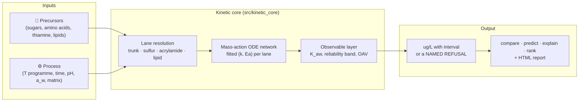

# Maillard

[](https://www.python.org/downloads/)
[](https://www.docker.com/)
[](https://opensource.org/licenses/Apache-2.0)
[](results/validation/core_panel_scores.md)
[](results/validation/core_panel_scores.md)

**Maillard** is a kinetic model of the Maillard reaction for alternative-protein scientists.
Sugars, amino acids, fats and the cooking programme go in. The aroma compounds come out: the
meaty thiols, the caramel furanones, acrylamide, the fat aldehydes, each with a measured
reliability interval, an odour-activity ratio, and a **named refusal** wherever the evidence
cannot answer. It exists to help decide *which experiment to run next*, not to replace the GC-MS.

> **Start here if you know what the Maillard reaction is and nothing else:**
> [**Modelling the Maillard reaction: an introduction**](docs/guides/INTRODUCTION.md). Eight short
> sections, each led by a figure: the chemistry and how well the field has measured it, how a kinetic
> model is built from that, what this repository is made of, how well this model does, how it got
> here, the one problem that stops it from predicting meaty aroma, and what is needed next. The
> step-by-step reaction trees are in its [appendix](docs/guides/REACTION_TREES.md); every paper
> used, with what was taken from it, in [SOURCES.md](docs/guides/SOURCES.md).
>
> [](docs/guides/INTRODUCTION.md)

> **Who is this for?** Alternative-protein scientists who want to triage formulations and
> process conditions before burning GC-MS time, and computational chemists who want a
> transparent, benchmarked, honestly scored Maillard kinetics platform.

---

## How it works



**Inputs** are a formulation (precursor names and mM) and a process (an isothermal or
programmed thermal history, pH, water activity, matrix). **Lane resolution** decides which of
the four networks can represent the request. The Maillard lanes (trunk, sulfur, acrylamide)
do not compose with each other; the lipid lane co-integrates with any one of them. Anything that
maps to no lane, or to a species the fit corpus never measured, is refused with the reason.
**Integration** is a plain mass-action ODE system with rate constants and activation energies
read from the frozen fit reports under `results/validation/kinetic_core_b*_fit_report.json`.
**The observable layer** wraps every absolute in its measured reliability band, converts to
headspace where a threshold exists, and reports odour-activity ratios. **No fitted constant is a
literal in the code**: every number the model ships is a fit-report value or a *declared
assumption* with its band.

---

## Getting started

```bash
git clone https://github.com/PabloAMC/Maillard.git
cd Maillard
./scripts/docker_maillard.sh up && ./scripts/docker_maillard.sh bootstrap
```

Everything runs inside the container (`./scripts/docker_maillard.sh run "<command>"`), or, without
it, `pip install -e .` in a clone gives the same front door as the `maillard` command, a Python API
(`from src import api`) and a local page (`maillard ui`). The front door has eight verbs.

```bash
python scripts/maillard.py compare --template > my_comparison.yml   # two arms, A vs B
python scripts/maillard.py compare my_comparison.yml --report compare.html
python scripts/maillard.py predict my_comparison.yml --system a      # one arm, absolutes
python scripts/maillard.py explain 2-methyl-3-furanthiol             # what the core knows about a compound
python scripts/maillard.py rank --top 10                             # which measurement would teach the model most
python scripts/maillard.py score --template > my_measurements.yml    # then: score my_measurements.yml
python scripts/maillard.py wishlist                                  # what to measure next, and what it would unlock
python scripts/maillard.py calibrate my_measurements.yml --lab "my lab"   # a per-laboratory overlay; apply with --calibration
python scripts/maillard.py ui                                        # a page on this machine: paste a spec, get the report
```

| verb | the question it answers | what it prints |
| --- | --- | --- |
| `compare` | which of two recipes gives more of a compound | the ratio between the arms per compound, the quantity the model's scale error cancels out of, with each arm's envelope declaration and a reliability grade for the axis the arms differ on |
| `predict` | how much of a compound one recipe gives | a level with its reliability interval and odour-activity ratio, and every declared extrapolation |
| `explain` | where a compound comes from in this model | the steps, their evidence class and the papers behind them; for a refused compound, the reason and whether a cited rule reaches it ("no rate" or "no route") |
| `score` | how good is the model on my own measurements | the panel's scorecard applied to your pots; a record lands under `results/user/`; nothing is refitted |
| `calibrate` | make it fit my laboratory | a per-laboratory file: response factors from your levels, the few rate constants your contrasts identify, the hold-out before and after; applied with `--calibration`, the shipped model untouched |
| `rank`, `wishlist` | what should I measure next | the rows the model misses most and least certainly; the constants the evidence does not pin and what each measurement would unlock |
| `ui` | the same, in a browser | a page on this machine: paste a spec, get the report |

A spec may state a protein loading (`protein_g_per_l`, with a matrix on file or its own `protein_sites`),
and the protein's disulfide and amine pools are then charged. `--json` gives the machine-readable
payload of any verb; `--report` writes a self-contained HTML page. When each verb refuses, and why,
is the first table of the [quick start](docs/guides/QUICKSTART.md); the worked examples are the
[tutorial](docs/USING_THE_TOOL.md).

Regenerate the evidence artifacts:

```bash
python scripts/generators/generate_core_panel_scores.py                 # ~15 s
python scripts/generators/generate_core_prediction_uncertainty.py --n-samples 200 --workers 6   # ~5-7 min natively
python scripts/generators/generate_model_card.py                        # re-splices the card below
```

Test tiers and gates: `pytest tests/unit -q`, `pytest tests/scientific -q`,
and `python scripts/ci/<gate>.py` for the six gates (citation, data read-only, fit-then-score,
hold-out isolation, benchmark schema, artifact freshness: tracked artifacts equal what the code
produces, modulo date and git head, and every recorded input still hashes the same).

---

## How well calibrated is it?

Badly, and measurably. The numbers below are what the core scores on the union panel — the 16
trust-loop bundles that hold a measurement, the 17 `maillard_path` hold-outs and the 4 external
matrix bundles, 37 in all, 39 evaluable rows (8 more are answered but declared not evaluable, 17
refused) — read from
[`core_panel_scores.md`](results/validation/core_panel_scores.md) and
[`core_prediction_uncertainty.md`](results/validation/core_prediction_uncertainty.md), and
pinned by `tests/scientific/test_core_headline_guards.py`. A moved number has to move this page
in the same change.

**Read the denominator, 2026-09-10.** It went from 39 rows to 46 in two days because seven
questions stopped being refused: a branch fraction measured in 1978 and 1981 was read into the model,
and a missing unit conversion was found. The numerator did not move, so the pass rate FELL on changes
that made the model strictly more capable. That is what happens when a model answers more questions,
and it is why a bare rate is a poor headline. Three of the seven new answers land at 3.0x, 3.3x and
7.3x, better than this panel's median; two land at 8500x and 42000x in a pair of pots that already
miss on hexanal by 3357x and 6078x, because a ten-minute hold at 40 °C forms almost nothing and what
was measured is what the isolate carried in. That is a benchmark defect, it is named in the backlog,
and it is not hidden inside a rate.

| | kinetic core |
| --- | --- |
| rows within 3x of the measurement | **4 of 46** (median fold error 31x, geometric mean 51x) |
| **out of sample** — every row a core fit read removed | **3 of 45** (median 32x); since the primary-evidence refit only one scored row is a fit row |
| by lane, within 3x | acrylamide 2/12 · sulfur 2/19 · lipid 0/14 · trunk 0/1 |
| strict-ready (passes its own contract; PRIMARY; free precursor) | **0 of 37** — `thiamine_cys_glucose_120C_Bolton1994` passed at 1.34x on ASSUMED loadings; read in full on 2026-09-04 (Table I: glucose 51.5 mM, thiamine 13.7 mM, pH 5.65) the core overpredicts its MFT 20x |
| literature rows inside the 90% Monte-Carlo interval | **7 of 34** evaluable (median width 1.31 dex); **7 of 33** out of sample; 5 rows not evaluable |
| direction / ranking skill (92-claim literature panel) | **25 of 43** strictly independent evaluable claims; **16 of 31** with pH and water activity set aside, **9 of 12** on pH and water activity; 28 independent claims not evaluable |

Three things a reader must know, all declared in code and printed on every row they touch:

- **The sulfur lane is fitted on primary evidence only (the refit of 2026-09-03).** The rule: rate
  constants, activation energies, fed-intermediate yields, conversions and within-study ratios fit
  the model; end-to-end concentrations in full precursor systems validate it. The earlier sulfur fits had fitted the
  Hofmann 1998 Table 1 levels of FFT and MFT for ribose, xylose, glucose and fructose + cysteine and
  then scored those same four bundles; the refit ([pre-registration](results/validation/kinetic_core_b9_prereg.md))
  removed the eight rows and refitted with everything else unchanged. **What the split revealed: without those rows the core predicts zero MFT from glucose and fructose.** The hexose entry to the thiols (`r_glc_c2c3` / `r_glc_fur`) is real chemistry but its rate constants are identified by no step-level measurement in the corpus; the refit left them on their band floor. Since 2026-09-04 the engine DECLARES this (`HEXOSE ENTRY UNIDENTIFIED`) on any hexose-only charge asked for MFT or FFT: the number is still returned, both scorers list the row as not evaluable instead of scoring a band-floor artefact, and the ordering "pentose above hexose" stays a claim the model supports structurally. The four returned Hofmann bundles' hexose rows are therefore off the absolute count; the two pentose ones score 1 of 4 within 3x. Every fit row now declares its bundle
  (`results/validation/kinetic_core_b9_fit_targets.json`); the only scored row the fit read is the
  C2 + C3 recombination pot, flagged `in_core_fit`.
- **Two bundles were quarantined and one was read in full (2026-09-04).** `cys_ribose_140C_Hofmann1998` (a
  repo-internal derivation the file itself labels "not a measurement") and `thiamine_cys_xylose_145C_Cerny2008`
  (an MFT value never located in the paper) left the scored panel (`data/benchmarks/quarantined/README.md`).
  `thiamine_cys_glucose_120C_Bolton1994`, the one benchmark that had passed its strict contract, was rebuilt from
  the chapter's Table I and II once the PDF arrived: with the paper's loadings (glucose 51.5 mM, thiamine 13.7 mM,
  cysteine 11.7 mM, pH 5.65, a_w 0.83) the core overpredicts MFT 20x. The pass had rested on assumed inputs; no
  benchmark is strict-ready now. The chapter's own finding is recorded in the bundle: no MFT formed without
  thiamine and only 8 % of it came from cysteine's sulfur, so this benchmark tests the thiamine route, not the
  sugar/cysteine one.
- **The sulfur lane's uncertainty is a Laplace covariance, not a fitted one.** The fit report
  has no parameter covariance; a Gauss-Newton covariance at the shipped fit's frozen optimum
  ([`kinetic_core_b9_laplace_covariance.json`](results/validation/kinetic_core_b9_laplace_covariance.json),
  reduced chi-square 1.21) identifies **20 of 23** free coordinates, which the envelope samples
  jointly. Since 2026-09-04 the three it does NOT identify are no longer frozen at the optimum: the
  two sink barriers are drawn uniformly across their declared bands (narrowed to what a physical
  prefactor allows, see below), and the acid yield stays fixed because its (0, 1) bound is
  definitional -- a yield is a fraction -- rather than a measurement of where the value lies. The slice profile
  ([`kinetic_core_b9_profile.md`](results/validation/kinetic_core_b9_profile.md)) grades 4 of the 23
  coordinates quadratic, 9 asymmetric, 3 flat and 7 bound-limited: the declared bands are still
  active constraints. Until the covariance step of 2026-09-03 the lane was unsampled and 24 rows were not evaluable.
- **The K_aw and HS-SPME bands are headspace facts.** The envelope applies them only to rows the
  bundle declares as headspace-quantified, never to isotope-dilution or HPLC values. Since 2026-09-03
  every panel bundle declares its class (`benchmark.schema.json` enum, `schema_gate`); eleven say
  `undeclared` with the reason in a `quantification_note`, get the bands by default, and say so.

**Directional and ranking claims are the product, and the core scores 25 of 43 on them.**
[`core_directional_scores.md`](results/validation/core_directional_scores.md) runs every claim of
the 92-claim literature panel ([`directional_claims_panel.yml`](docs/validation/directional_claims_panel.yml))
through the same front door a user calls. Nineteen claims are prose-only and 13 more are not
evaluable on the core: an arm refused because 2-pentylfuran is not a core
species or H2S and hydroxyacetaldehyde are not core precursors, or because the comparison moves an
axis the lane has no term for. **The engine refuses those comparisons outright** (water activity
on the sulfur and lipid lanes and outside its measured window on the acrylamide lane; pH on the lipid
lane and outside its window on the acrylamide lane; the trunk answers both with a declared, banded term) rather than returning two identical numbers,
so they are not evaluable rather than misses. Of the rest: sugar identity 4 of 8, temperature 5 of 9,
time 2 of 2, cysteine present-vs-absent 2 of 3, pH 8 of 10, water activity on the
trunk 1 of 2 (the peak at a_w 0.6-0.7 is reproduced; a monotone fall with water is not, as
[`kinetic_core_b12_prereg.md`](results/validation/kinetic_core_b12_prereg.md) expected).
**The sulfur lane's temperature behaviour was scored for the first time on 2026-09-06** (programme
step R2(c), [`kinetic_core_b10_prereg.md`](results/validation/kinetic_core_b10_prereg.md)): the panel
had no sulfur temperature claim. Yiltirak 2026's time-compensated ladder gives two evaluable
signs -- MFT falls across it, FFT rises -- and the shipped lane gets **both backwards** (`YIL-01`,
`YIL-02`); the Wang 2026 and Meng 2017 ladders are recorded and not evaluable (unstated pH/time, no
chargeable soy-sauce pot). That miss was the pre-registered baseline the temperature-structure attempt was judged
against; it was refused (the introduction, section 6).
A coin scores about half on binary orderings, so read the per-axis rows in the model card, not
the aggregate. `maillard compare` prints the axes each comparison moves and the weakest of their
verdicts.

**The cutover exam, frozen.** The pre-registered exam that compared the core with the lane it
replaced ([`cutover_prereg.md`](results/validation/cutover_prereg.md) →
[`cutover_final_exam.md`](results/validation/cutover_final_exam.md)) was last run on 2026-09-03,
the day the old lane was deleted, and is kept as a record: the core answered 34 of 40 points
(6 refused with a named reason), landed **3 / 34** within 3x with an all-answered median of
**19.08x**, and on the 33 points both lanes answered its paired median was **24.78x** against the
old lane's **10.86x**. The core lost the exam on median accuracy, as the pre-registration allowed
for, and won it on refusals: every one of its misses is localised to a named lane and a named
constant, which is what makes `rank` useful.

> **On literature provenance:** the kinetic anchors and benchmark values in this repo were
> ingested with heavy LLM assistance and are **not yet fully human-verified**. An automated
> audit (2026-08-26) found ~20% of registry DOIs unresolvable plus a class of live DOIs
> pointing at the wrong paper; five benchmarks are now quarantined and every suspect anchor
> has an `audit_flag` in its registry entry. **87 records are marked
> `no_verifiable_source`** (re-measured 2026-09-02 across every tracked JSON and YAML file
> under `data/` and `results/literature/`, including nested records), of which
> **65 carry numeric payloads** and **65 of those are consumed at runtime**. Both rises in that
> count were the repository getting more honest, not worse; both falls were deletions, not
> verifications. The registries are `data/keys/papers.yml` (285 DOIs) and
> `data/keys/compounds.yml` (74 InChIKey-resolved compounds); `scripts/ci/citation_gate.py`
> blocks a dead or confabulated DOI.

<!-- BEGIN GENERATED: model-card -->

### Model card — the validity domain, generated from the artifacts

*Generated by `scripts/generators/generate_model_card.py`. Do not hand-edit between the markers; regenerate. Every number below is read from a tracked artifact or recomputed live, and the row says which.*

- **Absolute concentrations are unreliable.** On the union panel the kinetic core lands 4/42 rows within 3x (median fold error 21.9x, worst 3.34e+04x); out of sample -- every row a core fit read removed -- 3/41 (median 23.6x). Nothing in this repository licenses a ppb number as a specification. The core's 90% Monte-Carlo interval covers 7/34 evaluable literature rows (5 not evaluable: the no lane carries no sampled uncertainty), 7/33 out of sample.
- **Directional and ranking claims are the product, and on the kinetic core they score 25/43 on strictly independent literature claims** (28 independent claims not evaluable: refused arms, prose-only claims, observables the core does not represent) -- 16/31 once pH and water activity are set aside, and 9/12 on pH and water activity themselves, 0 of the misses being identical predictions across an axis the lane carries no term for. A coin scores ~0.5 on binary orderings; read the per-axis rows below, not the aggregate.
- **The sulfur branch has 8 absolute literature anchors, and the model fails every one of them.** They are the primary-source-verified stable-isotope-dilution rows in hofmann1998_c2c3_recombination_145C_20min_pH3, hofmann1998_c2c3_recombination_145C_20min_pH5, hofmann1998_c2c3_recombination_145C_20min_pH7, hofmann1998_fructose_cysteine_145C_20min_pH5, hofmann1998_furan2aldehyde_h2s_145C_20min_pH5, hofmann1998_glucose_cysteine_145C_20min_pH5, hofmann1998_norfuraneol_cysteine_145C_20min_pH5, hofmann1998_ribose_cysteine_145C_20min_pH5. A further 1 primary-source-verified sulfur row(s) are on the panel and are NOT counted here, because a constant was selected by looking at them (hofmann1998_norfuraneol_h2s_145C_20min_pH5): agreement on a fitted row is not evidence about the model. The previously shipped claim of ZERO anchors was corrected on 2026-08-28 when the full text behind them was obtained; the retired benchmark (cys_ribose_140C_Hofmann1998) is kept in the tree as the provenance record of the values that were not measurements. Absolute agreement is poor and the DIRECTION is a separate question.

| Claim type | System class | Measured | Verdict |
|---|---|---|---|
| Absolute concentration (ppb) | free precursor, asparagine + reducing sugar [acrylamide lane] | 2/12 rows within 3x, median 7.73x<br/><sub>recomputed live on the union panel; an absolute is never trust by rule</sub> | **do-not-use** |
| Absolute concentration (ppb) | protein matrix, lipid-derived aldehydes [lipid lane] | 0/10 rows within 3x, median 21.5x<br/><sub>recomputed live on the union panel; an absolute is never trust by rule</sub> | **do-not-use** |
| Absolute concentration (ppb) | free precursor, cysteine / ribose meaty thiols [sulfur lane] | 2/19 rows within 3x, median 29.5x<br/><sub>recomputed live on the union panel; an absolute is never trust by rule</sub> | **do-not-use** |
| Absolute concentration (ppb) | free precursor, sugar + amine browning / furanics [trunk lane] | 0/1 rows within 3x, median 11.9x<br/><sub>recomputed live on the union panel; an absolute is never trust by rule</sub> | **do-not-use** |
| Absolute concentration interval (90% CI) | every lane with sampled uncertainty | 7/34 evaluable literature rows inside; 7/33 out of sample; 5 not evaluable<br/><sub>results/validation/core_prediction_uncertainty.json (n=200); the no lane has no sampled uncertainty</sub> | **do-not-use** |
| Direction / ranking on `sugar_identity` | any (sugar swap, conditions held) | 4/10 on the directional panel (independent claims)<br/><sub>misses: SUG-03, SUG-12, HOF-02, HOF-03, DIC-01, DIC-03</sub> | **do-not-use** |
| Direction / ranking on `additive_cysteine` | free precursor (cysteine present vs absent) | 2/3 on the directional panel (independent claims)<br/><sub>misses: CYS-02</sub> | caution |
| Direction / ranking on `temperature` | any (temperature moved, everything else held) | 7/11 on the directional panel (independent claims)<br/><sub>misses: TEMP-01, TEMP-05, YIL-01, YIL-02</sub> | caution |
| Direction / ranking on `time` | any (time moved, everything else held) | 3/6 on the directional panel (independent claims)<br/><sub>misses: WANG22-T-01, WANG22-T-03, WANG22-T-04</sub> | **do-not-use** |
| Direction / ranking on `lipid_lane` | protein matrix (lipid-derived aldehydes) | no evaluable independent claim on the core | **do-not-use** |
| Direction / ranking on `matrix_identity` | protein matrix (pea vs soy) | no evaluable independent claim on the core | **do-not-use** |
| Direction / ranking on `ph` | any (pH moved) | 8/10 on the directional panel (independent claims)<br/><sub>misses: MOT-01, CER07-PH-01</sub> | caution |
| Direction / ranking on `moisture_aw` | any (water activity moved) | 1/2 on the directional panel (independent claims)<br/><sub>misses: AW-01</sub> | **do-not-use** |
| Direction / ranking on `ranking` | several compounds ordered in one system | 0/1 on the directional panel (independent claims)<br/><sub>misses: MOT-03</sub> | **do-not-use** |
| Direction / ranking on `process_heating` | processed vs raw | no evaluable independent claim on the core | **do-not-use** |
| Any claim of benchmark-grade agreement | the union panel: trust loop + hold-outs + matrix bundles | 0/37 strict-ready (none); 4/42 rows within 3x, out-of-sample 3/41<br/><sub>recomputed live; strict-ready is the repository's own passing bar</sub> | **do-not-use** |
| Which experiment to run next (value of information) | any system the core envelope covers | every ranked row is a measured model failure<br/><sub>this claim type does not depend on the model being right -- it depends on the model being wrong in a located, quantified way, which it demonstrably is</sub> | **trust** |

**Verdict thresholds** (applied, not judged): trust = >= 80% agreement on >= 3 claims; caution = >= 60% agreement, or too few claims to establish; do-not-use = < 60% agreement, or unmeasured. An unmeasured axis is reported do-not-use on purpose — absence of evidence is not evidence.

**Provenance census (recounted at generation time, not copied).** **87 records** carry `source_status: no_verifiable_source` across 9 tracked data files — the figure the provenance note above quotes, reproduced here by recount. A further 46 carry the same marker under a different status key (`status`, `value_status`, `value_anchor_status`), for 133 in total. The numeric-payload and runtime-consumed subsets (65 and 65) use a narrower definition than this recount and are pinned separately by the headline guards under `tests/scientific/`.

**Blocking gates at generation time:** `holdout_guard.py` PASS · `citation_gate.py` PASS · `fit_target_gate.py` PASS.

**How to use this model in one line:** compare two formulations and read the ratio (`python scripts/maillard.py compare`), never quote the absolute number, and treat pH and moisture directions as caution-only: declared terms exist on the sulfur lane (pH) the trunk (water activity, Amadori-decay pH) and the acrylamide lane (pH and water activity inside measured windows), none on lipid.

<!-- END GENERATED: model-card -->

---

## What the core is

Four networks that do *not* compose, each with its own integrator (`src/kinetic_core/`):

| lane | steps | species it adds | pH and water terms | fitted to |
| --- | ---: | --- | --- | --- |
| trunk | 26 | glucose / fructose / glycine → Amadori, deoxyosones, melanoidins; HMF, DMHF, 3,4-dideoxyglucosone, acetylformoin; glucosone, glyoxal, diacetyl | declared Amadori-decay pH term; declared water-activity multiplier | Martins 2005 time series, Blank 1997 furanic yields, Kocadağlı 2016 dicarbonyl constants |
| sulfur | 93 | pentoses, cysteine, thiamine → MFT, FFT, furfural, the MFT dimer | pH trajectory | Hofmann 1998 Tables 1/3/4/10, Kang 2026, Zhou 2023, Whitfield 1999, Cerny 2007, van Seeventer 2001 |
| acrylamide | 42 | asparagine + reducing sugar → acrylamide, HMF | declared pH factor (pH 4 to 8) and water-activity term (0.34 to 0.99), De Vleeschouwer 2006 to 2008 | Claeys 2005, De Vleeschouwer 2009, Knol 2005 rate constants |
| lipid | — | a linoleate hydroperoxide pool → Frankel 1989's six products (hexanal, pentane, decadienal, …) | none | branch distribution fitted; the **rate is a declared assumption** with a Q10 band |

The sulfur steps are deliberately absent from the acrylamide lane, since composing them would
spend the same cysteine twice, so a request spanning both is declared **unanswerable** rather
than silently routed. What `engine.UNREPRESENTED_COMPOUNDS` refuses today, and why, is printed
by `maillard explain <compound>`: 1-hexanol and 2-pentylfuran (no measured branch fraction),
propanal and 2-nonenal (Frankel fed linoleate only), HEMF (needs alanine and a pentose in one
lane), and the thiophenone (a rate of exactly zero, because the only fed-precursor experiment
reports an area percent). Every refusal is an `EnvelopeDeclaration` with a reason and no number.

**Fit / hold-out discipline.** Every re-calibration was pre-registered
(`results/validation/kinetic_core_b*_prereg.md`), every fit report names its rows and their
source anchors, and `scripts/ci/holdout_guard.py` asserts statically that no fit generator names
the hold-out directory and that panel discovery never recurses. The one place that discipline was
found wanting, the xylose pH-5 row above, is declared rather than fixed silently. The list of
every re-calibration, what it tried and whether it was kept is section 6 of the
[introduction](docs/guides/INTRODUCTION.md#6-how-the-model-got-here).

---

## Repository layout

Three trees, one rule each ([CONTRIBUTING.md](CONTRIBUTING.md)):

| tree | rule | map |
| --- | --- | --- |
| `data/` | curated inputs, **read-only at runtime** (`scripts/ci/data_readonly_gate.py`); paths from `src/data_paths.py`, loads through `src/data_access.py`, names through `data/keys/` | [`data/README.md`](data/README.md) (generated) |
| `results/` | generated artifacts: the core's scorecard, envelope and directional scorecard (each with a `provenance` block), the frozen fit and hold-out records per re-calibration, the literature ledgers; `results/legacy_lane/` is the archive of the retired lane and of orphaned artifacts | [`results/README.md`](results/README.md) (generated) |
| `docs/` | human documents: [INTRODUCTION.md](docs/guides/INTRODUCTION.md) (modelling the Maillard reaction, for a reader with no context; appendix [REACTION_TREES.md](docs/guides/REACTION_TREES.md); every paper used, [SOURCES.md](docs/guides/SOURCES.md)), [QUICKSTART.md](docs/guides/QUICKSTART.md) (install and command reference), [EXPERIMENTS.md](docs/guides/EXPERIMENTS.md) (what to measure next, and why), [USING_THE_TOOL.md](docs/USING_THE_TOOL.md) (the tutorial), [GLOSSARY.md](docs/guides/GLOSSARY.md), [VALIDATION_CONTRACT.md](docs/reference/VALIDATION_CONTRACT.md), [FIT_HOLDOUT_DECLARATION.md](docs/reference/FIT_HOLDOUT_DECLARATION.md); the retired lane's README, the August 2026 audit and the old roadmaps under `docs/history/` | |

Code: `src/kinetic_core/` (the engine, its parameters, panel, scoring, envelope, fit-target
ledger), `src/comparative_cli.py` + `scripts/maillard.py` (the front door), `src/report_html.py`,
`src/explain_compound.py`, `src/experiment_value.py` (the `rank` verb), `src/model_card.py`;
`src/network_hypotheses/` (the hypothesis layer: cited reaction rules over the species' structures,
placed against the engine's reactions as modelled, mechanism known or proposed; steps only, never
rates, and the engine never imports it); the
literature side (`src/family_ingestion_plan.py`, `src/literature_intake_registry.py`,
`scripts/deep_research_tracker.py` and the `generate_*` scripts that write
`results/literature/`); and the six CI gates under `scripts/ci/`.

**Dependencies:** NumPy and SciPy (integration), PyYAML and jsonschema (data and gates),
Matplotlib and NetworkX (figures). RDKit is needed only to rebuild the compound registry.

---

## Guiding experiments: what to measure next

Two generated artifacts answer this, and the CLI prints both:

- **`maillard wishlist`** ([`data_wishlist.md`](results/validation/data_wishlist.md)) is the
  structural answer: which fitted constants the primary evidence does not pin (with the one
  fed-intermediate measurement that would identify each and the observables it would unlock),
  which panel rows the engine answers but declares not evaluable, what the panel asks for that no
  lane represents, which directional axes are below "trust" and how many agreeing claims would lift
  them, and a closing list of *what you could predict if you had it*. Its first entry is the finding
  the primary-evidence refit exposed: the hexose entry to the thiols (`k_glc_ha`) has no step-level
  measurement anywhere, so absolute MFT and FFT from glucose or fructose are not predictions until
  someone heats glucose alone and quantifies its C2 + C3 fragments against time.
- **`maillard rank`** ([`experiment_value_ranking.md`](results/validation/experiment_value_ranking.md))
  is the value-of-information answer: every (benchmark, compound) row the envelope misses, ordered
  by miss × uncertainty × sensory weight. Today it leads with hexanal in pea protein and FFT in the
  buffered ribose/cysteine series.

Both are regenerated and compared by the artifact-freshness gate, so they cannot drift from the
scorecard they are derived from. Both are machine-generated and terse.

**If you are deciding where to spend bench time, read
[EXPERIMENTS.md](docs/guides/EXPERIMENTS.md) instead.** It is the same evidence written for a
person: five experiments in the order they are worth funding, each with the question, the protocol,
what this model predicts today, and what each possible outcome would decide. It also says what NOT
to measure and why -- three things that look like gaps and are not, including one compound whose
branch fraction was measured in 1981, entered the model this week, and is still refused for a
different reason. The one experiment that would decide the thiol problem is first in that list, and
also section 8 of the [introduction](docs/guides/INTRODUCTION.md#8-what-is-needed-next). The wet-lab
protocol for the matrix gap, a quantitative PPI/SPI meaty-positive benchmark with the thiols and
the off-flavour aldehydes in one run, is
[PPI_SPI_PRIMARY_BENCHMARK_PROTOCOL.md](docs/protocols/PPI_SPI_PRIMARY_BENCHMARK_PROTOCOL.md).
Closing the loop from such a measurement back into the constants is a new pre-registered
re-calibration (`scripts/generators/WAVES.md`); `maillard score` writes your measurements in the
shape it reads.

---

## Where to look next

| If you are a… | Start with |
| --- | --- |
| **Anyone, first command** | `python scripts/maillard.py compare --template` → the model card above |
| **Anyone who knows what the Maillard reaction is** — the chemistry, what is measured, how a model is built from it, how well this one does, how it got here, what would decide it | [INTRODUCTION.md](docs/guides/INTRODUCTION.md), appendix [REACTION_TREES.md](docs/guides/REACTION_TREES.md), every paper used [SOURCES.md](docs/guides/SOURCES.md) |
| **First run** — install, the eight verbs, when each refuses, the command reference | [QUICKSTART.md](docs/guides/QUICKSTART.md) |
| **Learning to read the output** — three worked examples, intervals, refusals, declared extrapolations, what the model is and is not for | [USING_THE_TOOL.md](docs/USING_THE_TOOL.md) (the tutorial) |
| **Scientist** — understanding the output | [GLOSSARY.md](docs/guides/GLOSSARY.md) |
| **Reviewer** — auditing what is verified | [VALIDATION_CONTRACT.md](docs/reference/VALIDATION_CONTRACT.md) → [results/validation/](results/validation/) → [the August 2026 audit](docs/history/AUDIT_legacy_lane_2026-08.md) |
| **Laboratory with its own data** — calibrating to it | `maillard calibrate` → the card under `results/user/<lab>/` → `--calibration` on the other verbs; the rule: levels set the response factor, contrasts move the kinetics |
| **Experimentalist** — closing the gaps | `maillard wishlist` → [data wishlist](results/validation/data_wishlist.md) → [experiment ranking](results/validation/experiment_value_ranking.md) → [PPI_SPI protocol](docs/protocols/PPI_SPI_PRIMARY_BENCHMARK_PROTOCOL.md) |
| **Maintainer** — extending the chemistry | [CONTRIBUTING.md](CONTRIBUTING.md) → `src/kinetic_core/` module docstrings → [`tasks/data_restructure_plan.md`](tasks/data_restructure_plan.md) (section 7 is the backlog) |
| **Literature curator** — ingestion | [data/lit/README.md](data/lit/README.md) |
| **Historian** — what the retired lane claimed | [docs/history/README_legacy_lane_2026-09-03.md](docs/history/README_legacy_lane_2026-09-03.md), [results/legacy_lane/](results/legacy_lane/) |

---

## History

Until 2026-09-03 this repository held two prediction paths: a rule-enumeration "screening lane"
with a fitted volatile budget, and the kinetic core. The screening lane, its validation harness
and its headline numbers were deleted; everything above is the kinetic core, scored on its own.
The retired lane's README, its artifacts and the August 2026 adversarial audit that preceded the
retirement are kept verbatim under [`docs/history/`](docs/history/) and
[`results/legacy_lane/`](results/legacy_lane/). File names and artifacts have short tags for
their provenance (B1 to B18 for the fits and declared terms, lettered waves for the old audit,
"Amendment n" for the fit/hold-out declaration); the
[glossary](docs/guides/GLOSSARY.md#part-3--identifiers-you-will-meet-in-the-code-and-the-artifacts)
has the key.

## Citation

If you use Maillard in your research, please cite:

```
Moreno Casares, P. A. (2026). Maillard: a kinetic model of the Maillard reaction for
alternative-protein flavour work. GitHub repository. https://github.com/PabloAMC/Maillard
```

## License

[Apache 2.0](LICENSE)
