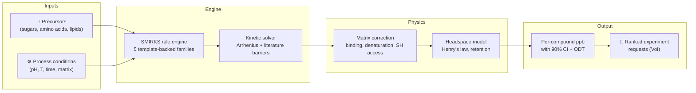

# Maillard

[](https://www.python.org/downloads/)
[](https://www.docker.com/)
[](https://opensource.org/licenses/Apache-2.0)
[](results/validation/prediction_uncertainty.md)
[](results/validation/family_implementation_status.md)

**Maillard** is a computational screening framework that predicts which combinations of
sugars, amino acids, temperatures, pH, and protein matrices will produce **meat-like aroma**
in plant-based formulations — and which will produce **off-notes** or **safety concerns** —
*before* you run a single wet-lab experiment.

Plant-based meat smells "beany" because the Maillard reactions that create real meat aroma
behave very differently inside a soy or pea protein matrix than in a free aqueous system.
Maillard maps 16 literature-derived chemistry lanes — **5 of them backed by generative
reaction templates**, the rest implemented as shared limbs, matrix/modifier layers or
literature priors ([which is which](results/validation/family_implementation_status.md)) —
corrects for how the plant matrix traps or releases each volatile, and tells you exactly where
its predictions are trustworthy, where they are directional, and **what experiment would
improve them most**.

> **Who is this for?** Alternative protein scientists who want to triage formulations before
> burning GC-MS time, and computational chemists who want a transparent, benchmarked platform
> for matrix-aware Maillard chemistry.

> **Read this first:** this repository underwent a two-day adversarial audit in August 2026
> that found — and fixed — serious problems, including circular validation and fabricated
> citations. The findings, the fixes, and the honest (worse) numbers that resulted are
> published in [AUDIT.md](AUDIT.md). The calibration claims below are the post-audit ones.

---

## How it works



**Inputs:** Choose your protein source (pea, soy, wheat gluten, mycoprotein, or 10 others),
precursors, and process conditions. **Engine:** The SMIRKS rule engine generates
atom-balanced reaction candidates for the 5 chemistry lanes that carry reaction templates
(core amino acid + sugar, lipid oxidation, thiamine, lipid x Maillard crosstalk, protein
damage markers); a kinetic solver ranks them using literature-calibrated Arrhenius
parameters. **Physics:** Matrix corrections account for
protein-volatile binding, denaturation, and accessibility; a headspace model applies Henry's
law partitioning and retention penalties. **Output:** Per-compound predicted concentrations
(ppb) with 90% confidence intervals, odour-activity ratios, and a ranked list of which
wet-lab experiment would reduce uncertainty the most.

---

## What the output looks like

This is the *Compound Confidence* table as `report.md` actually emits it — real columns,
real values, copied from a pea-isolate run at pH 5.5 / 105 °C / 45 min:

| Compound | Predicted | Tier | Score | Mode | Reachability | Calibration Source | Observable Assumption |
| :--- | :--- | :---: | ---: | :--- | :--- | :--- | :--- |
| Hexanal | 63.1 ppb [0.571-6.97e+03, 90% CI] | exploratory | 43.0 | hypothesis_only | chemically_reachable | Pratap-Singh 2021 pea isolate ambient slurry baseline | direct_binding_plus_ph_release_reference \| nearest_process_state \| standard_matrix_support |
| Nonanal | 18.7 ppb [0.169-2.07e+03, 90% CI] | exploratory | 43.0 | hypothesis_only | chemically_reachable | Pratap-Singh 2021 pea isolate ambient slurry baseline | static_class_profile \| class_level \| standard_matrix_support |
| furfural | 5.17 ppb [0.0468-571, 90% CI] | exploratory | 43.0 | hypothesis_only | chemically_reachable | Pratap-Singh 2021 pea isolate ambient slurry baseline (generic furan transfer) | static_class_profile \| class_level \| standard_matrix_support |
| CCCCCc1ccco1 | 13.1 ppb | exploratory | 43.0 | hypothesis_only | conditionally_reachable | class_fallback | static_class_profile \| class_level \| standard_matrix_support |

> **How to read this:** *Predicted* carries the 90 % Monte-Carlo interval inline; a compound
> with no interval had no envelope sampled. *Tier* is one of `high` / `medium` / `low` /
> `exploratory` — a band on the 0-100 *Score*, paired one-to-one with *Mode*
> (`benchmark_supported_quantitative` / `ranking_supported` / `directional_only` /
> `hypothesis_only`). *Reachability* says whether an enumerated pathway produces the
> compound or whether the number is a class-level projection. *Observable Assumption* is a
> pipe-joined triple: retention mode, calibration fallback mode, support origin. Compounds
> with no curated label appear by SMILES.
>
> Note the honesty of this example: every row is `exploratory`, because a pea-isolate matrix
> at 105 °C sits outside the free-precursor benchmark envelope. Wide intervals and low tiers
> are the normal output for matrix systems today — see the calibration section below.
>
> Two other tier vocabularies appear elsewhere in the same report and are **not** the same
> scale: `calibration_evidence_strength` (`literature_anchored` → `conditional_literature_anchored`
> → `class_anchored` → `directional_transferred` → `process_state_mismatch` → `heuristic`)
> grades the anchor behind a compound; `confidence_tier` (`high` / `medium_high` / `medium` /
> `medium_low` / `low`) grades a *literature prior* in `data/lit/`, not your run. §6 of every
> report defines all three side by side.

The full report also includes a compound confidence overlay chart, an intervention waterfall,
and provenance metadata linking every number to its literature source.


---

## How well calibrated is it?

We publish four orthogonal evidence surfaces rather than a single accuracy number — and
after an adversarial provenance audit (2026-08-26), we report calibration **split by signal
origin**, because an aggregate number quietly mixed literature-measured rows with internal
synthetic comparators.

### Headline: **2 of 11** evaluable literature-measured rows fall within the model's 90% CI — and the intervals are already ~3 orders of magnitude wide

| Signal origin | Inside 90% CI | Not evaluable* | Median CI width |
| --- | ---: | ---: | ---: |
| **External literature** (validation evidence) | **2/11** (18%) | 4 | 3.0 dex (~×1000 span) |
| **Internal synthetic** (reproducibility only — model vs its own frozen output) | 18/18 | 8 | 3.2 dex |

\* Degenerate near-zero-width envelopes: the Monte Carlo perturbs nothing on their path, so
pass/fail is meaningless and they are excluded from coverage.

**How to read this honestly:** coverage is only meaningful next to interval width — a 90% CI
spanning two or more orders of magnitude makes coverage cheap. This headline is the reverse of
the usual worry: the intervals *grew* to ~1000× and coverage still *fell* to 18%, which means
the point predictions moved further from the measurements than even those intervals allow. The
literature slice is now saying the model is wrong on the sulfur branch, and saying so loudly. The
internal-synthetic rows (26 of the 41 matched rows) are drift-detection harnesses, not
evidence, and are labeled as such throughout the pipeline. Four former panel benchmarks lost
their place in the audit because their cited sources are dead or resolve to unrelated papers:
three were deleted after source recovery confirmed no source exists (one was rebuilt from a
verified chapter and now fails honestly at 745×), and one was **quarantined**
([data/benchmarks/quarantined/](data/benchmarks/quarantined/)) — it carried the tightest
tolerance in the collection, 1.05×, and the model was landing inside it at 1.016×. The panel
and all artifacts were regenerated without them.

**Why this number fell — twice (2026-08-27):**

*First,* the projection layer was applying its Boltzmann selectivity term *twice* to the same
pathway span — once explicitly and once inside the pathway flux it multiplied by — so
competing volatiles were being discriminated at an effective temperature of T/2.19 with no
physical justification, and the volatile budget's temperature dependence came from a sigmoid
that saturated by 150 °C. Both were corrected and the budget's two free constants refit
against literature rows only
([results/validation/projection_constant_refit.md](results/validation/projection_constant_refit.md)).
Literature-row mean |log10 error| went 0.15 → 0.26 dex. That gap measures how much of the
previous agreement was being carried by the unphysical term.

*Then* a mechanism-level review of every reaction template found that the flagship compound,
2-methyl-3-furanthiol, was being made by a **fabricated one-step shortcut**, and that 93 % of
the emitted network was a lipid radical chain whose propagation rule matched any sp²
carbon — 61 of 103 peroxidation steps were chemistry that does not exist. The fabricated chain
was deleted (5500 → 369 steps) and MFT rebuilt on the accepted
1-deoxyosone → norfuraneol → MFT route (van den Ouweland & Peer 1975). **Absolute sulfur
yields fell 5–40×.** That is the entire cause of the calibration drop: the panel's previous
sulfur agreement was standing on chemistry that was not real.

The one surviving literature constraint on the sulfur branch (Hofmann 1998, after three
fabricated-source benchmarks were quarantined or deleted) was then used to refit the branch —
and the refit's finding is that **it does not work**: no barrier value anywhere in its
defensible range gets MFT closer than ~5.6× under, because the deficit is in how the volatile
budget is *allocated*, not in the barriers
([results/validation/sulfur_barrier_refit_hofmann.md](results/validation/sulfur_barrier_refit_hofmann.md)).
A single global scale on the budget *would* close it — the refit optimum sits 5× away and
would drop the Hofmann MFT residual to 0.05 dex — at the price of pushing furfural to ~19×
over. That constant was deliberately **not** moved
([results/validation/projection_constant_refit.md](results/validation/projection_constant_refit.md)).
We report the gap rather than absorbing it.

<table>
<tr>
<td width="33%" valign="top"><a href="docs/assets/validation_overview.png"></a><br/><sub><b>Parity.</b> Predicted vs. measured ppb across 16 benchmarks.</sub></td>
<td width="33%" valign="top"><a href="docs/assets/family_coverage.png"></a><br/><sub><b>Coverage.</b> Which of the 16 lanes are wired and evidence-backed.</sub></td>
<td width="33%" valign="top"><a href="results/validation/gap_heatmap.png"></a><br/><sub><b>Gaps.</b> Which experiments would close the largest blind spots.</sub></td>
</tr>
</table>

> **Figure staleness (2026-08-27):** the gap heatmap is current. The two LaTeX-rendered
> figures (`validation_overview.png`, `family_coverage.png`) are **stale** — regenerating
> them needs `dvipng`, which is not installed on the machine this wave ran on. The numeric
> tables above and every `.md`/`.json` artifact under `results/validation/` were regenerated
> and are current; where a figure and a table disagree, the table is right.

| Surface                       | Question                                                                 | Status                                                       |
| ----------------------------- | ------------------------------------------------------------------------ | ------------------------------------------------------------ |
| **Parity**              | On matched systems, how close is predicted ppb to measured?              | 16 benchmarks · 41 matched rows (15 literature, 26 internal-synthetic) · **0 strict-ready** |
| **External hold-out**   | On systems excluded from calibration, does the frozen model still cover? | 4 bundles · **2/5 on genuine extrapolations** (see note) · median 32.8× error |
| **Coverage**            | Which chemistry lanes are wired, and how?                                | 16 lanes wired · **5 with generative reaction templates** · 7 with DFT anchors |
| **Experiment priority** | Where would the next experiment improve confidence the most?             | 13/41 cells outside 90% CI — all queued                    |

> **On the external hold-out:** These 8 data points are genuinely excluded from calibration —
> the exclusion is code-enforced and was verified by adversarial audit. The honest reading:
> of the nominal 5/8 coverage, 3 come from bundles whose run conditions are copied from
> an in-panel benchmark, scored under a deliberately wide ±110× uncalibrated-tier prior
> (sized from in-panel leave-lane-out residuals, hold-out untouched) —
> a reproducibility comparison, not an extrapolation test. On the bundles at genuinely new
> process states (HME extrusion, roasting) the model is **2/5**, with misses up to ~2500×
> from the unbounded lipid-oxidation kinetics. Those two hits are the width of the interval,
> not the accuracy of the prediction: the median hold-out fold error is still ~33×, unchanged
> from when this line read 0/5 — only the prior widened (ln-sigma 2.0 → 2.86).
> Extreme-processing predictions should be
> treated as hypotheses, and the gap heatmap converts each miss into a ranked, bookable
> wet-lab request. Full methodology: [VALIDATION_CONTRACT.md §3E](docs/reference/VALIDATION_CONTRACT.md).

> **On literature provenance:** the kinetic anchors and benchmark values in this repo were
> ingested with heavy LLM assistance and are **not yet fully human-verified**. An automated
> audit (2026-08-26) found ~20% of registry DOIs unresolvable plus a class of live DOIs
> pointing at the wrong paper; three benchmarks were quarantined and every suspect anchor now
> carries an `audit_flag` in its registry entry. Treat kinetic parameters as provisional
> pending manual source verification — the remediation ledger is
> [tasks/audit_remediation.md](tasks/audit_remediation.md).

### When to trust the predictions

| Trust level                                  | Use for                                            | Example                                                         |
| -------------------------------------------- | -------------------------------------------------- | --------------------------------------------------------------- |
| **Moderate** — verify before deciding | Directional prioritisation and *relative* ranking  | Cys + ribose vs Cys + glucose; pea vs soy matrix comparisons; choosing what to test next |
| **Low** — exploratory only            | Hypothesis generation                              | Any absolute ppb figure; new protein sources without nearby benchmarks; extrusion claims |

**There is currently no "high" tier, and no benchmark in the panel is strict-ready
(0/16).** Free-precursor sulfur chemistry used to sit here as the high-confidence lane; after
the 2026-08-27 chemistry rebuild the model under-predicts MFT by ~5.6× on its one verified
sulfur benchmark and by 21–95× on the hydrolysate lanes, and the refit established that no
barrier value fixes it. What survives is **ordering**: the pentose ≫ hexose MFT constraint
still holds at 15.8× against a 3× floor, and the wheat ≫ soy hydrolysate ranking still holds.
Use the model to rank; do not use it to predict a concentration.

Full validation methodology: [VALIDATION_CONTRACT.md](docs/reference/VALIDATION_CONTRACT.md).
Regenerate all evidence artifacts: `./scripts/docker_maillard.sh summary`.

---

## The 16 chemistry lanes — and what is actually implemented

Maillard maps 16 chemistry lanes drawn from a systematic literature review. **They are not
16 implemented reaction mechanisms**, and the table below says which is which. Five lanes
carry generative reaction templates — the engine can enumerate atom-balanced steps for
them. The other eleven are real parts of the model, but they are shared limbs of another
lane, matrix/modifier layers that are not reaction chemistry at all, or literature priors
with no generative implementation yet.

The **Implementation** column is derived from the engine by enumeration, not asserted:
regenerate it with `python scripts/generators/generate_family_implementation_status.py`
([full detail](results/validation/family_implementation_status.md)). The generator fails if
the engine ever emits a reaction family the table does not classify.

| #  | Lane                          | Key compounds                     | Implementation                                | Evidence                 |
| -- | ----------------------------- | --------------------------------- | --------------------------------------------- | ------------------------ |
| 01 | Amino acid–sugar core        | MFT, FFT, methional, pyrazines    | 🧬 **20 reaction templates**                  | ⚠️ Benchmarked, failing 5.6–745× |
| 02 | Lipid oxidation & crosstalk   | Hexanal, 2-pentylfuran, nonanal   | 🧬 **5 reaction templates** (needs a hydroperoxide seed) | ⚠️ Benchmarked (intake lanes back-fitted) |
| 03 | Thiamine degradation          | MFT (via thiamine), thiazoles     | 🧬 **2 reaction templates**                   | ⚠️ Benchmarked, failing 3.2–745× |
| 04 | Nucleotide & ribose support   | IMP, GMP, umami precursors        | 📚 Priors only — ribose is a family-01 donor; nucleotides enumerate to nothing | 📐 Literature-calibrated |
| 05 | Glutathione & peptide support | GSH-derived sulfur volatiles      | 📚 Priors only — no GSH template; the `glutathione_cleavage` barrier is never reached | 📐 Literature-calibrated |
| 06 | Alternative protein matrices  | Matrix-specific modifiers         | 🧱 Matrix layer (`src/matrix_correction.py`) — not reaction chemistry | ⚠️ Benchmarked, failing 47–95× |
| 07 | Carbonyl donor hierarchy      | Sugar reactivity ranking          | 🎚️ Modifier on family 01 (`DONOR_REACTIVITY_MULTIPLIERS`) | 📐 Literature-calibrated |
| 08 | Off-notes & suppression       | Dicarbonyl traps, inhibitors      | 🎚️ Shares families 02/11; suppression is the intervention layer | ⚠️ Benchmarked, failing 6.4× |
| 09 | Caramelization & pyrolysis    | HMF, furfural                     | 🔗 Shares family 01's 1,2-enolisation limb    | ⚠️ Benchmarked, failing 3.9× |
| 10 | Fermentation pretreatment     | Free AA/nucleotide enrichment     | 🧱 Upstream modifier (`src/pre_processor.py`) | 📐 Literature-calibrated |
| 11 | Lipid–Maillard crosstalk     | MFT quenching by aldehydes        | 🧬 **3 reaction templates**                   | 🧮 DFT-queued |
| 12 | Protein damage markers        | CML, CEL, furosine, lysinoalanine | 🧬 **4 reaction templates**                   | ⚠️ Benchmarked, failing 201–1204× |
| 13 | Polyphenol–amino capping     | Quinone–thiol trapping           | 📚 Priors only — the quinone/cysteine prior is parked, nothing routes it | 🧮 DFT-queued |
| 14 | Ascorbic acid Maillard        | Dicarbonyl source, crosslinks     | 📖 Curated layer only (an ascorbate prior on a curated step) | 🧮 DFT-queued |
| 15 | PE stealth sugar sink         | Phospholipid glycation            | 📚 Priors only — the PE headgroup enumerates to nothing | 🧮 DFT-queued |
| 16 | Melanoidin polymerization     | Thiol scavenging                  | 🧱 Trapping factor in `src/recommend.py` — not reaction chemistry | 🧮 DFT-queued |

🧬 = generative reaction templates &emsp; 🔗 = shares another lane's templates &emsp;
🎚️ = modifier on another lane &emsp; 🧱 = matrix / process layer, not reaction chemistry &emsp;
📖 = curated layer only &emsp; 📚 = literature priors only

⚠️ = has quantitative benchmark rows, and currently MISSES them by the stated factor
(0/16 benchmarks are strict-ready — see the calibration section above) &emsp;
📐 = literature-calibrated priors, no dedicated benchmark &emsp;
🧮 = computational closure in progress (xTB → DFT queue)

The ✅ that used to sit in this column was retired on 2026-08-27: after the chemistry
rebuild no lane has a passing quantitative benchmark, so "benchmark-validated" would have
been a claim the panel no longer supports. The failures are shown rather than removed.

**Two entry-point facts the table cannot show.** The lipid radical chain runs only from a
*hydroperoxide*: an unoxidised fatty acid plus O₂ enumerates to **zero** steps, so in
production the chain is seeded by the lipid-oxidation anchor rather than by the network. And
the thiamine cascade matches thiamine by exact canonical SMILES and a ≥ 100 °C gate — a
differently written thiamine SMILES silently produces nothing.

Full literature basis: [docs/slr_benchmark_evaluation.md](docs/slr_benchmark_evaluation.md) (76 peer-reviewed papers evaluated against an 8-criterion quality checklist).

---

## Guiding experiments: what to measure next

Maillard doesn't just predict — it tells you which experiment would improve its predictions
the most, using a **Value of Information (VoI)** framework that ranks compounds by:
uncertainty × sensory impact.


**How to read the heatmap:** Each cell is a benchmark × compound combination. Bright cells
are high-value: the model is uncertain *and* the compound matters for sensory quality.
Dark cells are already well-calibrated.

### The highest-value missing experiment

The single experiment that would close the most gaps is a **quantitative PPI/SPI meaty-positive
benchmark** — pea and soy protein isolates with ribose + cysteine, measuring both desirable
sulfur targets and adverse off-flavour markers in the same GC-MS run:

- Full protocol: [PPI_SPI_PRIMARY_BENCHMARK_PROTOCOL.md](docs/protocols/PPI_SPI_PRIMARY_BENCHMARK_PROTOCOL.md)
- Ranked experiment requests: [experiment_value_ranking.md](results/validation/experiment_value_ranking.md)

---

## Getting started

### Prerequisites

- [Docker](https://www.docker.com/products/docker-desktop/) (recommended) or Python 3.12 with conda
- Git

### Install and boot

```bash
git clone https://github.com/PabloAMC/Maillard.git
cd Maillard
./scripts/docker_maillard.sh up && ./scripts/docker_maillard.sh bootstrap
```

### Step 1 — Predict your formulation (forward mode)

Forward mode scores **exactly** the formulation you type — every precursor, ratio,
temperature and time you pass is honoured:

```bash
./scripts/docker_maillard.sh run "python scripts/run_pipeline.py \
  --sugars ribose,glucose \
  --amino-acids cysteine,leucine \
  --ratios ribose:0.5,glucose:0.2,cysteine:0.2,leucine:0.1 \
  --ph 5.5 --temp 105 --time-minutes 45 \
  --protein-type pea_iso \
  --report --output-dir results/first_run"
```

Open `results/first_run/report.md` for the full analysis.

### Step 2 — Screen the candidate space (inverse design)

Adding `--target TAG` switches to **inverse design**: the tool screens the 15-entry grid in
`data/formulation_grid.yml` and ranks candidates for that sensory tag. Your own formulation
is entered as one extra candidate (`Your formulation (custom)`) when you supply precursors:

```bash
./scripts/docker_maillard.sh run "python scripts/run_pipeline.py \
  --sugars ribose,glucose \
  --amino-acids cysteine,leucine \
  --ratios ribose:0.5,glucose:0.2,cysteine:0.2,leucine:0.1 \
  --ph 5.5 --temp 105 --time-minutes 45 \
  --protein-type pea_iso \
  --target meaty --minimize beany \
  --report --output-dir results/first_screen"
```

The grid entries carry their own precursors and ratios, so `--ratios` and `--time-minutes`
apply only to your own candidate. If a grid entry wins the screen, the report describes
**that entry**, not the recipe you typed — the CLI says which, and §1 of `report.md` lists
the formulation that was actually evaluated. Use forward mode (Step 1) when you want a
report about your own recipe.

### Step 3 — Optimise & compare

Auto-search concentrations and process conditions over 50 Bayesian iterations. The search
space is class-based (one concentration knob per amino-acid class, in mM), and the winning
trial is re-scored as the formulation it actually described:

```bash
./scripts/docker_maillard.sh run "python scripts/optimize_formulation.py \
  --sugars ribose,glucose --amino-acids cysteine,leucine \
  --target-tag meaty --minimize-tag beany \
  --protein-type pea_iso --n-iterations 50"
```

Or run the built-in quickstart comparison:

```bash
./scripts/docker_maillard.sh quickstart
```


### Step 4 — Ingest lab results & close the loop

When your GC-MS results come back, normalise them into the matrix intake contract. Every
flag below is required (values may instead come from columns/metadata in your file);
`--water-activity`, `--time-min` and `--source-reference` are the ones usually forgotten:

```bash
./scripts/docker_maillard.sh ingest \
  --file path/to/my_results.csv \
  --protein-type pea_iso \
  --process-state extrusion_structured \
  --temp-c 105 --ph 5.5 \
  --water-activity 0.85 --time-min 45 \
  --source-reference "Internal run 2026-08, GC-MS/SIDA" \
  --precursor cysteine=15.0 \
  --precursor glucose=30.0 \
  --confirm
```

Without `--confirm` this is a preview: preview and support-delta artifacts are written to
`results/ingest_previews/` and nothing under `results/validation/` is touched. With
`--confirm` the canonical intake YAML is written into `results/validation/` — **one YAML
file**. It does *not* rebuild the benchmark panel and does *not* regenerate validation
artifacts; run `./scripts/docker_maillard.sh summary` (and the other generators) for that.

Full quickstart guide: [QUICKSTART.md](docs/guides/QUICKSTART.md). Glossary for non-computational scientists: [GLOSSARY.md](docs/guides/GLOSSARY.md).

---

<details>
<summary><b>Computational methods under the hood</b></summary>

### Reaction enumeration

The SMIRKS rule engine (`src/smirks_engine.py`) generates deterministic, atom-balanced reaction
candidates from precursor sets. The chemistry surface is explicit and inspectable — if the
reaction graph is not coherent, no later scoring is trustworthy.

### Kinetics

Literature-calibrated Arrhenius parameters (Schiff base 15 kcal/mol → enolisation 28 kcal/mol;
anchored to Hofmann, Martins, Nursten) drive laptop-speed FAST screening in < 1 second.
A Cantera ODE solver is available for temporal profiles and mechanism debugging.

### Matrix physics

Accessibility corrections model how protein denaturation, sulfhydryl availability, and pH
alter precursor reactivity in structured plant matrices. Volatile retention factors
(non-covalent binding to denatured proteins) and Henry's law headspace partitioning translate
beaker-chemistry yields into what a sensory panel would actually perceive.

### Uncertainty quantification

Monte Carlo propagation across the full benchmark panel produces per-compound 90% confidence
intervals. Each prediction carries a `tier` (`high` / `medium` / `low` / `exploratory`, a band
on a 0-100 confidence score) paired with a `prediction_mode`, plus a
`calibration_evidence_strength` naming the kind of anchor behind it (`literature_anchored`,
`conditional_literature_anchored`, `class_anchored`, `directional_transferred`,
`process_state_mismatch`, `heuristic`). Both propagate through the pipeline and surface in
every report, and both are demoted one notch when a run falls outside the calibrated scope.

### Selective quantum chemistry (xTB → DFT)

For high-value rate-limiting steps, GFN2-xTB identifies kinetically viable pathways (pathfinder,
not a barrier authority). Final barriers come from DFT (r2SCAN-3c/def2-svp + ddCOSMO implicit
water via PySCF/Sella). See the [Computational Gap Runbook](docs/guides/COMPUTATIONAL_GAP_RUNBOOK.md)
for the current queue and copy-paste commands.

### Key dependencies

RDKit (reaction enumeration), Cantera (ODE kinetics), PySCF + Sella (DFT refinement),
xtb (pathfinding), MACE (ML potentials), NumPy/SciPy (numerics), Matplotlib (figures).

### Supported protein matrices

14 protein sources are registered with endogenous composition profiles and matrix correction
factors: pea isolate, pea concentrate, soy isolate, soy concentrate, wheat gluten, mycoprotein,
chickpea, lentil, faba bean, oat, potato, sunflower, spirulina, and yeast extract.
Pea and soy have the strongest literature backing; others are directional.

</details>

---

## Where to look next

| If you are a…                                          | Start with                                                                                                                                 |
| ------------------------------------------------------- | ------------------------------------------------------------------------------------------------------------------------------------------ |
| **Food scientist** — first run                   | [QUICKSTART.md](docs/guides/QUICKSTART.md)                                                                                                    |
| **Scientist** — understanding the output         | [GLOSSARY.md](docs/guides/GLOSSARY.md)                                                                                                        |
| **Reviewer** — auditing what is verified         | [VALIDATION_CONTRACT.md](docs/reference/VALIDATION_CONTRACT.md) → [results/validation/](results/validation/)                                    |
| **Experimentalist** — closing the gaps           | [PPI_SPI protocol](docs/protocols/PPI_SPI_PRIMARY_BENCHMARK_PROTOCOL.md) → [experiment ranking](results/validation/experiment_value_ranking.md) |
| **Maintainer** — extending the chemistry         | [architecture.md](docs/architecture.md) → [SMIRKS_SYSTEM.md](docs/reference/SMIRKS_SYSTEM.md)                                                   |
| **QM operator** — running the DFT queue          | [COMPUTATIONAL_GAP_RUNBOOK.md](docs/guides/COMPUTATIONAL_GAP_RUNBOOK.md)                                                                      |
| **Literature curator** — ingestion & calibration | [data/lit/README.md](data/lit/README.md)                                                                                                      |
| **New contributor**                               | [CONTRIBUTING.md](CONTRIBUTING.md)                                                                                                            |

---

## Citation

If you use Maillard in your research, please cite:

```
Moreno Casares, P. A. (2026). Maillard: Computational screening for meat-like
Maillard chemistry in plant-based protein matrices. GitHub repository.
https://github.com/PabloAMC/Maillard
```

## License

[Apache 2.0](LICENSE)
