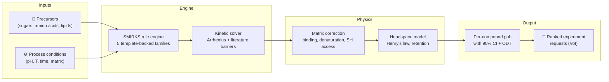

# Maillard

[](https://www.python.org/downloads/)
[](https://www.docker.com/)
[](https://opensource.org/licenses/Apache-2.0)
[](results/validation/prediction_uncertainty.md)
[](results/validation/family_implementation_status.md)

**Maillard** is a computational screening framework that predicts which combinations of
sugars, amino acids, temperatures, pH, and protein matrices will produce **meat-like aroma**
in plant-based formulations — and which will produce **off-notes** or **safety concerns** —
*before* you run a single wet-lab experiment.

Plant-based meat smells "beany" because the Maillard reactions that create real meat aroma
behave very differently inside a soy or pea protein matrix than in a free aqueous system.
Maillard maps 16 literature-derived chemistry lanes — **5 of them backed by generative
reaction templates**, the rest implemented as shared limbs, matrix/modifier layers or
literature priors ([which is which](results/validation/family_implementation_status.md)) —
corrects for how the plant matrix traps or releases each volatile, and tells you exactly where
its predictions are trustworthy, where they are directional, and **what experiment would
improve them most**.

> **Who is this for?** Alternative protein scientists who want to triage formulations before
> burning GC-MS time, and computational chemists who want a transparent, benchmarked platform
> for matrix-aware Maillard chemistry.

> **Read this first:** this repository underwent a two-day adversarial audit in August 2026
> that found — and fixed — serious problems, including circular validation and fabricated
> citations. The findings, the fixes, and the honest (worse) numbers that resulted are
> published in [AUDIT.md](AUDIT.md). The calibration claims below are the post-audit ones.

---

## How it works



**Inputs:** Choose your protein source (pea, soy, wheat gluten, mycoprotein, or 10 others),
precursors, and process conditions. **Engine:** The SMIRKS rule engine generates
atom-balanced reaction candidates for the 5 chemistry lanes that carry reaction templates
(core amino acid + sugar, lipid oxidation, thiamine, lipid x Maillard crosstalk, protein
damage markers); a kinetic solver ranks them using literature-calibrated Arrhenius
parameters. **Physics:** Matrix corrections account for
protein-volatile binding, denaturation, and accessibility; a headspace model applies Henry's
law partitioning and retention penalties. **Output:** Per-compound predicted concentrations
(ppb) with 90% confidence intervals, odour-activity ratios, and a ranked list of which
wet-lab experiment would reduce uncertainty the most.

---

## What the output looks like

This is the *Compound Confidence* table as `report.md` actually emits it, **regenerated by
running the tool** — `scripts/generators/generate_report_visual_examples.py`, which drives the
same forward-mode entry point as the documented CLI (ribose + cysteine + leucine, pea isolate,
pH 5.5 / 105 °C / 45 min). Copy it from a run, never by hand:

| Compound | Predicted | Tier | Score | Mode | Reachability | Calibration Source | Observable Assumption |
| :--- | :--- | :---: | ---: | :--- | :--- | :--- | :--- |
| furfural | 0.102 ppb [0.000922-11.3, 90% CI] | exploratory | 43.0 | hypothesis_only | chemically_reachable | Pratap-Singh 2021 pea isolate ambient slurry baseline (generic furan transfer) | static_class_profile \| class_level \| standard_matrix_support |
| 2-furfurylthiol | 0.00305 ppb [2.76e-05-0.337, 90% CI] | exploratory | 33.0 | hypothesis_only | chemically_reachable | Interpolated base sulfur yield matching internal benchmark limits | sulfur_binding_prior \| class_level \| standard_matrix_support |
| 2,5-dimethylpyrazine | 0.00234 ppb [2.71e-06-0.259, 90% CI] | exploratory | 43.0 | hypothesis_only | chemically_reachable | Interpolated base pyrazine yield matching internal benchmark limits | pyrazine_binding_prior \| class_level \| standard_matrix_support |
| 2-methyl-3-furanthiol | 0.00163 ppb [6.91e-06-0.18, 90% CI] | exploratory | 33.0 | hypothesis_only | chemically_reachable | Interpolated base sulfur yield matching internal benchmark limits | sulfur_binding_prior \| class_level \| standard_matrix_support |
| 3-methylbutanal | 0.00111 ppb | exploratory | 43.0 | hypothesis_only | chemically_reachable | Pratap-Singh 2021 pea isolate ambient slurry baseline (generic aldehyde transfer) | static_class_profile \| class_level \| standard_matrix_support |

> **This table used to be fabricated, and the fix is worth reading.** Until 2026-08-27 the
> generator behind these figures built its `FormulationResult` objects from hard-coded
> numbers and never touched the model. It announced *"DECISION CONFIDENCE: HIGH_CONFIDENCE
> (82/100)"* and *"SCIENTIFIC ENVELOPE: TRUSTED"* while this README said there is no "high"
> tier — and it attributed the two flagship thiols to the *Pratap-Singh soy-vs-pea ambient
> slurry* anchor, which contains no sulfur chemistry at all and is now labelled
> `fitted_to_benchmark`. Because the numbers were invented, the tracked figures dated from
> May and had survived every recalibration since: the one artifact guaranteed never to show a
> regression. It now runs the pipeline, so the showcase moves when the model does.

> **How to read this:** *Predicted* carries the 90 % Monte-Carlo interval inline; a compound
> with no interval had no envelope sampled. *Tier* is one of `high` / `medium` / `low` /
> `exploratory` — a band on the 0-100 *Score*, paired one-to-one with *Mode*
> (`benchmark_supported_quantitative` / `ranking_supported` / `directional_only` /
> `hypothesis_only`). *Reachability* says whether an enumerated pathway produces the
> compound or whether the number is a class-level projection. *Observable Assumption* is a
> pipe-joined triple: retention mode, calibration fallback mode, support origin. Compounds
> with no curated label appear by SMILES.
>
> Note the honesty of this example: every row is `exploratory`, because a pea-isolate matrix
> at 105 °C sits outside the free-precursor benchmark envelope. Wide intervals and low tiers
> are the normal output for matrix systems today — see the calibration section below.
>
> Two other tier vocabularies appear elsewhere in the same report and are **not** the same
> scale: `calibration_evidence_strength` (`literature_anchored` → `conditional_literature_anchored`
> → `class_anchored` → `directional_transferred` → `process_state_mismatch` → `heuristic`)
> grades the anchor behind a compound; `confidence_tier` (`high` / `medium_high` / `medium` /
> `medium_low` / `low`) grades a *literature prior* in `data/lit/`, not your run. §6 of every
> report defines all three side by side.

The full report also includes a compound confidence overlay chart, an intervention waterfall,
and provenance metadata linking every number to its literature source.


---

## How well calibrated is it?

We publish four orthogonal evidence surfaces rather than a single accuracy number — and
after an adversarial provenance audit (2026-08-26), we report calibration **split by signal
origin**, because an aggregate number quietly mixed literature-measured rows with internal
synthetic comparators.

### Headline: **1 of 3** evaluable literature rows falls within the model's 90% CI — and 3 populations that used to be pooled are now reported apart

| Population | Inside 90% CI | Not evaluable\* | Median CI width | Is it evidence? |
| --- | ---: | ---: | ---: | --- |
| **External literature** | **1/3** (33%) | 4 | 0.86 dex | **Yes — this is the only row that is** |
| **Fitted rows** (constants back-solved from the benchmark) | 2/2 | 0 | 2.32 dex | No — algebraic recovery |
| **Internal synthetic** (model vs its own frozen output) | 18/18 | 8 | 3.77 dex | No — reproducibility harness |

\* Degenerate near-zero-width envelopes: the Monte Carlo perturbs nothing on their path, so
pass/fail is meaningless and they are excluded from coverage.

**The `fitted rows` line is new (2026-08-27) and it is the whole point of the split.** Both of
its hits would previously have been counted as literature evidence — and in the immediately
preceding revision of this README, they *were*: they were the only two hits in a headline that
read "2 of 11 literature rows". A constant solved from a benchmark reproduces that benchmark.
Those rows are now removed from the literature numerator **and** denominator, which is why the
denominator fell from 11 to 3, and `scripts/ci/fit_target_gate.py` makes undisclosed
fit-then-score a build failure. The panel itself also shrank from 16 benchmarks to **14**: two
more were quarantined as fabricated (see [AUDIT.md](AUDIT.md), Round 2).

**And the benchmark-level count, split the same way:** of 14 benchmarks, the ones without
blocking coverage or ranking gaps are **0 of 6 predictive**, 1 of 4 fit-recovery, and 4 of 4
internal-synthetic. The 5/14 aggregate is retained in
[benchmark_summary.md](results/validation/benchmark_summary.md) only for continuity with older
reports; **every one of those five sits in a non-evidence bucket.**

> **Fit-recovery fell 3/4 → 1/4 on 2026-08-27 (Wave K/M), and it is the most instructive
> number on this page.** The two Pratap-Singh ambient-slurry benchmarks used to score max
> ratio 1.002× and 1.001× — textbook algebraic recovery, since their observability factors
> were back-solved from their own measured hexanal. Wave K then read the actual paper
> (Molecules 2021, 26, 4104, Table 1, via Europe PMC): the measured hexanal is **1138.00**
> ppb for pea and **1621.71** ppb for soy, not the 260 / 380 this repository had recorded,
> and the hexanol rows (80 / 120 ppb) were reported by the paper as **n.d.** With the
> corrected references the two lanes now miss by **4.37×** and **4.27×** — exactly the size
> of the transcription error, because the constants still reproduce the wrong number they
> were solved from. **A fit-recovery that no longer recovers is the cleanest possible proof
> that the recovery was never evidence.** The observability factors were deliberately NOT
> refitted here (see [AUDIT.md](AUDIT.md), Round 3): refitting them in the same pass as a
> chemistry change would make the resulting agreement unattributable.

**How to read this honestly:** coverage is only meaningful next to interval width — a 90% CI
spanning two or more orders of magnitude makes coverage cheap. This headline is the reverse of
the usual worry: the intervals *grew* — and coverage still *fell*, most recently from 2/11 to
1/3 when the fitted rows were pulled out of both sides. The point predictions moved further
from the measurements than even those intervals allow, and the literature slice's own interval
is the *narrowest* of the three (0.86 dex, a factor of ~7 end to end), so its 1/3 is the one
number here that is not cheap. The
literature slice is now saying the model is wrong on the sulfur branch, and saying so loudly. The
internal-synthetic rows (26 of the 35 matched rows in the Monte-Carlo panel) are
drift-detection harnesses, not
evidence, and are labeled as such throughout the pipeline. Four former panel benchmarks lost
their place in the audit because their cited sources are dead or resolve to unrelated papers:
three were deleted after source recovery confirmed no source exists (one was rebuilt from a
verified chapter and now fails honestly at 773×), and one was **quarantined**
([data/benchmarks/quarantined/](data/benchmarks/quarantined/)) — it carried the tightest
tolerance in the collection, 1.05×, and the model was landing inside it at 1.016×. The panel
and all artifacts were regenerated without them.

**Why this number fell — twice (2026-08-27):**

*First,* the projection layer was applying its Boltzmann selectivity term *twice* to the same
pathway span — once explicitly and once inside the pathway flux it multiplied by — so
competing volatiles were being discriminated at an effective temperature of T/2.19 with no
physical justification, and the volatile budget's temperature dependence came from a sigmoid
that saturated by 150 °C. Both were corrected and the budget's two free constants refit
against literature rows only
([results/validation/projection_constant_refit.md](results/validation/projection_constant_refit.md)).
Literature-row mean |log10 error| went 0.15 → 0.26 dex *from the Boltzmann de-duplication
alone*. That gap measures how much of the previous agreement was being carried by the
unphysical term.

> **Corrected 2026-08-27.** The sentence above used to be the whole story, and it stopped
> at the flattering number. 0.26 dex was measured *before* the chemistry rebuild described
> next; it was never the shipped state. At the shipped constants,
> [results/validation/projection_constant_refit.md](results/validation/projection_constant_refit.md)
> records a literature-row objective of **0.96 dex** (0.74 dex before the 2026-08-27 Wave N
> route correction and the Wave K/M benchmark content corrections; the objective is worse
> because the *references* got more accurate, not because the model changed) — nearly four
> times the figure this README was quoting, and six times the 0.15 it started from. The
> degradation was **larger** than stated. (The fit optimum the repository declines to apply
> sits at 0.94 dex, i.e. the refit buys almost nothing: tau_ref is a single global scale and
> cannot fix an allocation problem.) The regenerated coverage numbers are in the section above.

*Then* a mechanism-level review of every reaction template found that the flagship compound,
2-methyl-3-furanthiol, was being made by a **fabricated one-step shortcut**, and that 93 % of
the emitted network was a lipid radical chain whose propagation rule matched any sp²
carbon — 61 of 103 peroxidation steps were chemistry that does not exist. The fabricated chain
was deleted (5500 → 369 steps) and MFT rebuilt on a mechanistic
1-deoxyosone → furanone → MFT route. **Absolute sulfur
yields fell 5–40×.** That is the entire cause of the calibration drop: the panel's previous
sulfur agreement was standing on chemistry that was not real.

*And then the replacement route turned out to be wrong too (2026-08-27, Wave N).* The
norfuraneol intermediate was taken from van den Ouweland & Peer 1975
(`10.1021/jf60199a045`) — a real paper, correctly cited, describing a genuine **synthesis**
of MFT from norfuraneol and H₂S. It is not the in-situ Maillard route. Cerny & Davidek 2003
(`10.1021/jf026123f`) spiked authentic norfuraneol into a [¹³C₅]ribose/cysteine system and
the MFT came out **mainly ¹³C₅-labelled**, i.e. from the ribose and not from the spike:
"4-hydroxy-5-methyl-3(2H)-furanone is unimportant as an intermediate". Cerny & Davidek 2004
(`10.1021/jf035265m`) confirmed the real intermediate positionally with [1-¹³C]ribose:
**1,4-dideoxypento-2,3-diulose**. Hofmann & Schieberle 1998 say the same thing in their own
abstract — norfuraneol/cysteine is among the *less* effective MFT precursors. The route was
replaced with the isotope-evidenced one (`Deoxyosone_Reduction` + `Thiol_Addition_Pentodiulose`;
norfuraneol is retained as a real furanone product, just not in the MFT lane). Evidence
dossier: [docs/validation/isotope_topology_evidence.md](docs/validation/isotope_topology_evidence.md).

**The Hofmann agreement got worse, and that is the honest number.** MFT went 235.32 → **151.87
ppb** against a 342 ppb reference (**1.45× under → 2.25× under**) and FFT 219.96 → **243.72**
against 200 (1.10× over → **1.22× over**). Nothing was tuned to claw it back. The 1.45× had
been bought with `thiol_addition_norfuraneol` = 26.85 kcal/mol, a barrier Wave H fitted
*through the contradicted route*; its replacement ships at the un-fitted sulfur-addition class
value 28.60, explicitly unconstrained. **A worse number obtained through a route the isotope
literature supports is worth more than a better number obtained through one it refutes.**

The one surviving literature constraint on the sulfur branch (Hofmann 1998, after three
fabricated-source benchmarks were quarantined or deleted) was used to refit the branch —
and the refit's finding was that **it does not work**: no barrier value anywhere in its
defensible range closed the gap, because the deficit is in how the volatile
budget is *allocated*, not in the barriers
([results/validation/sulfur_barrier_refit_hofmann.md](results/validation/sulfur_barrier_refit_hofmann.md)
— **that record is now stale**: it profiles `thiol_addition_norfuraneol`, the family Wave N
retired, and re-running it is an open owner item).
A single global scale on the budget *would* close it — the refit optimum sits **2.51×** away
and would drop the Hofmann MFT residual from 0.35 dex to 0.05 dex — at the price of pushing
Resconi furfural from 4.6× to **11.4× over** and FFT from 1.22× to ~3.1× over. That constant
was deliberately **not** moved
([results/validation/projection_constant_refit.md](results/validation/projection_constant_refit.md)).
We report the gap rather than absorbing it.

<table>
<tr>
<td width="33%" valign="top"><a href="docs/assets/validation_overview.png"></a><br/><sub><b>Parity.</b> Predicted vs. measured ppb across the 14-benchmark panel.</sub></td>
<td width="33%" valign="top"><a href="docs/assets/family_coverage.png"></a><br/><sub><b>Coverage.</b> Which of the 16 lanes are wired and evidence-backed.</sub></td>
<td width="33%" valign="top"><a href="results/validation/gap_heatmap.png"></a><br/><sub><b>Gaps.</b> Which experiments would close the largest blind spots.</sub></td>
</tr>
</table>

> **Figures (updated 2026-08-27):** all figures on this page are now current. They had been
> stale since May because `configure_science_plot_style()` raised a `RuntimeError` whenever
> `dvipng` was absent — which is the state of the documented conda environment, so the
> documented path could not produce a report at all. It now falls back to matplotlib's
> `mathtext` renderer with a one-time warning; set `MAILLARD_STRICT_LATEX=1` to restore the
> hard failure for CI figure jobs that must have real LaTeX. Glyphs are typeset by mathtext
> rather than LaTeX until `dvipng` is installed; the numbers are unaffected.

| Surface                       | Question                                                                 | Status                                                       |
| ----------------------------- | ------------------------------------------------------------------------ | ------------------------------------------------------------ |
| **Parity**              | On matched systems, how close is predicted ppb to measured?              | **14** benchmarks · MC panel covers **11** of them, **35 matched rows** · **0 strict-ready** · **0/6 predictive benchmarks without blocking gaps** |
| **External hold-out**   | On systems excluded from calibration, does the frozen model still cover? | 4 bundles · **1/5 on genuine extrapolations** at the pre-widening prior (2/5 only via the wider one) · median **15.31×** error, worst **2474×** |
| **Coverage**            | Which chemistry lanes are wired, and how?                                | 16 lanes wired · **5 with generative reaction templates** · 7 with DFT anchors |
| **Experiment priority** | Where would the next experiment improve confidence the most?             | 6/35 MC cells outside 90% CI — all queued                    |

> **On the external hold-out — read this before the number above.** The 8 points are
> genuinely excluded from calibration; the exclusion is code-enforced and survived an
> adversarial leak hunt. Everything else about them needs qualifying.
>
> **Genuine-extrapolation coverage is 1 of 5 at the prior this project shipped for most of
> its life (ln-sigma 2.0).** The 2/5 quoted elsewhere is the *same predictions* re-scored
> after the prior was widened to ln-sigma 2.86 on 2026-08-26. Nothing about the model
> changed between those two numbers — only the width of the interval drawn around it. The
> median hold-out fold error is 15.31×, which is why that is the figure to track.
> The report now computes both and leads with the pre-widening one.
>
> **That 0 of 5 became 1 of 5, and the median halved from 32.79×, because a reference was
> corrected — not because the model improved (2026-08-27, Wave K/M).** Two of the four Li
> 2026 hold-out points had been transcribed from the wrong table rows: 2-pentylfuran was the
> paper's *Maltol* row (221.5 ppb; the true value is **5625.80**) and nonanal was its
> *Decanal* row (29.42 ppb; the true value is **72.66**). With the paper's own numbers the
> 2-pentylfuran point goes from **49.8× over to 1.96× over** and nonanal from 673× to 273×.
> The predictions are byte-identical. Verified against the Europe PMC full text
> (PMC12984281); every corrected row carries a `content_correction_note`.
>
> **Only 5 of the 8 points test extrapolation at all.** The other 3 come from bundles whose
> run conditions are copied from an in-panel benchmark: those are reproducibility
> comparisons. On the bundles at genuinely new process states (HME extrusion, roasting) the
> misses still reach ~2500×, from unbounded lipid-oxidation kinetics — the reference
> correction removed one large miss, it did not remove the failure mode.
>
> **And only 4 of the 8 are measurements.** Two are geometric midpoints of 10–12× reported
> bands — a number we constructed, not one anybody measured — and two are the source's
> odour-activity value multiplied by *this repository's own* hexanal odour threshold, which
> is itself compilation-level and never verified against a primary table. Those two move if
> we correct our own constant, so they are a consistency check, not external evidence. Every
> row now carries its `value_provenance` and the report renders the split.
>
> **On the ±110× band itself (corrected 2026-08-27):** until this date the sampler clamped
> every multiplier at ±100×, so 10.7 % of Monte-Carlo draws were pinned at the clamp and the
> realised band was ±100×, not the ±110× advertised. The clamp is now derived from the sigma
> at 3σ and truncates 0.27 % of draws, so the sigma finally expresses what it claims.
>
> Extreme-processing predictions should be treated as hypotheses, and the gap heatmap
> converts each miss into a ranked, bookable wet-lab request. Full methodology:
> [VALIDATION_CONTRACT.md §3E](docs/reference/VALIDATION_CONTRACT.md).

> **On literature provenance:** the kinetic anchors and benchmark values in this repo were
> ingested with heavy LLM assistance and are **not yet fully human-verified**. An automated
> audit (2026-08-26) found ~20% of registry DOIs unresolvable plus a class of live DOIs
> pointing at the wrong paper; five benchmarks are now quarantined and every suspect anchor
> carries an `audit_flag` in its registry entry. **102 records are marked
> `no_verifiable_source`** (measured 2026-08-27 across every tracked JSON and YAML file,
> including nested records), of which **80 carry numeric payloads** and **62 of those are
> consumed at runtime**.
>
> That count was **84 / 62 earlier the same day, and it rose because the repository got more
> honest, not because anything got worse.** `data/qm/` was excluded from every sweep this
> repo has ever run — not by choice, but because `.gitignore` hid the directory from git
> entirely. Tracking it (2026-08-27) exposed 18 barrier windows and claimed
> quantum-chemistry values that carried **no citation, no run record and no provenance of
> any kind**, and labelling them honestly is what moved 84 → 102. None of those 18 reach the
> model: `data/qm/` is read only by a loader test and by the skip-heavy Phase 3 authority
> lane, so the runtime figure stays at **62**. Treat kinetic parameters as provisional
> pending manual source verification — the remediation ledger is
> [tasks/audit_remediation.md](tasks/audit_remediation.md).
>
> **What the citation gate can and cannot do.** `scripts/ci/citation_gate.py` is blocking and
> reports **0 dead DOIs and 0 waivers** as of the 2026-08-26 and 2026-08-27 sweeps. But it is
> **structural and offline** — DOI grammar, confabulation signatures, status coherence,
> repair-record completeness — and it *cannot* tell that a live, correctly-resolving DOI
> points at a paper describing a different experiment. That is exactly how two fabricated
> benchmarks survived every check until a human read the paper (see
> [AUDIT.md](AUDIT.md), Round 2). DOI **liveness** is a scheduled weekly sample, advisory,
> not part of the required set.

### When to trust the predictions

| Trust level                                  | Use for                                            | Example                                                         |
| -------------------------------------------- | -------------------------------------------------- | --------------------------------------------------------------- |
| **Moderate** — verify before deciding | Directional prioritisation and *relative* ranking  | Cys + ribose vs Cys + glucose; pea vs soy matrix comparisons; choosing what to test next |
| **Low** — exploratory only            | Hypothesis generation                              | Any absolute ppb figure; new protein sources without nearby benchmarks; extrusion claims |

**There is currently no "high" tier, and no benchmark in the panel is strict-ready
(0/14).** Free-precursor sulfur chemistry used to sit here as the high-confidence lane; after
the 2026-08-27 chemistry rebuild and the Wave N route correction the model under-predicts MFT
by **2.25×** on its one verified
sulfur benchmark and by 21–95× on the hydrolysate lanes, and the refit established that no
barrier value fixes it. What survives is **ordering** — but read the size of it carefully, because the README
previously quoted a number that no longer holds and attributed it to the wrong thing. Measured
on the current tree (2026-08-27, after Wave N): the pentose ≫ hexose MFT constraint holds at
**3.39×** (ribose 370.3 ppb vs glucose 109.3 ppb at matched conditions). It has now been
published at 15.8×, then **8.98**×, and now 3.39× — each fall a support being removed, none of
them a model change. More importantly, **almost none of that separation is structural.** Zero
the 1.05 kcal/mol gap between `thiol_addition_hexose` (29.65) and
`thiol_addition_pentodiulose` (28.60)
— i.e. make the two routes energetically identical — and the ratio collapses to **1.13×**. So
the mechanism contributes ~1.1× and the remaining ~3× is carried by a barrier difference that
is **ESTIMATED and unconstrained** — no literature or QM measurement bears on that specific
step. What did improve is the *kind* of unconstrained: the pentose barrier used to be 26.85,
a value fitted through a route the isotope evidence contradicts; it is now the un-fitted
sulfur-addition class value. The ordering agrees with
Hofmann & Schieberle 1998; the *reason* the model reproduces it is weaker than the agreement
looks. The wheat ≫ soy hydrolysate ranking claim is withdrawn entirely: both benchmarks that
supported it were quarantined as fabricated.
Use the model to rank; do not use it to predict a concentration.

> **One disabled knob you should know exists.** `src/lipid_oxidation.py` carries an
> aldehyde-conversion saturation cap. **It ships disabled (`null`)** — the shipped model is
> byte-identical to the linear one — and until 2026-08-27 two docstrings claimed otherwise.
> The rationale is recorded verbatim in `data/lit/lipid_oxidation_calibration.json`
> (`_provenance.saturation_rationale`), and it is quoted here including the part that is
> awkward, because that part is the reason to publish it:
>
> > *"the validated benchmark envelope reaches progress ~= 0.06 (100C/45min) and the
> > external hold-out failures sit in the SAME progress regime (HME ~0.07), so a cap
> > aggressive enough to bend the hold-out also perturbs in-panel trace points … and
> > regressed the headline 37/48 -> 31/48 even at c=12. The hold-out over-prediction is
> > therefore a per-(matrix, process_state) CALIBRATION gap …, NOT a kinetic-shape problem.
> > The cap is therefore SHIPPED DISABLED (null) … **so the headline stays 37/48.**"*
>
> Read the last clause. A mechanism was left switched off with the preservation of a
> headline number stated as part of the reason. The diagnosis may well be right — the
> in-panel points it perturbs are trace-level with near-zero-width intervals — but "so the
> headline stays" is not a scientific argument, and it should never have been load-bearing.
> The cap remains disabled (turning it on now would be a recalibration entangled with this
> wave's chemistry changes) and re-deciding it on the evidence alone is an open owner item.

> **The matrix over-prediction story, re-derived on corrected anchors (2026-08-27, Wave M).**
> The S27 workstream that produced the disabled cap was written against a *median 36×
> hold-out over-prediction*. That framing was built on top of two data errors, so here is
> what the corrected anchors say:
>
> * The hold-out median is now **15.31×**, and one 49.8× miss is now 1.96×. That is entirely
>   the Li 2026 wrong-row correction, not a model change.
> * **The over-prediction has not gone away.** The extreme process-state misses — roasted pea
>   2474×, HME 1-hexanol 1117×, HME nonanal 273× — are untouched. All eight hold-out points
>   are still over-predictions.
> * **A new under-prediction appeared where there used to be perfect agreement.** With the
>   real Pratap-Singh hexanal values (1138 / 1621.71 ppb) the ambient pea and soy slurry
>   lanes are **4.37× and 4.27× UNDER**, because their observability factors were solved from
>   260 / 380. In the uncalibrated residual derivation soy ambient hexanal moves from 2.21×
>   under to **9.43× under**.
> * So the diagnosis "unbounded lipid-oxidation kinetics over-predict at high process
>   severity" survives, but the *baseline* it was measured against did not: the ambient lane
>   is not a calibrated reference, it is a lane pinned to a mistranscribed number. The
>   leave-lane-out matrix ln-sigma moved with it: RMS 2.86 → **3.25** on 5 residuals (was 6;
>   the hexanol row is gone), bias fold 3.46 → **3.91**, 90% CI [1.98, 5.48] → **[2.19,
>   6.80]**. The shipped 2.86 is still inside it and was **not** moved
>   ([matrix_sigma_residual_derivation.md](results/validation/matrix_sigma_residual_derivation.md)).

Full validation methodology: [VALIDATION_CONTRACT.md](docs/reference/VALIDATION_CONTRACT.md).
Regenerate all evidence artifacts: `./scripts/docker_maillard.sh summary`.

---

## The 16 chemistry lanes — and what is actually implemented

Maillard maps 16 chemistry lanes drawn from a systematic literature review. **They are not
16 implemented reaction mechanisms**, and the table below says which is which. Five lanes
carry generative reaction templates — the engine can enumerate atom-balanced steps for
them. The other eleven are real parts of the model, but they are shared limbs of another
lane, matrix/modifier layers that are not reaction chemistry at all, or literature priors
with no generative implementation yet.

The **Implementation** column is derived from the engine by enumeration, not asserted:
regenerate it with `python scripts/generators/generate_family_implementation_status.py`
([full detail](results/validation/family_implementation_status.md)). The generator fails if
the engine ever emits a reaction family the table does not classify.

| #  | Lane                          | Key compounds                     | Implementation                                | Evidence                 |
| -- | ----------------------------- | --------------------------------- | --------------------------------------------- | ------------------------ |
| 01 | Amino acid–sugar core        | MFT, FFT, methional, pyrazines    | 🧬 **20 reaction templates**                  | ⚠️ Benchmarked, failing 1.45–773× |
| 02 | Lipid oxidation & crosstalk   | Hexanal, 2-pentylfuran, nonanal   | 🧬 **5 reaction templates** (needs a hydroperoxide seed) | ⛔ **Fit-recovery only** — every matrix intake lane's observable factor was back-solved from the benchmark it is scored against |
| 03 | Thiamine degradation          | MFT (via thiamine), thiazoles     | 🧬 **2 reaction templates**                   | ⚠️ Benchmarked, failing 3.2–773× |
| 04 | Nucleotide & ribose support   | IMP, GMP, umami precursors        | 📚 Priors only — ribose is a family-01 donor; nucleotides enumerate to nothing | 📐 Literature-calibrated |
| 05 | Glutathione & peptide support | GSH-derived sulfur volatiles      | 📚 Priors only — no GSH template; the `glutathione_cleavage` barrier is never reached | 📐 Literature-calibrated |
| 06 | Alternative protein matrices  | Matrix-specific modifiers         | 🧱 Matrix layer (`src/matrix_correction.py`) — not reaction chemistry | ⛔ **Unbenchmarked** — its two anchors were quarantined as fabricated (2026-08-27); the surviving matrix rows are all fit-recovery |
| 07 | Carbonyl donor hierarchy      | Sugar reactivity ranking          | 🎚️ Modifier on family 01 (`DONOR_REACTIVITY_MULTIPLIERS`) | 📐 Literature-calibrated |
| 08 | Off-notes & suppression       | Dicarbonyl traps, inhibitors      | 🎚️ Shares families 02/11; suppression is the intervention layer | ⚠️ Benchmarked, failing 15.4× (acrylamide extrusion) |
| 09 | Caramelization & pyrolysis    | HMF, furfural                     | 🔗 Shares family 01's 1,2-enolisation limb    | ⚠️ Benchmarked, failing 3.1× |
| 10 | Fermentation pretreatment     | Free AA/nucleotide enrichment     | 🧱 Upstream modifier (`src/pre_processor.py`) | 📐 Literature-calibrated |
| 11 | Lipid–Maillard crosstalk     | MFT quenching by aldehydes        | 🧬 **3 reaction templates**                   | 🧮 DFT-queued |
| 12 | Protein damage markers        | CML, CEL, furosine, lysinoalanine | 🧬 **4 reaction templates**                   | ⚠️ Benchmarked, failing 201–1204× (unit-collision gaps, see AUDIT.md) |
| 13 | Polyphenol–amino capping     | Quinone–thiol trapping           | 📚 Priors only — the quinone/cysteine prior is parked, nothing routes it | 🧮 DFT-queued |
| 14 | Ascorbic acid Maillard        | Dicarbonyl source, crosslinks     | 📖 Curated layer only (an ascorbate prior on a curated step) | 🧮 DFT-queued |
| 15 | PE stealth sugar sink         | Phospholipid glycation            | 📚 Priors only — the PE headgroup enumerates to nothing | 🧮 DFT-queued |
| 16 | Melanoidin polymerization     | Thiol scavenging                  | 🧱 Trapping factor in `src/recommend.py` — not reaction chemistry | 🧮 DFT-queued |

🧬 = generative reaction templates &emsp; 🔗 = shares another lane's templates &emsp;
🎚️ = modifier on another lane &emsp; 🧱 = matrix / process layer, not reaction chemistry &emsp;
📖 = curated layer only &emsp; 📚 = literature priors only

⚠️ = has quantitative benchmark rows, and currently MISSES them by the stated factor
(0/14 benchmarks are strict-ready — see the calibration section above) &emsp;
📐 = literature-calibrated priors, no dedicated benchmark &emsp;
🧮 = computational closure in progress (xTB → DFT queue)

The ✅ that used to sit in this column was retired on 2026-08-27: after the chemistry
rebuild no lane has a passing quantitative benchmark, so "benchmark-validated" would have
been a claim the panel no longer supports. The failures are shown rather than removed.

**Two entry-point facts the table cannot show.** The lipid radical chain runs only from a
*hydroperoxide*: an unoxidised fatty acid plus O₂ enumerates to **zero** steps, so in
production the chain is seeded by the lipid-oxidation anchor rather than by the network. And
the thiamine cascade matches thiamine by exact canonical SMILES and a ≥ 100 °C gate — a
differently written thiamine SMILES silently produces nothing.

Full literature basis: [docs/slr_benchmark_evaluation.md](docs/slr_benchmark_evaluation.md).
**Corrected 2026-08-27:** this line used to claim "76 peer-reviewed papers evaluated". The
file does not contain 76 of anything. Counted directly, it holds **41 paper entries**
(36 distinct author–year citations, some appearing in more than one section), of which
**37 carry an explicit 8-criterion score**, and **27 distinct DOIs** appear anywhere in it.
The 8-criterion checklist itself is real and is applied to those 37. Where the 76 came from
is not recoverable; it is withdrawn rather than adjusted.

---

## Guiding experiments: what to measure next

Maillard doesn't just predict — it tells you which experiment would improve its predictions
the most, using a **Value of Information (VoI)** framework that ranks compounds by:
uncertainty × sensory impact.


**How to read the heatmap:** Each cell is a benchmark × compound combination. Bright cells
are high-value: the model is uncertain *and* the compound matters for sensory quality.
Dark cells are already well-calibrated.

### The highest-value missing experiment

The single experiment that would close the most gaps is a **quantitative PPI/SPI meaty-positive
benchmark** — pea and soy protein isolates with ribose + cysteine, measuring both desirable
sulfur targets and adverse off-flavour markers in the same GC-MS run:

- Full protocol: [PPI_SPI_PRIMARY_BENCHMARK_PROTOCOL.md](docs/protocols/PPI_SPI_PRIMARY_BENCHMARK_PROTOCOL.md)
- Ranked experiment requests: [experiment_value_ranking.md](results/validation/experiment_value_ranking.md)

---

## Getting started

### Prerequisites

- [Docker](https://www.docker.com/products/docker-desktop/) (recommended) or Python 3.12 with conda
- Git

### Install and boot

```bash
git clone https://github.com/PabloAMC/Maillard.git
cd Maillard
./scripts/docker_maillard.sh up && ./scripts/docker_maillard.sh bootstrap
```

### Step 1 — Predict your formulation (forward mode)

Forward mode scores **exactly** the formulation you type — every precursor, ratio,
temperature and time you pass is honoured:

```bash
./scripts/docker_maillard.sh run "python scripts/run_pipeline.py \
  --sugars ribose,glucose \
  --amino-acids cysteine,leucine \
  --ratios ribose:0.5,glucose:0.2,cysteine:0.2,leucine:0.1 \
  --ph 5.5 --temp 105 --time-minutes 45 \
  --protein-type pea_iso \
  --report --output-dir results/first_run"
```

Open `results/first_run/report.md` for the full analysis.

### Step 2 — Screen the candidate space (inverse design)

Adding `--target TAG` switches to **inverse design**: the tool screens the 15-entry grid in
`data/formulation_grid.yml` and ranks candidates for that sensory tag. Your own formulation
is entered as one extra candidate (`Your formulation (custom)`) when you supply precursors:

```bash
./scripts/docker_maillard.sh run "python scripts/run_pipeline.py \
  --sugars ribose,glucose \
  --amino-acids cysteine,leucine \
  --ratios ribose:0.5,glucose:0.2,cysteine:0.2,leucine:0.1 \
  --ph 5.5 --temp 105 --time-minutes 45 \
  --protein-type pea_iso \
  --target meaty --minimize beany \
  --report --output-dir results/first_screen"
```

The grid entries carry their own precursors and ratios, so `--ratios` and `--time-minutes`
apply only to your own candidate. If a grid entry wins the screen, the report describes
**that entry**, not the recipe you typed — the CLI says which, and §1 of `report.md` lists
the formulation that was actually evaluated. Use forward mode (Step 1) when you want a
report about your own recipe.

> **`--minimize beany` does not predict beaniness from your ingredients.** Stated plainly
> because the command reads as if it does (2026-08-27, cold-start review). The flag
> re-weights the objective over off-note compounds *already present in the run*; it does
> not generate them. **No fatty acid is registered as a precursor** — `Linoleic acid` is
> rejected by the resolver, and `--lipids` takes the aldehydes themselves (`hexanal`,
> `nonanal`). So forward mode can only score an off-note you supplied, and an empty
> `--lipids` yields `Off-Flavour Risk 0.00`, which means *"no off-note compound was in the
> system"*, not *"this formulation is not beany"*. The lipid radical chain cannot close
> the gap either: it enumerates to **zero** steps from an unoxidised fatty acid plus O₂
> (it needs a hydroperoxide seed), and the `MAX_MW = 300 Da` network prune removes
> 13-HPODE (312 Da) and the peroxyl radical (311 Da), so even a seeded chain is cut before
> hexanal. The matrix lane's hexanal is **fit-recovery** — its observability factors were
> back-solved from the benchmarks they are then scored against. Use this lane to *rank*
> formulations that already contain aldehydes; do not use it to ask whether ingredients
> will go beany. Registering a fatty-acid precursor is an open owner item and is
> deliberately **not** done yet: a registered precursor feeding a chain that cannot
> propagate would report a confident zero.

### Step 3 — Optimise & compare

Auto-search concentrations and process conditions over 50 Bayesian iterations. The search
space is class-based (one concentration knob per amino-acid class, in mM), and the winning
trial is re-scored as the formulation it actually described:

```bash
./scripts/docker_maillard.sh run "python scripts/optimize_formulation.py \
  --sugars ribose,glucose --amino-acids cysteine,leucine \
  --target-tag meaty --minimize-tag beany \
  --protein-type pea_iso --n-iterations 50"
```

Or run the built-in quickstart comparison:

```bash
./scripts/docker_maillard.sh quickstart
```


### Step 4 — Ingest lab results & close the loop

When your GC-MS results come back, normalise them into the matrix intake contract. Every
flag below is required (values may instead come from columns/metadata in your file);
`--water-activity`, `--time-min` and `--source-reference` are the ones usually forgotten:

```bash
./scripts/docker_maillard.sh ingest \
  --file path/to/my_results.csv \
  --protein-type pea_iso \
  --process-state extrusion_structured \
  --temp-c 105 --ph 5.5 \
  --water-activity 0.85 --time-min 45 \
  --source-reference "Internal run 2026-08, GC-MS/SIDA" \
  --precursor cysteine=15.0 \
  --precursor glucose=30.0 \
  --confirm
```

Without `--confirm` this is a preview: preview and support-delta artifacts are written to
`results/ingest_previews/` and nothing under `results/validation/` is touched. With
`--confirm` the canonical intake YAML is written into `results/validation/` — **one YAML
file**. It does *not* rebuild the benchmark panel and does *not* regenerate validation
artifacts; run `./scripts/docker_maillard.sh summary` (and the other generators) for that.

Full quickstart guide: [QUICKSTART.md](docs/guides/QUICKSTART.md). Glossary for non-computational scientists: [GLOSSARY.md](docs/guides/GLOSSARY.md).

---

<details>
<summary><b>Computational methods under the hood</b></summary>

### Reaction enumeration

The SMIRKS rule engine (`src/smirks_engine.py`) generates deterministic, atom-balanced reaction
candidates from precursor sets. The chemistry surface is explicit and inspectable — if the
reaction graph is not coherent, no later scoring is trustworthy.

### Kinetics

Literature-calibrated Arrhenius parameters (Schiff base 15 kcal/mol → enolisation 28 kcal/mol;
anchored to Hofmann, Martins, Nursten) drive laptop-speed FAST screening in < 1 second.
A Cantera ODE solver is available for temporal profiles and mechanism debugging.

### Matrix physics

Accessibility corrections model how protein denaturation, sulfhydryl availability, and pH
alter precursor reactivity in structured plant matrices. Volatile retention factors
(non-covalent binding to denatured proteins) and Henry's law headspace partitioning translate
beaker-chemistry yields into what a sensory panel would actually perceive.

### Uncertainty quantification

Monte Carlo propagation across the full benchmark panel produces per-compound 90% confidence
intervals. Each prediction carries a `tier` (`high` / `medium` / `low` / `exploratory`, a band
on a 0-100 confidence score) paired with a `prediction_mode`, plus a
`calibration_evidence_strength` naming the kind of anchor behind it (`literature_anchored`,
`conditional_literature_anchored`, `class_anchored`, `directional_transferred`,
`process_state_mismatch`, `heuristic`). Both propagate through the pipeline and surface in
every report, and both are demoted one notch when a run falls outside the calibrated scope.

### Selective quantum chemistry (xTB → DFT)

For high-value rate-limiting steps, GFN2-xTB identifies kinetically viable pathways (pathfinder,
not a barrier authority). Final barriers come from DFT (r2SCAN-3c/def2-svp + ddCOSMO implicit
water via PySCF/Sella). See the [Computational Gap Runbook](docs/guides/COMPUTATIONAL_GAP_RUNBOOK.md)
for the current queue and copy-paste commands.

### Key dependencies

RDKit (reaction enumeration), Cantera (ODE kinetics), PySCF + Sella (DFT refinement),
xtb (pathfinding), MACE (ML potentials), NumPy/SciPy (numerics), Matplotlib (figures).

### Supported protein matrices

14 protein sources are registered with endogenous composition profiles and matrix correction
factors: pea isolate, pea concentrate, soy isolate, soy concentrate, wheat gluten, mycoprotein,
chickpea, lentil, faba bean, oat, potato, sunflower, spirulina, and yeast extract.
Pea and soy have the strongest literature backing; others are directional.

</details>

---

## Where to look next

| If you are a…                                          | Start with                                                                                                                                 |
| ------------------------------------------------------- | ------------------------------------------------------------------------------------------------------------------------------------------ |
| **Food scientist** — first run                   | [QUICKSTART.md](docs/guides/QUICKSTART.md)                                                                                                    |
| **Scientist** — understanding the output         | [GLOSSARY.md](docs/guides/GLOSSARY.md)                                                                                                        |
| **Reviewer** — auditing what is verified         | [VALIDATION_CONTRACT.md](docs/reference/VALIDATION_CONTRACT.md) → [results/validation/](results/validation/)                                    |
| **Experimentalist** — closing the gaps           | [PPI_SPI protocol](docs/protocols/PPI_SPI_PRIMARY_BENCHMARK_PROTOCOL.md) → [experiment ranking](results/validation/experiment_value_ranking.md) |
| **Maintainer** — extending the chemistry         | [architecture.md](docs/architecture.md) → [SMIRKS_SYSTEM.md](docs/reference/SMIRKS_SYSTEM.md)                                                   |
| **QM operator** — running the DFT queue          | [COMPUTATIONAL_GAP_RUNBOOK.md](docs/guides/COMPUTATIONAL_GAP_RUNBOOK.md)                                                                      |
| **Literature curator** — ingestion & calibration | [data/lit/README.md](data/lit/README.md)                                                                                                      |
| **New contributor**                               | [CONTRIBUTING.md](CONTRIBUTING.md)                                                                                                            |

---

## Citation

If you use Maillard in your research, please cite:

```
Moreno Casares, P. A. (2026). Maillard: Computational screening for meat-like
Maillard chemistry in plant-based protein matrices. GitHub repository.
https://github.com/PabloAMC/Maillard
```

## License

[Apache 2.0](LICENSE)
