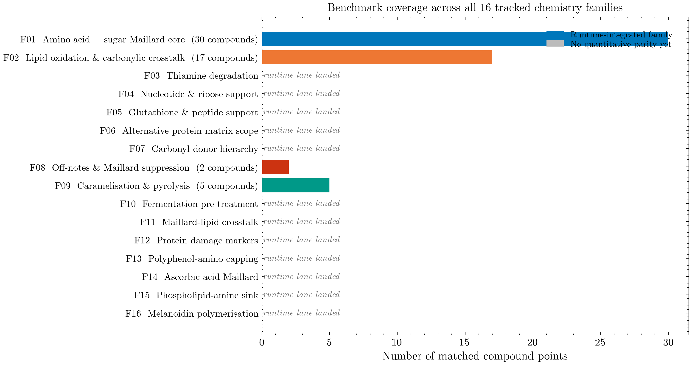
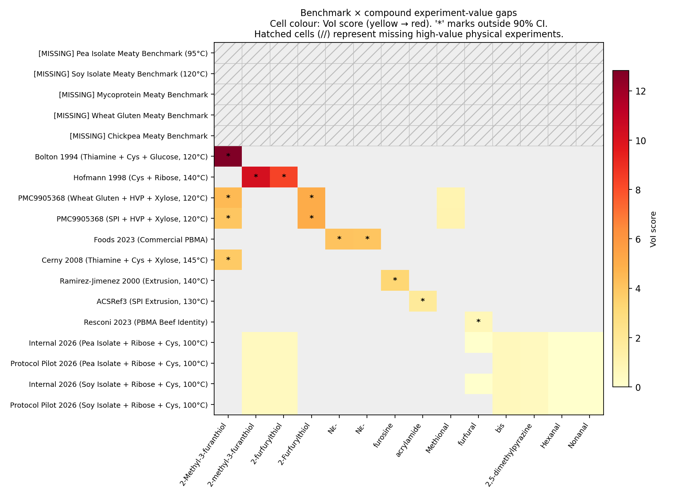

# Maillard

[](https://www.python.org/downloads/)
[](https://www.docker.com/)
[](https://opensource.org/licenses/Apache-2.0)
[](results/validation/prediction_uncertainty.md)

> **TL;DR** — Maillard predicts meat-like aroma chemistry in plant-based matrices (pea, soy, mycoprotein) *before* wet-lab campaigns, by combining deterministic kinetic ODEs with matrix-aware retention/headspace physics and selective DFT refinement. Today **39 of 48 matched-compound predictions sit inside their 90 % Monte-Carlo envelope**; the remaining 9 are surfaced as ranked, bookable experiment requests so the framework tells you *what to measure next* instead of pretending it already knows.

Maillard is a computational screening framework designed for food scientists who want to answer one question: *Which formulation and process changes are most worth testing next if the goal is meaty aroma under plant-matrix constraints?*

Our philosophy: **A model is useful when it separates known bounds from structural gaps.** See [docs/PHILOSOPHY.md](docs/PHILOSOPHY.md) for the full rationale.

## What This Does (Vs. Existing Tools)

Unlike general databases (like NIST WebBook) that only store static spectra, or raw chemical kinetics solvers (like RMG) that assume free chemistry environments, Maillard specifically translates:
1. **Ingredients + Process** (precursors, protein matrix type, physical state, pH, temp, time)
2. **Into actionable, benchmark-calibrated aroma outputs** (meaty thiols vs. beany off-notes, retention effects, and safety limits).

```mermaid
graph LR
    A[Inputs: Sugars, AAs, Matrix, T, pH] -->|Maillard Engine\n(ODEs + Matrix Correction)| B[Predictions: Aroma Profile, Off-Notes]
    B -.-> C[Decision Dashboard:\nConfidence & Interventions]
    style A fill:#e6f3ff,stroke:#4a90e2,stroke-width:2px;
    style B fill:#e6ffea,stroke:#2ecc71,stroke-width:2px;
    style C fill:#fff3e6,stroke:#f39c12,stroke-width:2px;
```
For a detailed diagram of the pipeline's SMIRKS, thermodynamic gating, and retention layers, read [docs/architecture.md](docs/architecture.md).

## 🚀 Quick Start

This project requires conda or Docker.

**Install and Boot:**
```bash
# Bring up the validated Linux container
./scripts/docker_maillard.sh up
./scripts/docker_maillard.sh bootstrap
```

**Run a Screening Prediction:**
```bash
python scripts/run_pipeline.py \
  --sugars ribose,glucose \
  --amino-acids cysteine,leucine \
  --ratios ribose:0.5,glucose:0.2,cysteine:0.2,leucine:0.1 \
  --ph 5.5 \
  --temp 105 \
  --time-minutes 45 \
  --protein-type pea_iso \
  --target meaty \
  --minimize beany \
  --report \
  --output-dir results/first_run
```

**Optimize a Formulation:**
```bash
python scripts/optimize_formulation.py \
  --sugars ribose,glucose \
  --amino-acids cysteine,leucine \
  --target-tag meaty \
  --minimize-tag beany \
  --protein-type pea_iso \
  --n-iterations 50
```

## 📊 Trust Dashboard

Maillard intentionally distances itself from arbitrary "sensory scores". We publish three orthogonal evidence surfaces — what the model **gets right today**, what it **covers but cannot yet anchor**, and **where the next experiment will move the needle most**.

| Surface | What it shows | Headline number |
| --- | --- | --- |
| **Parity** ([validation_overview.png](docs/assets/validation_overview.png)) | Measured vs. predicted ppb for every literature benchmark with matched numeric compounds. | 16 benchmarks × 48 compound rows |
| **Coverage** ([family_coverage.png](docs/assets/family_coverage.png)) | Which of the 16 reaction families are wired into the runtime, calibrated, or DFT-anchored. | 16 families wired, 7 with DFT anchors |
| **Gaps** ([gap_heatmap.png](results/validation/gap_heatmap.png)) | Per-(benchmark × compound) value-of-information score for the next wet-lab experiment. | 8 / 48 cells outside 90 % CI |

<table>
<tr>
<td width="33%"><a href="docs/assets/validation_overview.png"></a><br/><sub><b>Parity:</b> measured vs. predicted ppb (literature only).</sub></td>
<td width="33%"><a href="docs/assets/family_coverage.png"></a><br/><sub><b>Coverage:</b> which chemistry lanes are wired, calibrated, DFT-anchored.</sub></td>
<td width="33%"><a href="results/validation/gap_heatmap.png"></a><br/><sub><b>Gaps:</b> VoI per (benchmark × compound). <code>*</code> = outside 90 % CI.</sub></td>
</tr>
</table>

> **Reading these together.** The parity plot is benchmark-centric — it only plots literature systems with matched numeric compounds, not the offline computational-gap parametrization queue. A family can be active in the coverage map without yet appearing as a new point in the parity plot. The gap heatmap closes the loop: every `*` cell is a measured-but-mispredicted point that the VoI ranker has converted into a bookable experiment request.

### Where the next experiments matter most

The S20–S22 trust loop turns the panel residuals into ranked, bookable wet-lab requests. The artifacts below are regenerated in Docker on every refresh:

- **Monte-Carlo envelope** per matched compound (barriers + matrix/Henry/retention swept jointly): [results/validation/prediction_uncertainty.md](results/validation/prediction_uncertainty.md)
- **Ranked experiment requests** with DOE template + intake YAML per top candidate: [results/validation/experiment_value_ranking.md](results/validation/experiment_value_ranking.md), [results/validation/experiment_requests/index.md](results/validation/experiment_requests/index.md)
- **Leave-one-benchmark-out leverage** (which existing benchmark drags or carries the panel): [results/validation/loo_leverage.md](results/validation/loo_leverage.md)

Top VoI candidate today: **MFT × cys + glucose 150 °C (Farmer 1999)**, VoI = 7.70 — the request YAML is already pending in [data/protocols/](data/protocols/).

<details>
<summary><b>Computational-gap parametrization queue</b> (offline DFT/xTB targets, not yet in the parity plot)</summary>

These are formal selective-QM targets plus prep-only companion lanes:
- Family 11: `hexanal_radical_quench`
- Family 12: `lysinoalanine_crosslink`
- Family 13: `quinone_cys_michael`
- Family 13 safety lane: `asparagine_sugar_explicit_water_cluster`
- Family 14: `aa_ring_open_dicarbonyl`
- Family 15: `pe_schiff_base`, `pe_amadori` (formal DFT candidates after managed xTB pair-gate success)
- Family 16: `melanoidin_radical_trapping`

The runbook lives at [docs/guides/COMPUTATIONAL_GAP_RUNBOOK.md](docs/guides/COMPUTATIONAL_GAP_RUNBOOK.md).

</details>

## 📚 Where to Look Next

| If you are a… | Start here |
| --- | --- |
| **Scientist** running a screening or optimization | [docs/guides/QUICKSTART.md](docs/guides/QUICKSTART.md) → [docs/scientist_workflow_guide.md](docs/scientist_workflow_guide.md) |
| **Skeptic** auditing what's verified | [docs/VALIDATION_GUIDE.md](docs/VALIDATION_GUIDE.md) → [results/validation/](results/validation/) |
| **Maintainer** extending families or refinement | [docs/PHILOSOPHY.md](docs/PHILOSOPHY.md) → [docs/architecture.md](docs/architecture.md) → [docs/SMIRKS_SYSTEM.md](docs/SMIRKS_SYSTEM.md) |
| **QM operator** running the selective-DFT queue | [docs/guides/COMPUTATIONAL_GAP_RUNBOOK.md](docs/guides/COMPUTATIONAL_GAP_RUNBOOK.md) |
| **New contributor** chasing terminology | [docs/guides/GLOSSARY.md](docs/guides/GLOSSARY.md) → [agents.md](agents.md) |

All machine-readable reports, benchmarking artifacts, and matrix coverage metrics live under [results/validation/](results/validation/) and are auto-regenerated by `./scripts/docker_maillard.sh summary`.
