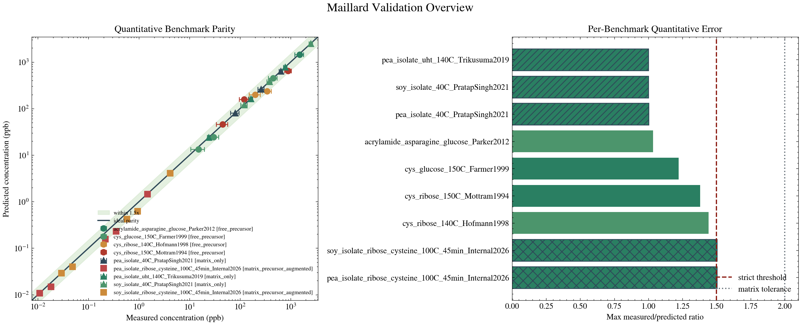

# Maillard

[](https://www.python.org/downloads/)
[](https://www.docker.com/)
[](https://opensource.org/licenses/Apache-2.0)

Maillard is a predictive computational framework designed to help alternative-protein scientists digitally explore and rank Maillard flavor chemistry *before* stepping into the wet lab.

By simulating the complex reactions between sugars and amino acids under specific conditions, it tells you what your current formulation will likely produce, what trade-offs exist (e.g., flavor vs. safety), and what you should try next.

---

**Important Note:** This project relies on complex chemistry dependencies. It **requires conda or Docker** — standard pip-only installation is not supported.

---

## 🚀 The Fastest Way to Start

If you want to run a prediction and see how it works, **start with the [Quickstart Guide](docs/guides/QUICKSTART.md)**. It takes under 10 minutes to run your first formulation.

For definitions of project terminology (e.g., "FAST mode", "validated envelope"), see our **[Glossary for Scientists](docs/guides/GLOSSARY.md)**.

---

## 📊 Example Output

When you run a candidate formulation, Maillard gives you a clear snapshot of its flavor profile, safety risks, and scientific confidence:

```text
================================================================================
MAILLARD FORMULATION SCREENING
================================================================================
Target: meaty | Minimize: beany | Protein: pea_iso

PREDICTION CONFIDENCE: MODERATE
Warning: Your system relies heavily on pea matrix behavior. Treat results
as directional prioritization rather than release-grade claims.

DOMINANT DESIRABLE COMPOUNDS:
- 2-methyl-3-furanthiol: 15.4 ppb
- 2-furfurylthiol: 8.2 ppb

DOMINANT PENALTIES:
- hexanal: 120.5 ppb (High Risk)
================================================================================
```

## 🧪 What Inputs Do I Need?

To run a prediction, you feed the tool a recipe. The minimum inputs are:

- **Sugars:** e.g., `ribose`, `glucose`, `xylose`
- **Amino Acids:** e.g., `cysteine`, `leucine`
- **Molar Ratios:** The proportions of your precursors
- **Environment:** `pH`, Temperature (`temp`), and Reaction Time (`time-minutes`)
- **Protein Matrix:** `free` (buffer), `pea_iso` (pea isolate), or `soy_iso` (soy isolate)

---

## What This Repository Is For

Use Maillard when you want to answer questions like these before running a wet-lab experiment:

- Which precursor combination is most likely to generate meaty sulfur compounds under my process conditions?
- If I change pH, temperature, water activity, or reaction time, which flavour-active compounds move the most?
- Which candidate formulation improves desirable aroma while reducing beany or safety penalties?
- Which predictions are benchmark-backed, and which are only directional?

The library is most useful as a formulation-screening and prioritization system. It is not a replacement for final experimental confirmation.

## What You Can Share Today

The repository now supports three shareable artifact levels for external scientific review:

- a single-run report with Markdown, JSON, and provenance
- a side-by-side comparison report for a small named set of formulations
- a campaign package with per-run reports, a leaderboard, and campaign-level provenance

That does not make every result equally validated. It does mean you can share outputs without losing the command context, branch/commit state, or the scientific files that define the current trust surface.

---

## Does It Work?

Yes, within a clearly defined envelope. The repository exposes a compact trust surface centered on the strongest quantitative benchmark evidence.

Current in-repo validation summary:

- 8 supported benchmarks are tracked in Docker-validated artifacts
- 4 benchmarks are strict-ready today, all in the free-precursor envelope
- 9 matched compounds define the current authoritative quantitative proof surface
- the median matched-compound ratio in that proof surface is 1.118x

In practice, this means the software already reproduces a narrow but real set of literature systems closely enough to support quantitative screening inside that envelope.

The main validation figure now focuses only on the two panels that matter most for first-pass trust: parity against literature and benchmark-level quantitative error.



If you need the full boundary conditions, benchmark-by-benchmark status, or caveats beyond this first-pass view, use the generated validation documents rather than a second summary graphic.

How to interpret trust:

- Free-precursor benchmarks are the quantitative proof surface. Use them when you need concentration-scale decisions.
- Pea and soy matrix paths are useful for directional prioritization, not yet for release-grade quantitative claims.
- Extrusion-heavy or intact-protein systems remain exploratory unless you add new benchmark evidence.

---

## Trust Levels

| System Type | Trust Level | What You Can Safely Use It For |
| --- | --- | --- |
| **Free precursors** | **High** | Quantitative ranking, concentration-scale comparison, candidate screening, safety-aware optimization. |
| **Pea / soy matrices** | **Moderate** | Directional comparison, off-flavour triage, hypothesis generation, deciding what to test next. |
| **Intact protein / extrusion-heavy systems** | **Low** | Exploratory use only; treat outputs as hypotheses until benchmarked. |

Important caveat: matrix trust is lower because accessibility, retention, and pH-dependent headspace effects are not yet benchmark-closed across real plant matrices.

---

## What The Software Can Do

Within its supported envelope, Maillard can already do the following:

- **Rank likely volatile products for a formulation.**
  Given sugars, amino acids, additives, lipids, pH, temperature, water activity, and time, the pipeline predicts which compounds are most likely to dominate.
- **Estimate concentration-scale outputs in ppb inside the validated free-precursor envelope.**
  This is the main quantitative use case when your system resembles the strict-ready literature benchmarks.
- **Score formulations against sensory goals and penalties.**
  You can target tags such as meaty or roasted and simultaneously penalize beany or safety-related outcomes.
- **Generate scientist-facing reports.**
  The CLI can emit Markdown and JSON reports that include decision summaries, confidence metadata, and domain-of-validity warnings.
- **Optimize precursor mixtures.**
  The optimizer searches pH, temperature, water activity, time, and concentration choices to maximize a target sensory direction under penalties.
- **Explain why a prediction looks the way it does.**
  The reporting layer surfaces dominant compounds, penalties, likely bottlenecks, and why confidence is limited.

## What It Cannot Do Reliably Yet

- It cannot serve as a universal zero-shot predictor for complex plant matrices.
- It cannot replace wet-lab confirmation for extrusion-heavy or strongly peptide-bound systems.
- It cannot yet claim broad quantitative accuracy for matrix headspace release across process states.
- It should not be used as if every output were equally validated; some outputs are quantitative, others are directional.

---

## Recommended Workflow For Useful Results

For a new user, the most productive path is:

1. Check the validation surfaces first so you know whether your intended use case is benchmark-backed.
2. Run a forward prediction with your candidate precursors and process conditions.
3. Re-run with `--report` so you get Markdown and JSON outputs you can inspect or share.
4. If the prediction looks promising, use the optimizer to search nearby formulations instead of tuning by hand.
5. Treat matrix-heavy outputs as directional unless your system is visibly close to the validated envelope.

---

## Advanced Workflows & Command Reference

<details>
<summary><strong>Click here to view detailed command examples (Docker setup, Optimization, Campaign generation, etc.)</strong></summary>

### Quick Start (Technical Setup)

Recommended setup: Docker for reproducibility. Local Python/conda setup is also documented in [Installation.md](Installation.md).

### 1. Start the environment and inspect the trust surface

```bash
./scripts/docker_maillard.sh up
./scripts/docker_maillard.sh bootstrap
./scripts/docker_maillard.sh summary
./scripts/docker_maillard.sh validation-figures
```

This gives you the core validation artifacts that should be read before interpreting predictions:

- [results/validation/benchmark_summary.md](results/validation/benchmark_summary.md) for the benchmark-by-benchmark contract
- [results/validation/validation_overview.md](results/validation/validation_overview.md) for the repository-level trust snapshot
- [results/validation/validated_envelope.md](results/validation/validated_envelope.md) for the current boundary of reliable use

## What To Run For Each Goal

| Goal | Command | What you get |
| --- | --- | --- |
| Check whether your use case is benchmark-backed | `./scripts/docker_maillard.sh validation-figures` | Overview PNGs plus Markdown/JSON summaries of trust and envelope boundaries. |
| Inspect benchmark-by-benchmark status | `./scripts/docker_maillard.sh summary` | The current benchmark table with status, coverage, ratios, and notes. |
| Generate a prediction for a candidate formulation | `python scripts/run_pipeline.py ... --report` | Compound predictions, decision summary, confidence warnings, and a saved report bundle. |
| Optimize a formulation around a target profile | `python scripts/optimize_formulation.py ... --report` | The best trial, predicted tradeoffs, and an exportable report. |
| Compare a short list of named formulations | `python scripts/compare_formulations.py --names ... --output-dir ...` | A side-by-side comparison bundle with confidence and provenance. |
| Build a scientist-shareable campaign package | `./scripts/docker_maillard.sh campaign data/campaigns/shareable_meaty_screen.yml` | Run-level bundles plus campaign-level Markdown/JSON artifacts. |
| Inspect one literature benchmark directly | `./scripts/docker_maillard.sh run python scripts/compare_sim_to_lit.py --lit ...` | A benchmark card with parity plot, absolute yields, and benchmark summary. |

### 2. Run a forward prediction

Use [scripts/run_pipeline.py](scripts/run_pipeline.py) when you already have a candidate formulation and want to know what it is likely to produce.

```bash
python scripts/run_pipeline.py \
  --sugars ribose,glucose \
  --amino-acids cysteine,leucine \
  --ratios ribose:0.5,glucose:0.2,cysteine:0.2,leucine:0.1 \
  --ph 5.5 \
  --temp 105 \
  --time-minutes 45 \
  --protein-type pea_iso \
  --target meaty \
  --minimize beany \
  --report \
  --output-dir results/first_run
```

This command is useful because it returns more than a list of compounds. It also gives you:

- a prediction summary for desirable compounds and penalties
- confidence and domain-of-validity warnings
- report artifacts you can compare between runs

Useful flags in this pipeline:

- `--list-precursors` to discover supported precursor names
- `--list-tags` to inspect available sensory tags
- `--aw` and `--time-minutes` to change process severity
- `--protein-type` and `--denaturation-state` to express matrix assumptions
- `--report` to persist a scientist-facing Markdown and JSON bundle

Every saved bundle now includes provenance metadata: generating command, branch, commit, dirty-state flag, input fingerprint, and the key scientific-reference files needed to interpret the result honestly.

### 2b. Compare named formulations when the question is comparative

```bash
python scripts/compare_formulations.py \
  --names "Cysteine Enrichment (Basic),Premium Meaty Mix,Soy-Specific Masking" \
  --ph 5.5 \
  --temp 105 \
  --target-tag meaty \
  --minimize-tag beany \
  --output-dir results/comparison_meaty
```

Use this when you want a side-by-side scientific review artifact instead of reading one run at a time.

### 2c. Build a campaign package for external review

```bash
./scripts/docker_maillard.sh campaign \
  data/campaigns/shareable_meaty_screen.yml \
  results/share/campaign_meaty
```

This produces:

- one report bundle per run in `runs/`
- `comparison.md` and `comparison.json`
- `campaign.md` and `campaign.json`

Use this when you need to hand results to scientists or reviewers and want the package itself to carry the review context.

### 3. Optimize a formulation instead of guessing by hand

Use [scripts/optimize_formulation.py](scripts/optimize_formulation.py) when you want the software to search for a better operating point.

```bash
python scripts/optimize_formulation.py \
  --sugars ribose,glucose \
  --amino-acids cysteine,leucine \
  --lipids hexanal \
  --target-tag meaty \
  --minimize-tag beany \
  --protein-type pea_iso \
  --risk-aversion 1.5 \
  --n-iterations 50
```

The optimizer is useful when you want to balance several levers at once:

- maximize a sensory direction such as meaty
- penalize off-notes such as beany
- penalize safety risk through the objective
- search concentration ratios and process settings faster than manual trial-and-error

If you want a persistent report of the best trial, add `--report --output-dir ...`.

### 4. Generate benchmark-specific validation cards when you need them

If you need to inspect one literature benchmark directly, regenerate its comparison card:

```bash
./scripts/docker_maillard.sh run \
  python scripts/compare_sim_to_lit.py \
    --lit data/benchmarks/cys_glucose_150C_Farmer1999.json
```

This writes a PNG, Markdown summary, and JSON payload in [results/validation](results/validation).

</details>

---

## How To Decide Whether A Result Is Actionable

Use this rule of thumb:

- If your system is close to the free-precursor benchmarks, the output is suitable for quantitative screening and prioritization.
- If your system depends heavily on pea or soy matrix behavior, use the output to decide what to test next, not as a final concentration claim.
- If your system relies on extrusion history, intact proteins, or unsupported matrix physics, treat the result as exploratory.

The repository is designed to tell you not only what it predicts, but also when not to overclaim.

---

## Deeper Documentation

If you need to dig deeper into the science, validation mechanics, or architecture:

- **[docs/README.md](docs/README.md)** - The main index for all deep-dive reference and research documentation.
- **[docs/guides/SHARING_RESULTS.md](docs/guides/SHARING_RESULTS.md)** - How to create shareable single-run, comparison, and campaign artifacts.
- **[docs/guides/SCIENTIFIC_RELIABILITY.md](docs/guides/SCIENTIFIC_RELIABILITY.md)** - Detailed breakdown of matrix predictability caps.
- **[docs/VALIDATION_GUIDE.md](docs/VALIDATION_GUIDE.md)** - Our strict validation methodology.
- **[docs/protocols/PPI_SPI_PRIMARY_BENCHMARK_PROTOCOL.md](docs/protocols/PPI_SPI_PRIMARY_BENCHMARK_PROTOCOL.md)** - The review-ready internal protocol for the primary pea/soy matrix experiment.
- **[docs/use_cases/README.md](docs/use_cases/README.md)** - Operational reports and the current pea/soy meaty benchmark candidate studies.
- **[docs/use_cases/food_scientist_walkthrough.md](docs/use_cases/food_scientist_walkthrough.md)** - A narrative walkthrough demonstrating how a food scientist would use Maillard to solve a formulation challenge.
- **[docs/guides/PYTHON_API.md](docs/guides/PYTHON_API.md)** - Guide for using the core components in custom Python scripts.
- **[docs/notebooks/1_Formulation_Screening_Example.ipynb](docs/notebooks/1_Formulation_Screening_Example.ipynb)** - Interactive Jupyter notebook for the programmatic API.
- **[docs/notebooks/2_Food_Scientist_Walkthrough.ipynb](docs/notebooks/2_Food_Scientist_Walkthrough.ipynb)** - Interactive version of the food scientist narrative walkthrough.
