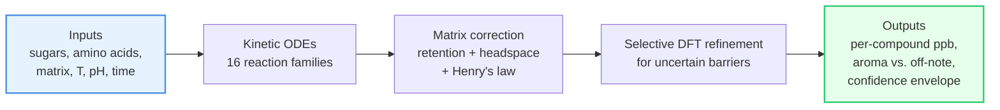

# Maillard

[](https://www.python.org/downloads/)
[](https://www.docker.com/)
[](https://opensource.org/licenses/Apache-2.0)
[](results/validation/prediction_uncertainty.md)
[](results/validation/external_validation_report.md)

## In one paragraph

Plant-based meat tastes "beany" because the **Maillard reactions** that produce real meat aroma behave very differently inside a soy or pea matrix than in water. **Maillard** is a computational screening tool that predicts which sugars, amino acids, temperatures, pH and matrix choices will produce **meat-like aroma molecules** (such as 2-methyl-3-furanthiol, the "roasted-meat" thiol) versus **off-notes** — *before* you run a single wet-lab experiment. It does this by simulating the underlying chemistry (kinetic ODEs over 16 reaction families), correcting for how the matrix traps or releases each volatile, and refining the most uncertain reaction barriers with quantum chemistry (DFT). Today it predicts **39 out of 48** literature data points within their 90 % confidence envelope, and it tells you exactly which **9** are still wrong and **what experiment would fix them next**.

> **Who is this for?** Food scientists who want to triage formulations *before* burning lab time, and computational chemists who want a transparent benchmark surface for matrix-aware Maillard chemistry.

---

## Why this is hard (and why a simple lookup won't do)

| Existing tool | What it gives you | What it misses |
| --- | --- | --- |
| NIST WebBook, FlavorDB | Static spectra & odor descriptors of *isolated* compounds | No yields. No matrix. No process. Cannot answer "how much MFT do I get from this recipe?" |
| RMG, Cantera, generic kinetics | Free-radical / gas-phase chemistry solvers | Assume free chemistry — no protein binding, no headspace partitioning, no plant-matrix retention |
| Sensory panels | Ground truth for finished products | Slow, expensive, late in the design loop |

Maillard fills the middle. It maps **(ingredients + process + matrix) → (per-compound concentrations + headspace + confidence)** so you can rank candidate formulations *cheaply*, then spend wet-lab time on the few that truly matter.

---

## What you put in, what you get out



Full pipeline: [docs/architecture.md](docs/architecture.md). Philosophy (why we separate *known bounds* from *structural gaps*): [docs/PHILOSOPHY.md](docs/PHILOSOPHY.md).

---

## 🚀 Quick start (5 minutes)

Requires Docker.

```bash
# 1. Boot the validated container (one-time)
./scripts/docker_maillard.sh up
./scripts/docker_maillard.sh bootstrap

# 2. One-command demo: runs a pea-isolate baseline and a cysteine-enrichment
#    comparison, then points at the resulting report bundles.
./scripts/docker_maillard.sh quickstart

# 3. Or assemble a custom formulation by hand:
./scripts/docker_maillard.sh run "python scripts/run_pipeline.py \
  --sugars ribose,glucose \
  --amino-acids cysteine,leucine \
  --ratios ribose:0.5,glucose:0.2,cysteine:0.2,leucine:0.1 \
  --ph 5.5 --temp 105 --time-minutes 45 \
  --protein-type pea_iso \
  --target meaty --minimize beany \
  --report --output-dir results/first_run"

# 4. Or have the optimizer search the design space for you
./scripts/docker_maillard.sh run "python scripts/optimize_formulation.py \
  --sugars ribose,glucose --amino-acids cysteine,leucine \
  --target-tag meaty --minimize-tag beany \
  --protein-type pea_iso --n-iterations 50"
```

Open `results/quickstart/baseline/report.md` (or `results/first_run/report.md`) for a per-compound table, the matched literature benchmark, a confidence label on every prediction, a plain-language glossary, **`## 7. Recommended next experiment`** (the top-N value-of-information rows scoped to the formulation's matrix when known; each per-target protocol Markdown ships with a `## CRO send-to-lab checklist` and an `analytical_context` block that mirrors `data/protocols/matrix_experiment_intake_schema.json`, so a returned YAML lands cleanly via `maillard ingest`), and **`## 8. Sensory readout`** (per-compound OAV with 90 % CI and a meaty / off-note / safety axis roll-up).

Run `./scripts/docker_maillard.sh help` for the full audience-grouped command surface.

The report bundle now also writes scientist-facing visuals:

- `compound_confidence_overlay.png`: per-compound 90 % envelope whiskers colored by evidence class
- `intervention_waterfall.png`: class-level delta summary when a baseline is supplied
- `comparison_intervention_waterfall.png`: the same waterfall surface for two-formulation campaign reports


Confidence overlay: each point is the p50 observable ppb with p5-p95 whiskers, colored by evidence class.


Intervention waterfall: the comparison report aggregates compound deltas into class-level gains and losses between two candidates.

If you want the scientist-facing ingest loop as well, see [docs/scientist_workflow_guide.md](docs/scientist_workflow_guide.md). The new `./scripts/docker_maillard.sh ingest ...` path previews benchmark additions, trust-loop deltas, and support-strengthening before it writes a canonical intake YAML.

---

## 📊 How good are the predictions, really?

We refuse to publish a single "accuracy %". Instead we publish **four orthogonal evidence surfaces**, each answering a different honest question.

| Surface | Question it answers | Headline number today |
| --- | --- | --- |
| **Parity** ([validation_overview.png](docs/assets/validation_overview.png)) | *On the literature systems we can match compound-for-compound, how close is predicted ppb to measured ppb?* | 16 benchmarks · 48 matched compound rows |
| **External hold-out** ([external_validation_report.md](results/validation/external_validation_report.md)) | *On isolated literature systems we explicitly did not calibrate to, does the frozen model still cover the measurement?* | 4 bundles · **0/8 inside 90 % CI** · median **36.02x** |
| **Coverage** ([family_coverage.png](docs/assets/family_coverage.png)) | *Which of the 16 reaction families are wired into the runtime, calibrated against data, or anchored by DFT?* | 16/16 wired · 7 with DFT anchors |
| **Gaps** ([gap_heatmap.png](results/validation/gap_heatmap.png)) | *Where would the next wet-lab experiment move our confidence the most?* | **9/48 cells outside 90 % CI** — all queued as bookable requests |
| **Matrix refit decision** ([calibration_refit_decision.md](results/validation/calibration_refit_decision.md)) | *Did the latest matrix observable recalibration actually improve the panel enough to justify changing runtime factors?* | 2026-05-10 refit **rejected** · matrix median residual unchanged · trust headline holds at **39/48** |

<table>
<tr>
<td width="33%" valign="top"><a href="docs/assets/validation_overview.png"></a><br/><sub><b>Parity.</b> Each dot is one (literature benchmark × compound). The closer to the diagonal, the better the prediction.</sub></td>
<td width="33%" valign="top"><a href="docs/assets/family_coverage.png"></a><br/><sub><b>Coverage.</b> Green = wired & calibrated, blue = DFT-anchored, grey = surrogate prior only. Tells you what the model is allowed to claim.</sub></td>
<td width="33%" valign="top"><a href="results/validation/gap_heatmap.png"></a><br/><sub><b>Gaps.</b> Hotter = higher value-of-information. <code>*</code> marks cells where measurement falls outside the 90 % envelope — the next experiments worth booking.</sub></td>
</tr>
</table>

> **How to read these together.** Parity and coverage are *not* the same thing, and the external hold-out row is a stricter stress test than either: those 8 points are intentionally excluded from calibration, so they tell you how far the frozen model still has to go on adjacent matrix surfaces. The gap heatmap closes the loop: every `*` cell is already converted into a ranked, bookable wet-lab request below.

### What the trust loop is recommending right now

1. **Top experiment to book**: 2-methyl-3-furanthiol from cysteine + glucose at 150 °C (Farmer 1999) — value-of-information = 7.70. A multi-factor SIDA campaign would close the precursor × matrix gap on the most decision-relevant meaty odorant.
2. **Most influential existing benchmark**: `cml_cel_commercial_pbma_Foods2023` — currently drags the panel by –0.035 dex; flagged for a re-anchor pass.
3. **Widest envelope**: matched MFT predictions span up to ~6 dex of Monte-Carlo width on HVP-spiked systems, driven jointly by barrier and headspace priors.

Full machine-readable artifacts (regenerated in Docker, never hand-edited — run `make trust-loop` to refresh all five):

- 90 % envelope per matched compound: [results/validation/prediction_uncertainty.md](results/validation/prediction_uncertainty.md)
- External hold-out panel vs frozen calibration: [results/validation/external_validation_report.md](results/validation/external_validation_report.md)
- Ranked experiment requests + DOE templates: [results/validation/experiment_value_ranking.md](results/validation/experiment_value_ranking.md), [results/validation/experiment_requests/index.md](results/validation/experiment_requests/index.md)
- Leave-one-benchmark-out leverage: [results/validation/loo_leverage.md](results/validation/loo_leverage.md)
- Per-cell value-of-information heatmap: [results/validation/gap_heatmap.png](results/validation/gap_heatmap.png)

**Want the next experiment for *your* matrix, not the global top miss?** Run `./scripts/docker_maillard.sh next-experiment --top 5 --matrix soy_iso` (or `pea_iso`, `wheat_gluten`, `myco`). Each row drops a pre-filled intake YAML into `data/protocols/` and a SIDA-grade protocol Markdown into `results/validation/experiment_requests/`. After a wet-lab measurement comes back, `./scripts/docker_maillard.sh ingest --file results.csv ...` previews the trust-loop delta before landing the benchmark.

<details>
<summary><b>Computational-gap parametrization queue</b> (offline DFT/xTB targets — not yet in the parity plot)</summary>

These are formal selective-QM targets plus prep-only companion lanes:

- Family 11: `hexanal_radical_quench`
- Family 12: `lysinoalanine_crosslink`
- Family 13: `quinone_cys_michael`
- Family 13 safety lane: `asparagine_sugar_explicit_water_cluster`
- Family 14: `aa_ring_open_dicarbonyl`
- Family 15: `pe_schiff_base`, `pe_amadori`
- Family 16: `melanoidin_radical_trapping`

Runbook: [docs/guides/COMPUTATIONAL_GAP_RUNBOOK.md](docs/guides/COMPUTATIONAL_GAP_RUNBOOK.md).

</details>

---

## 📚 Where to look next

| If you are a… | Start with |
| --- | --- |
| **Food scientist** running a screening or optimization | [docs/guides/QUICKSTART.md](docs/guides/QUICKSTART.md) → [docs/scientist_workflow_guide.md](docs/scientist_workflow_guide.md) |
| **Skeptic** auditing what is actually verified | [docs/VALIDATION_GUIDE.md](docs/VALIDATION_GUIDE.md) → [results/validation/](results/validation/) |
| **Maintainer** extending reaction families or refinement | [docs/PHILOSOPHY.md](docs/PHILOSOPHY.md) → [docs/architecture.md](docs/architecture.md) → [docs/SMIRKS_SYSTEM.md](docs/SMIRKS_SYSTEM.md) |
| **QM operator** running the selective-DFT queue | [docs/guides/COMPUTATIONAL_GAP_RUNBOOK.md](docs/guides/COMPUTATIONAL_GAP_RUNBOOK.md) |
| **New contributor** chasing terminology | [docs/guides/GLOSSARY.md](docs/guides/GLOSSARY.md) → [agents.md](agents.md) |

All trust-dashboard artifacts can be regenerated with `./scripts/docker_maillard.sh summary`.
