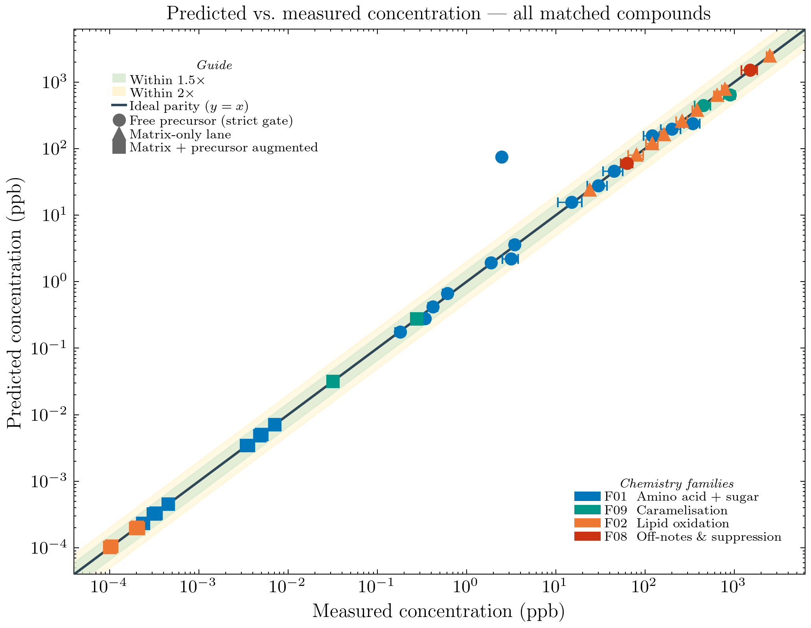
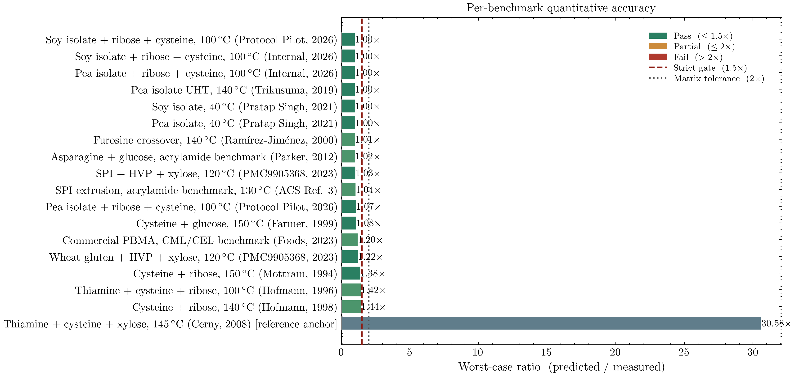

# Maillard

[](https://www.python.org/downloads/)
[](https://www.docker.com/)
[](https://opensource.org/licenses/Apache-2.0)

Maillard is a computational screening framework for scientists who want to imitate meat-like Maillard chemistry in plant-based systems before running wet-lab campaigns.

The point is not to predict every food matrix equally well. The point is to help scientists answer the most useful pre-lab question:

Which formulation and process changes are most worth testing next if the goal is meat-like aroma under plant-matrix constraints?

Important note: this project requires conda or Docker. Pip-only installation is not supported.

## Quick Start

If you want to run the tool immediately, start with [docs/guides/QUICKSTART.md](docs/guides/QUICKSTART.md).

If you want definitions for terms such as FAST mode, validated envelope, or benchmark neighborhood, see [docs/guides/GLOSSARY.md](docs/guides/GLOSSARY.md).

If you want the current matrix-family scope and the experiment-ingestion workflow, see [results/validation/matrix_family_coverage.md](results/validation/matrix_family_coverage.md) and [docs/guides/MATRIX_EXPERIMENT_INGESTION.md](docs/guides/MATRIX_EXPERIMENT_INGESTION.md).

## The Goal and the Problem

The framework operates as a rigorous forward-prediction and optimization engine, rather than a static lookup database. It takes initial formulation conditions (precursors, protein matrix type, physical state) and deterministic process variables (pH, temperature, time), and computationally resolves the competitive kinetic pathways of the Maillard reaction. 

The most useful version of this tool is a scientist-facing decision system that can:

- rank candidate formulations prior to wet-lab campaigns
- optimize targeted aromatic profiles (e.g., maximizing meaty thiols while minimizing beany off-notes) by computationally navigating the complex reaction network
- separate benchmark-backed certainty from directional extrapolation
- isolate which volatile markers are driven by free chemistry versus matrix retention

That means the central problem is broader than matching one benchmark table. We need a model that is useful across three regimes of scientific confidence.

## The Three Regimes

| Regime                  | What it represents                                                         | Current trust | What the tool should do well                                                  |
| ----------------------- | -------------------------------------------------------------------------- | ------------- | ----------------------------------------------------------------------------- |
| Free precursors         | Buffer-like systems where sugars and amino acids are directly accessible   | High          | Quantitative ranking and concentration-scale screening                        |
| Pea / soy matrices      | Real protein matrices where accessibility, retention, and headspace matter | Moderate      | Directional and near-quantitative prioritization where explicit anchors exist |
| Extrusion-heavy systems | Highly processed systems with strong structural and transport effects      | Low           | Exploratory hypothesis generation and experiment prioritization               |

These regimes are not three unrelated products. They are three layers of increasing structural complexity.

- Free precursors test whether the chemistry core is right.
- Pea and soy matrices test whether observable reality is right.
- Extrusion-heavy systems test whether process-structured accessibility and transport are right.

## Family Validation Surface

The important question for a scientist is not whether the repository names many chemistry families. The important question is whether each family has an explicit experimental prediction surface.

This repo therefore separates three cases:

- families with **compound-level quantitative parity** against experiments
- families with **benchmark-linked calibration support** but not yet strict quantitative closure
- families that remain **directional or gap-limited**, and are reported as such rather than being overclaimed

The figures below are generated with `./scripts/docker_maillard.sh validation-figures` and are provided as standalone PNGs so they can be embedded, cropped, or cited independently.





Captions:

- **Compound parity:** Predicted vs measured concentrations (log–log). Colour = chemistry family; marker shape = execution lane. Green/yellow bands denote 1.5× and 2× tolerances. This figure is intentionally quantitative-only: a family appears here only when it already has executable numeric benchmarks with matched measured compounds.
- **Per-benchmark accuracy:** Worst-case predicted/measured ratio per benchmark (human-readable study labels). Vertical lines mark strict-gate (1.5×) and matrix tolerance (2×).
- **Family coverage:** Counts of matched quantitative compound points across all 16 tracked families; families with no parity points are still shown explicitly so runtime-only, support, and gap lanes do not disappear from the public surface.

If your markdown viewer does not render images inline, open the files directly in `docs/assets`.

For machine-readable artifacts, see [results/validation/family_validation_overview.md](results/validation/family_validation_overview.md). For the single-panel authoritative parity drill-down see [docs/assets/validation_overview.png](docs/assets/validation_overview.png).

Why all families are not quantitative today:

- A quantitative family needs at least one executable benchmark with direct measured compounds or markers that can be matched against predictions.
- Several integrated families are upstream modifiers, guardrails, or support lanes rather than endpoint volatile panels, so they change the prediction context without yet having their own matched numeric compound surface.
- Those families are still tracked explicitly in [docs/assets/family_coverage.png](docs/assets/family_coverage.png) and [results/validation/family_validation_overview.md](results/validation/family_validation_overview.md) instead of being over-claimed as quantitative.


The objective-progress panel is the complement to the parity plots: it keeps internal calibration closure separate from external promotion closure. Today the Hexanal/Nonanal ambiguity route is closed internally, while mixed meaty-positive external closure and extrusion direct-damage closure remain explicitly blocked on external measurement packages.

## How To Use This For Alternative Protein Research

For a scientist evaluating alternative proteins, the operational workflow is:

1. Select matrix family and process state explicitly (for example pea isolate, soy isolate, mycoprotein, extrusion-heavy process).
2. Run a forward prediction and generate report artifacts.
3. Check the matrix-family coverage artifact so you know whether your family is explicit support, indirect support, or an open gap.
4. Read family evidence ladder and family lane sensitivity before trusting absolute concentrations.
5. Use benchmark-backed families for quantitative decisions and directional families for experiment prioritization.
6. Promote a family lane only after adding benchmark or calibration evidence, not by tuning barriers alone.
7. When you obtain a new measurement set, compare it against the model through the experiment-intake workflow before treating it as promotion evidence.

Practical commands:

```bash
./scripts/docker_maillard.sh validation-figures
python scripts/run_pipeline.py --protein-type pea_iso --target meaty --report --output-dir results/first_run
```

Primary artifacts for this workflow:

- [results/validation/family_validation_overview.md](results/validation/family_validation_overview.md)
- [results/validation/family_lane_validation.md](results/validation/family_lane_validation.md)
- [results/validation/family_deviation_audit.md](results/validation/family_deviation_audit.md)
- [results/validation/benchmark_summary.md](results/validation/benchmark_summary.md)
- [results/validation/validated_envelope.md](results/validation/validated_envelope.md)
- [results/validation/matrix_family_coverage.md](results/validation/matrix_family_coverage.md)
- [results/validation/matrix_target_status.md](results/validation/matrix_target_status.md)
- [results/validation/matrix_promotion_contract.md](results/validation/matrix_promotion_contract.md)
- [results/validation/matrix_observable_closure_audit.md](results/validation/matrix_observable_closure_audit.md)
- [results/validation/matrix_experiment_intake_schema.md](results/validation/matrix_experiment_intake_schema.md)
- [results/validation/p3_refinement_governance.md](results/validation/p3_refinement_governance.md)
- [results/validation/mlp_assessment.md](results/validation/mlp_assessment.md)
- [results/validation/mlp_adoption_notes.md](results/validation/mlp_adoption_notes.md)
- [results/validation/literature_learning_loop.md](results/validation/literature_learning_loop.md)
- [results/validation/family_promotion_state.md](results/validation/family_promotion_state.md)

## Predictive Accuracy: What Is Quantitative Today

Current artifact-backed status (from results/validation):

- 16 chemistry families tracked in runtime scope
- 4 families currently benchmark-linked
- 4 families currently have compound-level quantitative parity points
- 51 quantitative compound points in the current family validation surface

Interpretation:

- Quantitative prediction claims are strongest in benchmark-backed families and free-precursor strict-ready lanes.
- Matrix and support families can still be decision-useful, but some remain calibration-grade or directional.
- This is a deliberate trust posture: explicit boundaries are preferred over overclaiming broad quantitative closure.

## Current Validation Snapshot

Current in-repo validation summary:

- 16 supported benchmarks are tracked in Docker-validated artifacts
- 9 benchmarks are strict-ready today, all inside the free-precursor envelope
- all 16 quantitative benchmark summaries stay inside the 1.5x acceptance band today
- the worst quantitative benchmark ratio currently exposed in-repo is 1.442x
- 19 matched compounds define the current authoritative quantitative proof surface
- the median matched-compound ratio in that proof surface is 1.055x

The authoritative benchmark-level parity plot (per compound, per benchmark, with formatted study references) is shown below.


How to interpret this trust surface:

- Free-precursor benchmarks are the quantitative proof surface.
- The current quantitative benchmark surface is fully inside the 1.5x and 2x tolerance envelopes, so the README parity plot is now a useful trust indicator instead of a decorative figure.
- Not every runtime-integrated family appears in the benchmark-level scatter. That plot is intentionally restricted to numeric benchmark points; the cross-family status view lives in [docs/assets/family_coverage.png](docs/assets/family_coverage.png) and [results/validation/family_validation_overview.md](results/validation/family_validation_overview.md).
- Pea and soy matrix paths are useful for prioritization, not yet for broad release-grade claims.
- Soy and pea are not the only matrix families tracked by the repo, but they are the only plant-protein matrix lanes with executable benchmark-plus-calibration support today.
- Family 07 carbonyl donor hierarchy is now promoted to benchmark-linked support, meaning sugar identity is no longer only a heuristic lane: existing benchmark-linked compounds constrain it with explicit uncertainty, but it is not yet near-quantitative as a standalone family.
- Family 09 carbohydrate pyrolysis now acts as an evidence-bounded severity lane with explicit carbonyl and furanone anchors; it remains a failure-mode surface, not a generic route to boost browning.
- Family 10 fermentation pretreatment now acts as an evidence-bounded upstream modifier with explicit hydrolysate, sulfur-reference, and nucleotide-release anchors; it remains support logic rather than a standalone benchmarked flavor family.
- P3 mechanistic refinement is now explicitly gate-kept by benchmark-visible compounds and cheap-first screening; if [results/validation/p3_refinement_governance.md](results/validation/p3_refinement_governance.md) shows zero approved jobs, offline QM stays parked.
- MLP work remains an offline accelerator lane only. The current policy in [results/validation/mlp_assessment.md](results/validation/mlp_assessment.md) and [results/validation/mlp_adoption_notes.md](results/validation/mlp_adoption_notes.md) is no default MLP adoption until the reaction benchmark passes.
- Mycoprotein is currently bounded prior support, soy hydrolysate remains qualitative intake support, and other plant proteins remain explicit scope gaps until elevated into runtime-facing evidence.
- P6 matrix expansion is intentionally bounded: [results/validation/matrix_family_coverage.md](results/validation/matrix_family_coverage.md) now separates bounded expansion candidates from evidence-blocked matrix families so scope cannot drift faster than the evidence surface.
- Extrusion-heavy systems remain exploratory until benchmarked directly.
- For the full 16-family strategic view including coverage gaps, see the **Family Validation Surface** section above.

## What Accuracy Depends On

The tool does not have a single accuracy mode. Its precision depends on which layer is doing most of the work.

| Layer                                    | Main inputs                                                                                        | What it mainly controls                                         |
| ---------------------------------------- | -------------------------------------------------------------------------------------------------- | --------------------------------------------------------------- |
| Core FAST kinetics                       | Literature barriers, cached barrier records, calibrated Arrhenius heuristics                       | Pathway ordering and relative competitiveness                   |
| Observable projection                    | Proxy-to-observable mapping, volatility, retention, process-sensitive projection factors           | Absolute ppb-scale fit                                          |
| Matrix calibration and headspace release | Protein type, process state, compound-specific observable factors, transferred anchors             | Whether matrix predictions stay physically plausible and useful |
| Offline refinement                       | xTB, selective DFT, and optional external ML-potential refinement written back as cached artifacts | Narrow mechanistic correction of decisive motif classes         |

Two rules follow from this:

- We should not retune energy barriers just to make one benchmark concentration match.
- When ranking looks right but ppb scale is wrong, the preferred fix is usually in the observable or matrix-calibration layer.

The current validation contract therefore uses two scale checks:

- max ratio, to catch worst-case outliers
- mean absolute log-scale error, to catch broad multiplicative drift

## Scientific Architecture

The core framework pipelines computational chemistry through five stages: from precursor enumeration governed by mechanistic limits down to matrix-specific observable projection.

```mermaid
graph TD
    subgraph "1. Input & Accessibility"
        A["Precursors (Sugars, AAs, Lipids)"] --> C["Matrix Correction"]
        B["Process Conditions (pH, T, t, Matrix)"] --> C
    end

    subgraph "2. Reactive Core"
        C -->| "Accessible Molarity" | D["SMIRKS Rule Engine"]
        D -->| "Reaction Network" | E["Thermodynamic Gating (Joback)"]
        E -->| "Feasible Paths" | F["Cantera ODE Solver"]
        G["Literature Kinetics"] --> F
    end

    subgraph "3. Observability Projection"
        F -->| "Aqueous Moles" | I["Projection Module"]
        I -->| "Volatilization (Henry's Law)" | J["Headspace Calibration"]
        I -->| "Surface Adsorption" | K["Matrix Retention"]
    end

    subgraph "4. Decision Layer"
        J & K --> L["Validation Surface"]
        L --> M["Bayesian Optimizer"]
        M -->| "Formulation Candidate" | A
    end
```

| Layer | Main tool or model | Role in the system | Main dependency |
| --- | --- | --- | --- |
| **Input & Matrix Correction** | Priors and heuristics | Determines *accessible* reactant molarity adjusting for protein folding and thermal state | Matrix-specific accessibility data |
| **Reaction Enumeration** | Hybrid SMIRKS Rules | Autogenerates plausible intermediate and product pathways from inputs | Curated reaction family rules |
| **Thermodynamic Gating** | Joback Estimator (+ xTB/DFT) | Diagnostics; prunes unphysical pathways if $\Delta G^\ddagger$ is too high | Thermodynamic parameters |
| **Fast Prediction Core** | FAST Kinetics & Cantera | Integrates deterministic rate constants over time to solve intermediate competition | Literature-derived kinetic barriers |
| **Observable Projection** | Headspace & Retention | Converts aqueous molar concentrations to measured headspace ppb via retention | Benchmark-anchored observable calibration |
| **Offline Refinement** | xTB, DFT, ML Potentials | Offline acceleration and structural refinement | Narrow motif targets and external ML states |

What this means in practice:
- **FAST** handles day-to-day kinetic solutions because it is cheap enough to screen and calibrate efficiently.
- **Cantera** provides rigorous network integration within the fast engine.
- Expensive structural refinements (xTB, DFT, ML Potentials) occur strictly offline.

## Should ML Potentials Be The Main Missing Piece?

No.

ML potentials are useful, but they are not the elegant primary solution to the current product gap.

The main missing problem is not raw quantum precision. The main missing problem is that plant-matrix and extrusion-heavy systems are under-benchmarked in accessibility, retention, headspace release, and process-state dependence.

That means the clean modeling order is:

1. benchmark and calibrate observable-layer behavior where literature or internal data exist
2. add process-aware matrix accessibility and transport surrogates
3. use xTB and selective DFT to refine narrow motif classes only after cheap closure stops improving decisions
4. use external state-of-the-art ML potentials later, offline, only if repeated motif classes justify them and the target motif class is already well-scoped

ML potentials should therefore be a tertiary offline accelerator, not the main path to making the tool useful, and the default assumption should be to reuse the best available external model rather than train a new one ourselves.

## What The Best Version Of This Tool Looks Like

The best version of Maillard is the tool that helps a scientist decide what to make next, not the tool that claims uniform absolute accuracy everywhere.

To get there, the repo needs to do five things well:

- keep the free-precursor chemistry quantitatively solid
- promote pea and soy from intake checks to matrix target-ranking benchmarks
- model extrusion-heavy systems as process-structured accessibility problems rather than pretending they are just bigger free systems
- expose confidence, extrapolation axes, and calibration sources clearly in reports
- keep expensive computation offline and reusable

## Recommended Workflow

1. Check the validation surface first.
2. Run a forward prediction for your candidate formulation.
3. Save a report bundle with provenance.
4. Use the optimizer to search nearby operating points.
5. Treat matrix-heavy and extrusion-heavy outputs according to their trust regime.

## Key Commands

```bash
./scripts/docker_maillard.sh up
./scripts/docker_maillard.sh bootstrap
./scripts/docker_maillard.sh summary
./scripts/docker_maillard.sh validation-figures
./scripts/docker_maillard.sh matrix-promotion-contract
./scripts/docker_maillard.sh matrix-closure-audit
./scripts/docker_maillard.sh experiment-intake-schema
./scripts/docker_maillard.sh matrix-family-coverage
./scripts/docker_maillard.sh p3-refinement
./scripts/docker_maillard.sh p4-mlp-assessment
./scripts/docker_maillard.sh literature-learning-loop
./scripts/docker_maillard.sh family-promotion-state
./scripts/docker_maillard.sh compare-experiment data/protocols/example_matrix_experiment_intake.yaml
```

Generate one prediction:

```bash
python scripts/run_pipeline.py \
  --sugars ribose,glucose \
  --amino-acids cysteine,leucine \
  --ratios ribose:0.5,glucose:0.2,cysteine:0.2,leucine:0.1 \
  --ph 5.5 \
  --temp 105 \
  --time-minutes 45 \
  --protein-type pea_iso \
  --target meaty \
  --minimize beany \
  --report \
  --output-dir results/first_run
```

Optimize a formulation:

```bash
python scripts/optimize_formulation.py \
  --sugars ribose,glucose \
  --amino-acids cysteine,leucine \
  --target-tag meaty \
  --minimize-tag beany \
  --protein-type pea_iso \
  --n-iterations 50
```

## Literature Integration: Runtime vs. Benchmark

Literature serves as the strict deterministic control system governing predictive accuracy, rather than mere citations. Every paper is rigorously evaluated through an 8-point Systematic Literature Review (SLR) checklist (scoring criteria like exact matrix tracking, absolute quantification, and internal standards). Literature data maps into two mutually exclusive functions:

### 1. Runtime Integration (Parametrization)
Runtime data drives the underlying scientific engine. These papers supply the chemical constants, activation configurations, and thermodynamic limits used to compute the paths.
- **Data type:** Rate constants, activation energies ($E_a$), matrix retention multipliers.
- **Example:** A structural study providing the dynamic, reversible binding affinity ($K_a$) of hexanal to a soy glycinin isolate. This is parameterized into the retention module to accurately constrain expected headspace release levels.

### 2. Benchmark Integration (Validation)
Benchmark data establishes the isolated "ground truth" used exclusively for quality control and structural validation. To strictly prevent overfitting ("circular validation"), benchmark targets are fully independent of runtime calibration parameters.
- **Data type:** Absolute end-state product concentrations (e.g., ppb) measured under definitively constrained starting conditions.
- **Example:** A study producing 45 ppb of 2-methyl-3-furanthiol isolated from 10 mM ribose and 10 mM cysteine in a pea protein isolate under 120°C for 30 minutes.

### Current Implementation State
Presently, **free-precursor chemistry is highly integrated** and tightly mapped throughout both datasets. Extending rigorous literature mappings to encompass **complex plant-matrix benchmarks defines the current development frontier**. While the architecture explicitly handles these variables natively, roughly 80% of defined plant-matrix target targets await extraction into formal quantitative payload encodings within the test suite.

## Scientific References

The canonical human-readable reference list is [docs/reference/SCIENTIFIC_REFERENCE.md](docs/reference/SCIENTIFIC_REFERENCE.md).

For the broader structured literature-screening and ingestion view, see [docs/slr_benchmark_evaluation.md](docs/slr_benchmark_evaluation.md).

## Current Boundary

Use the generated validation artifacts when you need the exact benchmark-by-benchmark contract:

- [results/validation/benchmark_summary.md](results/validation/benchmark_summary.md)
- [results/validation/validation_overview.md](results/validation/validation_overview.md)
- [results/validation/family_validation_overview.md](results/validation/family_validation_overview.md)
- [results/validation/family_deviation_audit.md](results/validation/family_deviation_audit.md)
- [results/validation/validated_envelope.md](results/validation/validated_envelope.md)
- [results/validation/matrix_family_coverage.md](results/validation/matrix_family_coverage.md)
- [results/validation/matrix_target_status.md](results/validation/matrix_target_status.md)
- [results/validation/matrix_promotion_contract.md](results/validation/matrix_promotion_contract.md)
- [results/validation/matrix_observable_closure_audit.md](results/validation/matrix_observable_closure_audit.md)
- [results/validation/matrix_experiment_intake_schema.md](results/validation/matrix_experiment_intake_schema.md)
- [results/validation/literature_learning_loop.md](results/validation/literature_learning_loop.md)
- [results/validation/family_promotion_state.md](results/validation/family_promotion_state.md)
