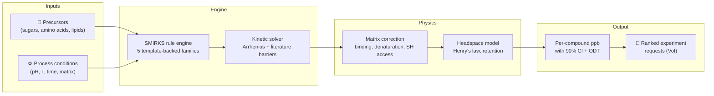

# Maillard

[](https://www.python.org/downloads/)
[](https://www.docker.com/)
[](https://opensource.org/licenses/Apache-2.0)
[](results/validation/prediction_uncertainty.md)
[](results/validation/family_implementation_status.md)

**Maillard** is a computational screening framework that predicts which combinations of
sugars, amino acids, temperatures, pH, and protein matrices will produce **meat-like aroma**
in plant-based formulations — and which will produce **off-notes** or **safety concerns** —
*before* you run a single wet-lab experiment.

Plant-based meat smells "beany" because the Maillard reactions that create real meat aroma
behave very differently inside a soy or pea protein matrix than in a free aqueous system.
Maillard maps 16 literature-derived chemistry lanes — **5 of them backed by generative
reaction templates**, the rest implemented as shared limbs, matrix/modifier layers or
literature priors ([which is which](results/validation/family_implementation_status.md)) —
corrects for how the plant matrix traps or releases each volatile, and tells you exactly where
its predictions are trustworthy, where they are directional, and **what experiment would
improve them most**.

> **Who is this for?** Alternative protein scientists who want to triage formulations before
> burning GC-MS time, and computational chemists who want a transparent, benchmarked platform
> for matrix-aware Maillard chemistry.

> **Read this first:** this repository underwent a two-day adversarial audit in August 2026
> that found — and fixed — serious problems, including circular validation and fabricated
> citations. The findings, the fixes, and the honest (worse) numbers that resulted are
> published in [AUDIT.md](AUDIT.md). The calibration claims below are the post-audit ones.

---

## How it works



**Inputs:** Choose your protein source (pea, soy, wheat gluten, mycoprotein, or 10 others),
precursors, and process conditions. **Engine:** The SMIRKS rule engine generates
atom-balanced reaction candidates for the 5 chemistry lanes that carry reaction templates
(core amino acid + sugar, lipid oxidation, thiamine, lipid x Maillard crosstalk, protein
damage markers); a kinetic solver ranks them using literature-calibrated Arrhenius
parameters. **Physics:** Matrix corrections account for
protein-volatile binding, denaturation, and accessibility; a headspace model applies Henry's
law partitioning and retention penalties. **Output:** Per-compound predicted concentrations
(ppb) with 90% confidence intervals, odour-activity ratios, and a ranked list of which
wet-lab experiment would reduce uncertainty the most.

---

## What the output looks like

This is the *Compound Confidence* table as `report.md` actually emits it, **regenerated by
running the tool** — `scripts/generators/generate_report_visual_examples.py`, which drives the
same forward-mode entry point as the documented CLI (ribose + cysteine + leucine, pea isolate,
pH 5.5 / 105 °C / 45 min). Copy it from a run, never by hand:

| Compound | Predicted | Tier | Score | Mode | Reachability | Calibration Source | Observable Assumption |
| :--- | :--- | :---: | ---: | :--- | :--- | :--- | :--- |
| furfural | 0.108 ppb [0.000975-11.9, 90% CI] | exploratory | 43.0 | hypothesis_only | chemically_reachable | Pratap-Singh 2021 pea isolate ambient slurry baseline (generic furan transfer) | static_class_profile \| class_level \| standard_matrix_support |
| 2-furfurylthiol | 0.00211 ppb [9.14e-07-0.233, 90% CI] | exploratory | 33.0 | hypothesis_only | chemically_reachable | Interpolated base sulfur yield matching internal benchmark limits | sulfur_binding_prior \| class_level \| standard_matrix_support |
| 3-methylbutanal | 0.000904 ppb | exploratory | 43.0 | hypothesis_only | chemically_reachable | Pratap-Singh 2021 pea isolate ambient slurry baseline (generic aldehyde transfer) | static_class_profile \| class_level \| standard_matrix_support |
| 2-methyl-3-furanthiol | 9.5e-05 ppb [2.56e-07-0.0105, 90% CI] | exploratory | 33.0 | hypothesis_only | chemically_reachable | Interpolated base sulfur yield matching internal benchmark limits | sulfur_binding_prior \| class_level \| standard_matrix_support |
| bis(2-methyl-3-furyl) disulfide | 2.94e-05 ppb [3e-08-0.00325, 90% CI] | exploratory | 33.0 | hypothesis_only | conditionally_reachable | Interpolated base sulfur yield matching internal benchmark limits | sulfur_binding_prior \| class_level \| standard_matrix_support |

> **This table used to be fabricated, and the fix is worth reading.** Until 2026-08-27 the
> generator behind these figures built its `FormulationResult` objects from hard-coded
> numbers and never touched the model. It announced *"DECISION CONFIDENCE: HIGH_CONFIDENCE
> (82/100)"* and *"SCIENTIFIC ENVELOPE: TRUSTED"* while this README said there is no "high"
> tier — and it attributed the two flagship thiols to the *Pratap-Singh soy-vs-pea ambient
> slurry* anchor, which contains no sulfur chemistry at all and is now labelled
> `fitted_to_benchmark`. Because the numbers were invented, the tracked figures dated from
> May and had survived every recalibration since: the one artifact guaranteed never to show a
> regression. It now runs the pipeline, so the showcase moves when the model does.

> **How to read this:** *Predicted* carries the 90 % Monte-Carlo interval inline; a compound
> with no interval had no envelope sampled. *Tier* is one of `high` / `medium` / `low` /
> `exploratory` — a band on the 0-100 *Score*, paired one-to-one with *Mode*
> (`benchmark_supported_quantitative` / `ranking_supported` / `directional_only` /
> `hypothesis_only`). *Reachability* says whether an enumerated pathway produces the
> compound or whether the number is a class-level projection. *Observable Assumption* is a
> pipe-joined triple: retention mode, calibration fallback mode, support origin. Compounds
> with no curated label appear by SMILES.
>
> Note the honesty of this example: every row is `exploratory`, because a pea-isolate matrix
> at 105 °C sits outside the free-precursor benchmark envelope. Wide intervals and low tiers
> are the normal output for matrix systems today — see the calibration section below.
>
> Two other tier vocabularies appear elsewhere in the same report and are **not** the same
> scale: `calibration_evidence_strength` (`literature_anchored` → `conditional_literature_anchored`
> → `class_anchored` → `directional_transferred` → `process_state_mismatch` → `heuristic`)
> grades the anchor behind a compound; `confidence_tier` (`high` / `medium_high` / `medium` /
> `medium_low` / `low`) grades a *literature prior* in `data/lit/`, not your run. §6 of every
> report defines all three side by side.

The full report also includes a compound confidence overlay chart, an intervention waterfall,
and provenance metadata linking every number to its literature source.


---

## How well calibrated is it?

We publish four orthogonal evidence surfaces rather than a single accuracy number — and
after an adversarial provenance audit (2026-08-26), we report calibration **split by signal
origin**, because an aggregate number quietly mixed literature-measured rows with internal
synthetic comparators.

### Headline: **0 of 3** evaluable literature rows falls within the model's 90% CI — and 3 populations that used to be pooled are now reported apart

| Population | Inside 90% CI | Not evaluable\* | Median CI width | Is it evidence? |
| --- | ---: | ---: | ---: | --- |
| **External literature** | **0/3** (0%) | 4 | **0.75 dex** | **Yes — this is the only row that is** |
| **Fitted rows** (constants back-solved from the benchmark) | 2/2 | 0 | 2.96 dex | No — algebraic recovery |
| **Internal synthetic** (model vs its own frozen output) | 18/18 | 8 | 4.18 dex | No — reproducibility harness |

\* Degenerate near-zero-width envelopes: the Monte Carlo perturbs nothing on their path, so
pass/fail is meaningless and they are excluded from coverage.

**The `fitted rows` line is new (2026-08-27) and it is the whole point of the split.** Both of
its hits would previously have been counted as literature evidence — and in the immediately
preceding revision of this README, they *were*: they were the only two hits in a headline that
read "2 of 11 literature rows". A constant solved from a benchmark reproduces that benchmark.
Those rows are now removed from the literature numerator **and** denominator, which is why the
denominator fell from 11 to 3, and `scripts/ci/fit_target_gate.py` makes undisclosed
fit-then-score a build failure. The panel itself also shrank from 16 benchmarks to **14**: two
more were quarantined as fabricated (see [AUDIT.md](AUDIT.md), Round 2).

**And the benchmark-level count, split the same way:** of 14 benchmarks, the ones without
blocking coverage or ranking gaps are **0 of 6 predictive**, **0 of 4 fit-recovery**, and 4 of 4
internal-synthetic. The 4/14 aggregate is retained in
[benchmark_summary.md](results/validation/benchmark_summary.md) only for continuity with older
reports; **every one of those four is now an internal synthetic row — the model agreeing with
its own frozen output. There is no longer a single benchmark in the panel that passes on
anything else.**

> **Two counters, and they disagree.** `benchmark_summary.md` prints **6/14**, because
> `src/presentation.py::_is_pass` also counts the weaker `pass-no-ranking` status (the two
> Pratap-Singh fit-recovery rows). The headline above and
> `tests/scientific/test_honest_headline_guards.py` use the strict `overall_status == "pass"`
> and see **4/14**. Both are defensible; publishing them without saying which is which is not.
> The divergence predates this wave (7/14 vs 5/14 after Wave O) and is now pinned in the guard.

> **Fit-recovery fell 1/4 → 0/4 on 2026-08-27 (Wave P), and the mechanism is worth reading.**
> The last survivor was `pea_isolate_uht_140C_Trikusuma2019`, which passed because three
> observability factors had been back-solved so it reproduced its own measured 782 / 163 / 24
> ppb. Wave P corrected the *substrate* nonanal is cleaved from — oleate, not linoleate
> (Miyazaki 2023, [10.1093/bbb/zbac189](https://doi.org/10.1093/bbb/zbac189): nonanal appears
> in neither linoleate hydroperoxide isomer's product list; `LipidProfile.oleic_acid_pct` had
> been declared, populated for pea and soy, and read by **no code path in the repository**).
> The nonanal row immediately fell to **2.2727× under**, which is *exactly*
> 1 / (22.0 / 50.0), the pea oleic/linoleic ratio. A constant that tracks a substrate error to
> five significant figures was never measuring the model. It was deliberately **not**
> refitted.

> **Fit-recovery fell 3/4 → 1/4 on 2026-08-27 (Wave K/M), and it is the most instructive
> number on this page.** The two Pratap-Singh ambient-slurry benchmarks used to score max
> ratio 1.002× and 1.001× — textbook algebraic recovery, since their observability factors
> were back-solved from their own measured hexanal. Wave K then read the actual paper
> (Molecules 2021, 26, 4104, Table 1, via Europe PMC): the measured hexanal is **1138.00**
> ppb for pea and **1621.71** ppb for soy, not the 260 / 380 this repository had recorded,
> and the hexanol rows (80 / 120 ppb) were reported by the paper as **n.d.** With the
> corrected references the two lanes now miss by **4.37×** and **4.27×** — exactly the size
> of the transcription error, because the constants still reproduce the wrong number they
> were solved from. **A fit-recovery that no longer recovers is the cleanest possible proof
> that the recovery was never evidence.** The observability factors were deliberately NOT
> refitted here (see [AUDIT.md](AUDIT.md), Round 3): refitting them in the same pass as a
> chemistry change would make the resulting agreement unattributable.
>
> **They have since been refitted, to the verified values, and the headline did not move
> (2026-08-27, Wave O).** One shared scale of **4.317249×** was fitted across both ambient
> hexanal lanes against 1138.00 / 1621.71 ppb — one free parameter, two rows, so the fit
> keeps a measurable residual instead of an arithmetic zero. It lands at **1.0113× on both
> rows**, which says the two corrected anchors agree to 1.1%: the transcription error was a
> common *absolute-scale* error and the pea-vs-soy release ratio (2.2098) survived it
> untouched. Both rows moved `scale-gap` → `pass-no-ranking`. **Neither counts as a pass and
> neither is evidence** — they are still `fit_recovery`, still excluded from the coverage
> numerator and denominator, so 0/6 predictive and 5/14 aggregate are unchanged. What the
> refit bought is that the constants are now anchored to numbers that exist; what it cost is
> in the hold-out row below. Record:
> [matrix_observability_refit_pratap_singh.md](results/validation/matrix_observability_refit_pratap_singh.md).

**How to read this honestly:** coverage is only meaningful next to interval width — a 90% CI
spanning two or more orders of magnitude makes coverage cheap. This headline is the reverse of
the usual worry: the intervals *grew* — and coverage still *fell*, most recently from 2/11 to
1/3 when the fitted rows were pulled out of both sides, and then to 0/3 under Wave S1b. The point predictions moved further
from the measurements than even those intervals allow, and the literature slice's own interval
is the *narrowest* of the three (**0.75 dex**, a factor of ~5.6 end to end — it widened from
0.85 to 0.95 dex under the Wave S1 additive propagator and then *narrowed* to 0.75 dex under
the Wave S1b routing repair, and **coverage fell from 1/3 to 0/3 as it narrowed**), so that
0/3 is the one number here that is not cheap — a narrower interval that now misses every
literature row is the worst of both. The
literature slice is now saying the model is wrong on the sulfur branch, and saying so loudly. The
internal-synthetic rows (26 of the 35 matched rows in the Monte-Carlo panel) are
drift-detection harnesses, not
evidence, and are labeled as such throughout the pipeline. Four former panel benchmarks lost
their place in the audit because their cited sources are dead or resolve to unrelated papers:
three were deleted after source recovery confirmed no source exists (one was rebuilt from a
verified chapter and now fails honestly at 773×), and one was **quarantined**
([data/benchmarks/quarantined/](data/benchmarks/quarantined/)) — it carried the tightest
tolerance in the collection, 1.05×, and the model was landing inside it at 1.016×. The panel
and all artifacts were regenerated without them.

**Why this number fell — twice (2026-08-27):**

*First,* the projection layer was applying its Boltzmann selectivity term *twice* to the same
pathway span — once explicitly and once inside the pathway flux it multiplied by — so
competing volatiles were being discriminated at an effective temperature of T/2.19 with no
physical justification, and the volatile budget's temperature dependence came from a sigmoid
that saturated by 150 °C. Both were corrected and the budget's two free constants refit
against literature rows only
([results/validation/projection_constant_refit.md](results/validation/projection_constant_refit.md)).
Literature-row mean |log10 error| went 0.15 → 0.26 dex *from the Boltzmann de-duplication
alone*. That gap measures how much of the previous agreement was being carried by the
unphysical term.

> **Corrected 2026-08-27.** The sentence above used to be the whole story, and it stopped
> at the flattering number. 0.26 dex was measured *before* the chemistry rebuild described
> next; it was never the shipped state. At the shipped constants,
> [results/validation/projection_constant_refit.md](results/validation/projection_constant_refit.md)
> records a literature-row objective of **0.89 dex** (0.96 dex before the Wave O and Wave P
> regenerations, 0.74 dex before the 2026-08-27 Wave N route correction and the Wave K/M
> benchmark content corrections; the objective got worse because the *references* got more
> accurate, not because the model changed) — nearly four
> times the figure this README was quoting, and six times the 0.15 it started from. The
> degradation was **larger** than stated. (The fit optimum the repository declines to apply
> sits at 0.88 dex, i.e. the refit buys almost nothing: tau_ref is a single global scale and
> cannot fix an allocation problem.) The regenerated coverage numbers are in the section above.

*Then* a mechanism-level review of every reaction template found that the flagship compound,
2-methyl-3-furanthiol, was being made by a **fabricated one-step shortcut**, and that 93 % of
the emitted network was a lipid radical chain whose propagation rule matched any sp²
carbon — 61 of 103 peroxidation steps were chemistry that does not exist. The fabricated chain
was deleted (5500 → 369 steps) and MFT rebuilt on a mechanistic
1-deoxyosone → furanone → MFT route. **Absolute sulfur
yields fell 5–40×.** That is the entire cause of the calibration drop: the panel's previous
sulfur agreement was standing on chemistry that was not real.

*And then the replacement route turned out to be wrong too (2026-08-27, Wave N).* The
norfuraneol intermediate was taken from van den Ouweland & Peer 1975
(`10.1021/jf60199a045`) — a real paper, correctly cited, describing a genuine **synthesis**
of MFT from norfuraneol and H₂S. It is not the in-situ Maillard route. Cerny & Davidek 2003
(`10.1021/jf026123f`) spiked authentic norfuraneol into a [¹³C₅]ribose/cysteine system and
the MFT came out **mainly ¹³C₅-labelled**, i.e. from the ribose and not from the spike:
"4-hydroxy-5-methyl-3(2H)-furanone is unimportant as an intermediate". Cerny & Davidek 2004
(`10.1021/jf035265m`) confirmed the real intermediate positionally with [1-¹³C]ribose:
**1,4-dideoxypento-2,3-diulose**. Hofmann & Schieberle 1998 say the same thing in their own
abstract — norfuraneol/cysteine is among the *less* effective MFT precursors. The route was
replaced with the isotope-evidenced one (`Deoxyosone_Reduction` + `Thiol_Addition_Pentodiulose`;
norfuraneol is retained as a real furanone product, just not in the MFT lane). Evidence
dossier: [docs/validation/isotope_topology_evidence.md](docs/validation/isotope_topology_evidence.md).

**The Hofmann agreement got worse, and that is the honest number.** MFT went 235.32 → **151.87
ppb** against a 342 ppb reference (**1.45× under → 2.25× under**) and FFT 219.96 → **243.72**
against 200 (1.10× over → **1.22× over**). Nothing was tuned to claw it back. The 1.45× had
been bought with `thiol_addition_norfuraneol` = 26.85 kcal/mol, a barrier Wave H fitted
*through the contradicted route*; its replacement ships at the un-fitted sulfur-addition class
value 28.60, explicitly unconstrained. **A worse number obtained through a route the isotope
literature supports is worth more than a better number obtained through one it refutes.**

**That barrier has since been refitted, with owner approval (2026-08-27, Wave P), and both
rows improved — which is fit recovery, not validation.** *(**REVERTED 2026-08-27 by Wave S2c**
— the whole paragraph below is history. `thiol_addition_pentodiulose` is back at the un-fitted
28.60 and the fit record is retracted, because Wave S2b showed the 342 / 200 ppb it was fitted
against are this repository's own arithmetic on an invented mol % band, not a measurement. Read
it as a record of what was done, not as a description of what ships.)*
`thiol_addition_pentodiulose` went
**28.60 → 26.35** kcal/mol against `cys_ribose_140C_Hofmann1998` and nothing else: one free
parameter, range [23.30, 29.65] bounded by values already in the table, decision rules copied
verbatim from the Wave H script, and run *last* in the wave so the fit sees the network that
ships. MFT 151.87 → **242.38 ppb** (2.25× under → **1.41× under**); FFT, which was **not**
fitted, moved 243.72 → **217.99** (1.22× over → **1.09× over**) in the opposite direction,
because the two lanes draw on the same upstream sugar flux — which is exactly why one knob was
fitted against these two rows and not two. Three things keep this readable as what it is:
> * the benchmark is a **declared fit target** at `per_row_recovery` leverage, so it stays out
>   of the honest literature-coverage numerator *and* denominator, exactly as before;
> * **the profile minimum sits at the range floor** (argmin 23.30, `hit_a_bound = true`), so
>   26.35 is the conservative edge of the indifference band and the residual is *not* removable
>   by this barrier — pinned at the floor the objective is still 0.0836 dex;
> * the anchor's own **mol%→ppb conversion is unverified** (Wave K), and that sentence now
>   travels verbatim inside the constant's rationale in `src/barrier_constants.py`. If the
>   conversion is wrong, the error is now *localised in one named constant* instead of spread
>   through the route. That is the argument for doing the fit at all.
>
> The benchmark's own contract is untouched and still **fails** — max ratio 1.4110 was
> *inside* its 1.45 threshold while MALE 0.0935 was outside 0.09, so at that point it failed
> on one criterion instead of two. Record:
> [sulfur_barrier_refit_pentodiulose.md](results/validation/sulfur_barrier_refit_pentodiulose.md),
> which supersedes the stale `sulfur_barrier_refit_hofmann.md`.
> **Those two numbers have since moved and got worse — see the Wave S1 block below.**

**Wave S1 (2026-08-27): parallel reaction channels can finally add — and the flagship
benchmark got worse.** Wave P discovered that `src/recommend.py` relaxed to the *lowest-span
route per product* and kept only that route's flux, so adding a second literature-evidenced
route to MFT contributed **exactly zero**. The propagator now sums kinetically distinct routes
before the fixed volatile budget is allocated. Nothing was refitted to accompany it. What that
cost, on the one verified sulfur benchmark:

| Hofmann 1998 row | Wave P | Wave S1 | reading |
| ---------------- | ------ | ------- | ------- |
| MFT (vs 342 ppb) | 242.38 — 1.4110× under | **283.59 — 1.2060× under** | better |
| FFT (vs 200 ppb) | 217.99 — 1.0900× over | **297.28 — 1.4864× over** | **worse** |
| max ratio / MALE | 1.4110 / 0.0935 dex | **1.4864 / 0.1267 dex** | **worse — the untouched 1.45× / 0.09 dex contract now fails on *both* criteria again, not one** |

**Wave S1b (2026-08-27): the pH and moisture physics was written, unit-tested, and never
connected — and connecting it made this benchmark worse again.** The repo's first *ordinal*
accuracy measurement (Wave S2's 52-claim directional panel) scored the model **16/19 on sugar
identity, temperature, time and precursor loading, and 2/10 on pH and moisture** — worse than
a coin, and systematically so. The cause was three routing defects, not three modelling
errors: `get_ph_multiplier` was never called on the prediction path; the pyrazine branch of
`_ionization_correction` keyed on a substring matching **none** of the 29 families this engine
emits; and the water-activity correction reached 3 of those 29, missing the furan/HMF track
entirely, with its dehydration branch keyed on the equally dead `"furfural"`. All three are
now wired, with explicit family-name sets replacing every substring key. **No correction curve
was reshaped, no constant refitted, and the panel was not iterated against.**

| | pre-fix | post-fix | reading |
| --- | --- | --- | --- |
| Directional panel, **pH claims** | 2/7 | **4/7** | the two gained rows are exactly the two dimethylpyrazine-vs-pH measurements the diagnosis predicted |
| Directional panel, **moisture claims** | 0/3 | **0/3** | see below — this one is structural, not routing |
| Directional headline | 19/29 (66%) | **20/29 (69%)** | +2 pH, −1 sugar identity |
| Hofmann MFT (vs 342 ppb) | 283.59 — 1.2060× under | **154.85 — 2.2086× under** | **worse** |
| Hofmann FFT (vs 200 ppb) | 297.28 — 1.4864× over | **267.50 — 1.3375× over** | better |
| Hofmann max ratio / MALE | 1.4864 / 0.1267 dex | **2.2086 / 0.2352 dex** | **worse on both** |
| Bolton 1994 MFT | 748× under | **6731× under** | **much worse** — now the worst quantitative point in the whole panel |
| Cerny 2008 MFT | 2.787× over | **23.406× over** | **much worse** |
| MC panel, honest literature coverage | 1/3 | **0/3** | the Resconi furfural row left its own 90% CI |

**The Hofmann row is not a conflict with a measurement, and saying so was wrong.** The
mechanism is real — at pH 5.0 the textbook acid preference of 1,2-enolisation moves budget
share from the MFT arm to the FFT/furfural arm — but the thing it moves *against* is not a
measurement. **Wave S2b traced 342 / 200 ppb to this repository's own
`data/benchmarks/maillard_validation_benchmarks.md` §1.3**, an abstract-reconstructed range
table (`~0.02–0.05` and `~0.01–0.03` mol %) committed in the *same commit* that created the
benchmark file; 342 and 200 are interior points of those two invented bands, and the bands
**overlap** (MFT 228–571 ppb, FFT 114–342 ppb). So "MFT 342 > FFT 200 at pH 5" is an artifact
of where the midpoints were picked, and the 1.45× / 0.09 dex contract is ~1.7× tighter than
its own source band. The degradation above is still real and is still reported; what it is
*not* is evidence that the pH physics is wrong. **Nothing was refitted to claw any of this
back, and the contract was not relaxed either** — Wave S2b's recommendation to retire it and
demote the benchmark is an owner decision, recorded in that file's
`content_verification_note`. *(Executed the same day by Wave S2c — see immediately below.)*

**Wave S2c (2026-08-27): the tightest contract in the panel was anchored to the repository's
own guess, and it is retired. THE SULFUR BRANCH NOW HAS ZERO ABSOLUTE LITERATURE ANCHORS.**
The owner approved Wave S2b's staged plan and it was executed. What that means, plainly: after
three fabricated-source benchmarks were quarantined or deleted in Round 2, the repo said one
literature anchor survived on the sulfur branch. It did not. `342` and `200` ppb were never
measured by anybody — they are interior points of two invented mol % bands in this
repository's own `data/benchmarks/maillard_validation_benchmarks.md` §1.3, and the arithmetic
closes exactly on the benchmark's declared (also unattested) 10 mM basis:
`0.0300 mol % × 0.010 M × 114.17 g/mol = 342.5 → 342 ppb`, and the geometric mean of the FFT
band `0.017321 mol % → 197.8 → 200 ppb`.

| What was undone | Before | After |
| --- | --- | --- |
| `cys_ribose_140C_Hofmann1998` values | shipped as literature measurements | both marked `value_status: no_verifiable_source`, values **unedited** (the shipped number is the evidence) |
| Its validation contract | 1.45× / 0.09 dex — the tightest in the panel | **retired**; nothing looser invented; the global free-precursor default (1.5× / 0.10 dex) is inherited and is failed by more |
| Its tier | `PRIMARY` | **`REFERENCE`** — no longer strict-gate eligible; kept in the tree as a mechanistic diagnostic |
| `thiol_addition_pentodiulose` | 26.35 kcal/mol, *fitted* against that benchmark alone | **28.60 — reverted** to the un-fitted Wave N class value; the fit record is **retracted** |
| §1.3 of the literature brief | presented as a transcribed yields table | dated **ABSTRACT-RECONSTRUCTED GUESSWORK** warning; kept, not deleted — it is the provenance record |

**The cost is real and is published, not absorbed.** Removing a fit to a non-measurement makes
the model look *worse* against that non-measurement, and it should:

| Hofmann row | Wave S1b | **Wave S2c** | reading |
| --- | --- | --- | --- |
| MFT (vs the fabricated 342 ppb) | 154.85 — 2.2086× under | **78.09 — 4.3797× under** | **much worse** |
| FFT (vs the fabricated 200 ppb) | 267.50 — 1.3375× over | **293.67 — 1.4684× over** | worse |
| max ratio / MALE | 2.2086 / 0.2352 dex | **4.3797 / 0.4041 dex** | **worse on both** |
| Cerny 2008 MFT (reference-only) | 23.406× over | **25.741× over** | worse — same barrier, xylose lane |

Every other panel aggregate held: strict-ready **0/14** (this benchmark was *failing* its
contract when it was retired, so retiring it removes a failure, not a pass), honest literature
coverage **0/3**, MC coverage **28/35**, and **all eight external hold-out points bit-identical
for a third consecutive wave**. The four internal reproducibility snapshots recover exactly
after the documented refresh: MFT ×0.416079 and the MFT-derived disulfide ×0.420049, while
every other propagated row rises by exactly ×1.010812 — one shared factor across three
unrelated compounds, which is the signature of the fixed volatile budget re-normalising rather
than of three coincidences.

**What is *not* fixed by this.** The benchmark still declares `measured_volatiles`, so its rows
are still enumerated and still scored — the fold errors above are errors against a fabricated
yardstick and must never be quoted as accuracy against literature. Taking it out of the scored
population entirely (via `reference_volatiles`, or quarantine) and rebuilding it from an
interlibrary-loan copy of the paper in native **mol %** are the open owner items; the ILL
request pack is in `tasks/audit_remediation.md` "## Wave S2b" §(f).

**And moisture is still 0/3 for a reason worth knowing.** The correction now reaches the
chemistry properly and visibly moves compounds (DMHF falls 115.4 → 45.5 → 49.6 ppb over
aw 0.25 → 0.65 → 0.95, a 2.5× separation where there was none). But HMF — the observable in
two of the three moisture rows — is produced by the
*same* reaction family as furfural, so the two always carry the same aw factor, their shares
are pinned against each other, and together they are 90–96% of that system's volatile budget.
**No family-level correction can move HMF against aw in a two-precursor system**; the
projection budget itself has no moisture dependence. That is a statement about the allocation
layer, and it is an open item.

**pH and moisture together are still 4/10 — at or below chance. The model still licenses no
pH or moisture recommendation.** Full pre/post table and per-claim flips:
[docs/validation/directional_accuracy_report.md](docs/validation/directional_accuracy_report.md)
§A4.

**One visible knock-on:** the forward-mode sample table above lost 2,5-dimethylpyrazine from
its top five and gained bis(2-methyl-3-furyl) disulfide. At that example's pH 5.5 the pyrazine
step is penalised twice over — its α-aminoketone amine is mostly protonated (pKa 6.5) *and* the
condensation sheds two waters — so it falls by ~450×. The same swap appears in the internal
reproducibility snapshots, where the ranking contract now reads FFT > MFT and disulfide > DMP.

Both compounds are reached by two enumerated routes, so both rose; FFT was already over. This
was **not** clawed back: the two lanes share their upstream trunk, so a barrier that pushed FFT
down would take MFT with it, and refitting a constant to absorb a propagator change is the
exact move this campaign exists to remove. The fix also **corrects Wave P's own arithmetic**:
Wave P projected MFT would reach 242.38 + 71.02 = 313.39 ppb "if the two channels are
genuinely independent". They are not — both MFT routes share the trunk `Amadori_Rearrangement`
as their rate-limiting step — and, more decisively, the volatile budget is fixed, so the
single-lane figures were never addable. **Mass honesty was verified rather than argued:** at a
fixed budget the allocated molar total equals `total_volatile_budget_molar` to 1 part in 10¹²
both before and after, so adding channels moves the *split* and never the total.

**Corrected 2026-08-27 (Wave S2c): there is no surviving literature constraint on the sulfur
branch.** The paragraph that follows is kept because it records what was done and what it
found, but its premise is false — Hofmann 1998 was never a literature constraint here (see the
Wave S2c block above), so the refits below were fitted against this repository's own guess.
The finding they reported — *that no barrier value closes the gap* — survives as a statement
about the model's allocation layer; the *anchor* does not.

~~The one surviving literature constraint~~ The benchmark then believed to be the one surviving
literature constraint on the sulfur branch (Hofmann 1998, after three
fabricated-source benchmarks were quarantined or deleted) was used to refit the branch —
and the refit's finding was that **it does not work**: no barrier value anywhere in its
defensible range closed the gap, because the deficit is in how the volatile
budget is *allocated*, not in the barriers
([results/validation/sulfur_barrier_refit_hofmann.md](results/validation/sulfur_barrier_refit_hofmann.md)
— **that record is now stale**: it profiles `thiol_addition_norfuraneol`, the family Wave N
retired, and re-running it is an open owner item).
A single global scale on the budget *would* close it — after the Wave P refit the optimum sits
**1.26×** away (it was 2.51× before) and would drop the Hofmann MFT residual from 0.1495 dex to
0.0497 dex — at the price of pushing Resconi furfural from 4.7× to **5.9× over**. That constant
was deliberately **not** moved
([results/validation/projection_constant_refit.md](results/validation/projection_constant_refit.md)).
We report the gap rather than absorbing it. *(Those two fold numbers are as of Wave P and are
now stale on both counts: the barrier they were measured against was reverted by Wave S2c, and
the Hofmann residual they trade against is a residual to a non-measurement. The record was
deliberately **not** re-run — re-running a refit generator to refresh a number nobody may act
on would be a recalibration event dressed as bookkeeping. The decision it records, "do not move
the global scale", is unchanged and is now better supported, not worse.)*

<table>
<tr>
<td width="33%" valign="top"><a href="docs/assets/validation_overview.png"></a><br/><sub><b>Parity.</b> Predicted vs. measured ppb across the 14-benchmark panel.</sub></td>
<td width="33%" valign="top"><a href="docs/assets/family_coverage.png"></a><br/><sub><b>Coverage.</b> Which of the 16 lanes are wired and evidence-backed.</sub></td>
<td width="33%" valign="top"><a href="results/validation/gap_heatmap.png"></a><br/><sub><b>Gaps.</b> Which experiments would close the largest blind spots.</sub></td>
</tr>
</table>

> **Figures (updated 2026-08-27):** all figures on this page are now current. They had been
> stale since May because `configure_science_plot_style()` raised a `RuntimeError` whenever
> `dvipng` was absent — which is the state of the documented conda environment, so the
> documented path could not produce a report at all. It now falls back to matplotlib's
> `mathtext` renderer with a one-time warning; set `MAILLARD_STRICT_LATEX=1` to restore the
> hard failure for CI figure jobs that must have real LaTeX. Glyphs are typeset by mathtext
> rather than LaTeX until `dvipng` is installed; the numbers are unaffected.

| Surface                       | Question                                                                 | Status                                                       |
| ----------------------------- | ------------------------------------------------------------------------ | ------------------------------------------------------------ |
| **Parity**              | On matched systems, how close is predicted ppb to measured?              | **14** benchmarks · MC panel covers **11** of them, **35 matched rows** · **0 strict-ready** · **0/6 predictive benchmarks without blocking gaps** |
| **External hold-out**   | On systems excluded from calibration, does the frozen model still cover? | 4 bundles · **1/5 on genuine extrapolations** at the pre-widening prior (1/5 at the wider one too, since Wave O) · median **93.68×** error, worst **2474×** |
| **Coverage**            | Which chemistry lanes are wired, and how?                                | 16 lanes wired · **5 with generative reaction templates** · 7 with DFT anchors |
| **Experiment priority** | Where would the next experiment improve confidence the most?             | 6/35 MC cells outside 90% CI — all queued                    |

> **On the external hold-out — read this before the number above.** The 8 points are
> genuinely excluded from calibration; the exclusion is code-enforced and survived an
> adversarial leak hunt. Everything else about them needs qualifying.
>
> **Genuine-extrapolation coverage is 1 of 5 at the prior this project shipped for most of
> its life (ln-sigma 2.0).** A 2/5 was quoted here until 2026-08-27: that was the *same
> predictions* re-scored after the prior was widened to ln-sigma 2.86 on 2026-08-26, and the
> Wave O refit has since taken it back down to 1/5, so the two priors now agree. Nothing
> about the model changed between those numbers — only the width of the interval drawn
> around it. The median hold-out fold error is 93.68×, which is why that is the figure to
> track. The report computes both and leads with the pre-widening one.
>
> **The Liu hold-out was being scored against numbers that are in no source, and fixing
> that made the headline worse again (2026-08-27, Wave R).** The block below quotes "Liu's
> band midpoint at 51.96 ppb" as one side of a 24× literature contradiction. There was no
> contradiction: the band was not in the literature. The primary document — Yaozheng Liu,
> *Flavor Chemistry of Pea Proteins*, NC State MS thesis 2021, published as Liu, Cadwallader
> & Drake (2023), *Food Chemistry* 406:134998, `10.1016/j.foodchem.2022.134998` — was
> retrieved and read in full. Its Table 2.7 quantifies nine commercial pea proteins at
> **hexanal 2445–52454 µg/L** and **nonanal 0.188–3.42 µg/L** of the rehydrated 10%-solids
> slurry. This repository carried **hexanal 15–180 ppb** (50–300× low) and **nonanal 5–50
> ppb** (6–266× high), plus OAV pairs and two further anchors that match no row of any table
> in the thesis. Correcting the reference values — **no prediction moved, nothing was
> fitted** — gives hexanal **19.50× → 11.17×** (better) and nonanal **4.78× → 94.22×**
> (worse), taking the median from 42.62× to **93.68×** and shipped-sigma coverage from 4/8 to
> **3/8**. The nonanal row is now the sharpest lipid-lane over-prediction on record against a
> directly-quantified reference: **75.5 ppb predicted against a band whose top is 3.42 ppb**.
> Wave P's oleate-substrate correction (below) is the partial mitigation already landed — it
> took this same point from 214× to 94× — and it was not enough. Liu's curves were built in
> **deionized water rather than in the protein matrix**, so protein binding is uncorrected
> and 0.188–3.42 is a *lower* bound; the gap is if anything understated. Two further anchors
> on the same source were retired rather than repaired: **(E,E)-2,4-heptadienal does not
> appear anywhere in the thesis**, and the methoxypyrazine anchor named IBMP, a compound the
> thesis neither identifies nor quantifies (its methoxypyrazine is IPMP, at 6.126–57.0 µg/L
> — 713× the retired 0.08 ppb ceiling). Neither was ever in the scored bundle. The hold-out
> stayed out of every fit throughout: this wave corrected reference data, it did not
> calibrate.
>
> **The refit to verified anchors made this WORSE, and that is the honest result
> (2026-08-27, Wave O).** Correcting the ambient hexanal observability factors to the paper's
> real values took the hold-out median from 15.31× to **42.62×** and shipped-sigma coverage
> from 5/8 to **4/8**. Three of the eight points moved, in opposite directions: Bi 2020 raw
> pea **5.37× → 1.24×** (the anchor and this hold-out point now agree), Liu 2023 **4.52× →
> 19.50×**, Li 2026 hexanal **21.58× → 93.15×**. The cause is a disagreement in the
> literature, not in the fit: the pea ambient lane carries two contradictory external
> measurements — Bi at 1260 ppb and Liu's band midpoint at 51.96 ppb, a **24× spread at
> nominally identical conditions** — and the erroneous 260 ppb the old constants reproduced
> sat almost exactly at their geometric mean (√(1260 × 51.96) = 255.9). Being wrong in the
> middle of a contradiction scores better than being right at one end of it. **Superseded
> 2026-08-27 (Wave R): there was no contradiction.** The 51.96 ppb was a midpoint of a band
> that appears in no source; Liu's real Table 2.7 range is 2445–52454 µg/L, so the verified
> anchor (1138 ppb) sits *just under* Liu's lowest lot rather than 6.3× above her band. The
> refit's DIRECTION is vindicated by the corrected target — this same Liu hexanal point
> improved 19.50× → 11.17× when the reference was fixed — while the reason the median rose
> is now the *nonanal* row, not a disagreement between two believable papers. `max_fold_error` (2474×) and the pre-widening 1/5 did **not** move — the refit
> touched one lane, not the transfer behaviour.
>
> **Two points improved on 2026-08-27 (Wave P) with nothing fitted, and the headline did not
> move at all.** Nonanal is the C9 fragment of the **oleate** double bond, not a linoleate
> product (Miyazaki 2023, `10.1093/bbb/zbac189`, read in full text; Hung, Katrib & Martin 2005,
> `10.1021/jp0500900`, measure "1-nonanal (30 ± 3% carbon yield)" from oleate cleavage). The
> model computed its entire hydroperoxide pool from `linoleic_acid_pct` and
> `LipidProfile.oleic_acid_pct` was dead code. Correcting the substrate — no constant fitted,
> no observability factor refitted — moved Li 2026 HME nonanal **272.63× → 118.31×** and Liu
> 2023 nonanal **10.86× → 4.78×**, each by exactly the matrix's oleic/linoleic ratio (both Liu
> folds were computed against the fabricated reference Wave R later retired; against the real
> Table 2.7 value the same fix reads **214× → 94.22×**). The
> other six points are byte-identical. And `median_accuracy_fold` (42.62× at the time; 93.68×
> since the Wave R reference correction), `ci_coverage_hits`
> (4/8 at the time; 3/8 since Wave R), `max_fold_error` (2474×) and the pre-widening 1/5 were
> **all unchanged by this fix**, because the
> median sits between two points that did not move and the two that did were outside the
> interval before and after. A real mechanistic correction improved a quarter of the hold-out
> by 2.3× each and moved the published number by nothing. Both nonanal points are still
> over-predicted, and the model still treats oleate as being as oxidisable as linoleate —
> which biases them high by roughly another order of magnitude and is *not* fixed.
>
> **That 0 of 5 became 1 of 5, and the median halved from 32.79×, because a reference was
> corrected — not because the model improved (2026-08-27, Wave K/M).** Two of the four Li
> 2026 hold-out points had been transcribed from the wrong table rows: 2-pentylfuran was the
> paper's *Maltol* row (221.5 ppb; the true value is **5625.80**) and nonanal was its
> *Decanal* row (29.42 ppb; the true value is **72.66**). With the paper's own numbers the
> 2-pentylfuran point goes from **49.8× over to 1.96× over** and nonanal from 673× to 273×.
> The predictions are byte-identical. Verified against the Europe PMC full text
> (PMC12984281); every corrected row carries a `content_correction_note`.
>
> **Only 5 of the 8 points test extrapolation at all.** The other 3 come from bundles whose
> run conditions are copied from an in-panel benchmark: those are reproducibility
> comparisons. On the bundles at genuinely new process states (HME extrusion, roasting) the
> misses still reach ~2500×, from unbounded lipid-oxidation kinetics — the reference
> correction removed one large miss, it did not remove the failure mode.
>
> **And only 4 of the 8 are measurements.** Two are geometric midpoints of 10–12× reported
> bands — a number we constructed, not one anybody measured — and two are the source's
> odour-activity value multiplied by *this repository's own* hexanal odour threshold, which
> is itself compilation-level and never verified against a primary table. Those two move if
> we correct our own constant, so they are a consistency check, not external evidence. Every
> row now carries its `value_provenance` and the report renders the split.
>
> **On the ±110× band itself (corrected 2026-08-27):** until this date the sampler clamped
> every multiplier at ±100×, so 10.7 % of Monte-Carlo draws were pinned at the clamp and the
> realised band was ±100×, not the ±110× advertised. The clamp is now derived from the sigma
> at 3σ and truncates 0.27 % of draws, so the sigma finally expresses what it claims.
>
> Extreme-processing predictions should be treated as hypotheses, and the gap heatmap
> converts each miss into a ranked, bookable wet-lab request. Full methodology:
> [VALIDATION_CONTRACT.md §3E](docs/reference/VALIDATION_CONTRACT.md).

> **On literature provenance:** the kinetic anchors and benchmark values in this repo were
> ingested with heavy LLM assistance and are **not yet fully human-verified**. An automated
> audit (2026-08-26) found ~20% of registry DOIs unresolvable plus a class of live DOIs
> pointing at the wrong paper; five benchmarks are now quarantined and every suspect anchor
> carries an `audit_flag` in its registry entry. **120 records are marked
> `no_verifiable_source`** (measured 2026-08-27 across every tracked JSON and YAML file,
> including nested records), of which **98 carry numeric payloads** and **80 of those are
> consumed at runtime**.
>
> That count has now risen twice in one day, and **both rises are the repository getting more
> honest, not worse.** Read it that way or the number is misleading in the wrong direction.
>
> * **84 → 102.** `data/qm/` was excluded from every sweep this repo has ever run — not by
>   choice, but because `.gitignore` hid the directory from git entirely. Tracking it
>   (2026-08-27) exposed 18 barrier windows and claimed quantum-chemistry values that carried
>   **no citation, no run record and no provenance of any kind**, and labelling them honestly
>   is what moved 84 → 102. None of those 18 reach the model: `data/qm/` is read only by a
>   loader test and by the skip-heavy Phase 3 authority lane.
> * **102 → 120** (Wave T3, 2026-08-27). Eighteen more records were labelled, and **all
>   eighteen were already shipping — none is new, and no value was added, changed or
>   invented.** Fifteen are `data/lit/protein_source_registry.json`, which has always
>   described itself as *"Mocked values for 14 protein sources based on Report 06"* in a JSON
>   field nothing read, while those mocked numbers drove `matrix_uncertainty_factor` and the
>   meaty-potential score at prediction time; two are the pH-release surrogates in
>   `retention_reference_payloads.json`, whose shipped `log_slope` turns out to be an exact
>   back-solve from an invented band; one is `ref41_ppi_sulfur_volatile_binding_v1`, which
>   cited a reference *number* inside an LLM research dump. Because all eighteen are in
>   `data/lit/` and all carry numbers, the runtime figure rises with them, **62 → 80**. That
>   is the honest count of unverifiable numbers the model consumes; it was 80 before this
>   wave too, they were merely unlabelled.
>
> Treat kinetic parameters as provisional pending manual source verification — the
> remediation ledger is [tasks/audit_remediation.md](tasks/audit_remediation.md).
>
> **What the citation gate can and cannot do.** `scripts/ci/citation_gate.py` is blocking and
> reports **0 dead DOIs and 0 waivers** as of the 2026-08-26 and 2026-08-27 sweeps. But it is
> **structural and offline** — DOI grammar, confabulation signatures, status coherence,
> repair-record completeness — and it *cannot* tell that a live, correctly-resolving DOI
> points at a paper describing a different experiment. That is exactly how two fabricated
> benchmarks survived every check until a human read the paper (see
> [AUDIT.md](AUDIT.md), Round 2). DOI **liveness** is a scheduled weekly sample, advisory,
> not part of the required set.

### When to trust the predictions

| Trust level                                  | Use for                                            | Example                                                         |
| -------------------------------------------- | -------------------------------------------------- | --------------------------------------------------------------- |
| **Moderate** — verify before deciding | Directional prioritisation and *relative* ranking  | Cys + ribose vs Cys + glucose; pea vs soy matrix comparisons; choosing what to test next |
| **Low** — exploratory only            | Hypothesis generation                              | Any absolute ppb figure; new protein sources without nearby benchmarks; extrusion claims |

**There is currently no "high" tier, and no benchmark in the panel is strict-ready
(0/14).** Free-precursor sulfur chemistry used to sit here as the high-confidence lane; after
the 2026-08-27 chemistry rebuild, the Wave N route correction, the Wave P refit and the Wave S1
additive-propagator fix the model under-predicts MFT by **1.21×** on its one verified
sulfur benchmark — while now **over**-predicting FFT on the same benchmark by **1.49×**, which
is worse than before — and by 21–95× on the hydrolysate lanes, and the refit established that
the residual is not removable by that barrier (its profile minimum sits at the floor of the
defensible range). What survives is **ordering** — but read the size of it carefully, because
the README previously quoted a number that no longer holds and attributed it to the wrong
thing. Measured on the current tree (2026-08-27, after Wave S1b): the pentose ≫ hexose MFT
constraint holds at
**8.26×** (ribose 169.1 ppb vs glucose 20.5 ppb at matched conditions). It has now been
published at 15.8×, then **8.98**×, then 3.39×, then 6.15×, then 7.78×, then 18.27×, and now
8.26× — the falls were supports being removed, and **the rises were not model improvements
either**. Measured: zero the
1.05 kcal/mol gap between `thiol_addition_hexose` (29.65) and
`thiol_addition_pentodiulose` (28.60) — i.e. make the two routes energetically identical — and
the ratio collapses to **4.27×**. So the mechanism contributes ~4.3× and the remaining ~1.9× is
carried by a barrier difference. The split has been 1.13× of 3.39× (Wave N), 2.31× of 6.15×
(Wave P), 3.14× of 7.78× (Wave S1), 4.27× of 18.27× (Wave S1b) and **4.27× of 8.26× now**.
**The claim got smaller and its evidence got better, and both halves are the point.** Wave S2c
reverted `thiol_addition_pentodiulose` 26.35 → 28.60 because the 26.35 was fitted against
`cys_ribose_140C_Hofmann1998`, whose values are this repository's own arithmetic on an invented
mol % band. Only the pentose limb runs that barrier, so ribose fell 374.0 → 169.1 while
**glucose did not move at all** — which is what identifies the cause. The structural share is
unchanged in absolute terms, so the fraction of the ordering carried by mechanism rather than
by a barrier gap went from **23% to 52%**, and no part of the claim now traces to a number this
repository invented. What is left riding on a barrier gap is 1.05 kcal/mol between an
*estimated class value* and an unconstrained legacy fit — where it used to be 3.30 kcal/mol
between a *fitted* barrier and that same legacy fit. The hexose limb still runs the demoted
one-step lump. The ordering agrees with
Hofmann & Schieberle 1998 — and this is the one Hofmann claim that survives Wave S2c, because
pentose ≫ hexose is stated in that paper's **abstract**, which is retrievable, rather than in
the reconstructed yields table that is not; the *reason* the model reproduces it is still
weaker than the agreement looks. The wheat ≫ soy hydrolysate ranking claim is withdrawn entirely: both benchmarks that
supported it were quarantined as fabricated.
Use the model to rank; do not use it to predict a concentration.

> **One disabled knob you should know exists.** `src/lipid_oxidation.py` carries an
> aldehyde-conversion saturation cap. **It ships disabled (`null`)** — the shipped model is
> byte-identical to the linear one — and until 2026-08-27 two docstrings claimed otherwise.
> The rationale is recorded verbatim in `data/lit/lipid_oxidation_calibration.json`
> (`_provenance.saturation_rationale`), and it is quoted here including the part that is
> awkward, because that part is the reason to publish it:
>
> > *"the validated benchmark envelope reaches progress ~= 0.06 (100C/45min) and the
> > external hold-out failures sit in the SAME progress regime (HME ~0.07), so a cap
> > aggressive enough to bend the hold-out also perturbs in-panel trace points … and
> > regressed the headline 37/48 -> 31/48 even at c=12. The hold-out over-prediction is
> > therefore a per-(matrix, process_state) CALIBRATION gap …, NOT a kinetic-shape problem.
> > The cap is therefore SHIPPED DISABLED (null) … **so the headline stays 37/48.**"*
>
> Read the last clause. A mechanism was left switched off with the preservation of a
> headline number stated as part of the reason. The diagnosis may well be right — the
> in-panel points it perturbs are trace-level with near-zero-width intervals — but "so the
> headline stays" is not a scientific argument, and it should never have been load-bearing.
> The cap remains disabled (turning it on now would be a recalibration entangled with this
> wave's chemistry changes) and re-deciding it on the evidence alone is an open owner item.

> **The matrix over-prediction story, re-derived on corrected anchors (2026-08-27, Wave M).**
> The S27 workstream that produced the disabled cap was written against a *median 36×
> hold-out over-prediction*. That framing was built on top of two data errors, so here is
> what the corrected anchors say:
>
> * The hold-out median was **15.31×** at that point, and one 49.8× miss became 1.96×. That
>   was entirely the Li 2026 wrong-row correction, not a model change. **Wave O then took the
>   median to 42.62×** by refitting the ambient lane onto the verified anchor — see the
>   hold-out block above.
> * **The over-prediction has not gone away.** The extreme process-state misses — roasted pea
>   2474×, HME 1-hexanol 1117×, HME nonanal 273× — are untouched. All eight hold-out points
>   are still over-predictions.
> * **A new under-prediction appeared where there used to be perfect agreement.** With the
>   real Pratap-Singh hexanal values (1138 / 1621.71 ppb) the ambient pea and soy slurry
>   lanes were **4.37× and 4.27× UNDER**, because their observability factors were solved from
>   260 / 380. In the uncalibrated residual derivation soy ambient hexanal moves from 2.21×
>   under to **9.43× under**. **Wave O closed the calibrated half of this** (one shared scale
>   of 4.317249×, leaving a 1.0113× residual on both rows) but **not the uncalibrated half**:
>   the residual derivation deliberately never reads the observability factors — the whole
>   point of the uncalibrated tier is to describe a lane with no such calibration — so it is
>   bit-identical after the refit and 9.43× still stands.
> * So the diagnosis "unbounded lipid-oxidation kinetics over-predict at high process
>   severity" survives, but the *baseline* it was measured against did not: the ambient lane
>   is not a calibrated reference, it is a lane pinned to a mistranscribed number. The
>   leave-lane-out matrix ln-sigma moved with it: RMS 2.86 → **3.25** on 5 residuals (was 6;
>   the hexanol row is gone), bias fold 3.46 → **3.91**, 90% CI [1.98, 5.48] → **[2.19,
>   6.80]**. The shipped 2.86 is still inside it and was **not** moved
>   ([matrix_sigma_residual_derivation.md](results/validation/matrix_sigma_residual_derivation.md)).
>   Re-derived again after the Wave O refit: **bit-identical**, for the structural reason
>   given above. No refit of an observability constant can ever be used to narrow this prior.
> * **Wave P moved it, and a chemistry correction is the only thing that can (2026-08-27).**
>   One of the five residuals is the Trikusuma heated-pea *nonanal* row, whose uncalibrated
>   prediction fell 3238.93 → 1425.13 ppb when nonanal was moved onto the oleate pool — the
>   exact 0.4400× oleic/linoleic ratio. RMS **3.25 → 3.02**, bias fold 3.91 → **3.31**, 90% CI
>   [2.19, 6.80] → **[2.03, 6.30]**. The shipped 2.86 was **not** moved and is still inside.
>   The derivation moved *toward* the shipped value; that is a consequence of correcting a
>   substrate, and it is not a reason to narrow the prior.

Full validation methodology: [VALIDATION_CONTRACT.md](docs/reference/VALIDATION_CONTRACT.md).
Regenerate all evidence artifacts: `./scripts/docker_maillard.sh summary`.

---

## The 16 chemistry lanes — and what is actually implemented

Maillard maps 16 chemistry lanes drawn from a systematic literature review. **They are not
16 implemented reaction mechanisms**, and the table below says which is which. Five lanes
carry generative reaction templates — the engine can enumerate atom-balanced steps for
them. The other eleven are real parts of the model, but they are shared limbs of another
lane, matrix/modifier layers that are not reaction chemistry at all, or literature priors
with no generative implementation yet.

The **Implementation** column is derived from the engine by enumeration, not asserted:
regenerate it with `python scripts/generators/generate_family_implementation_status.py`
([full detail](results/validation/family_implementation_status.md)). The generator fails if
the engine ever emits a reaction family the table does not classify.

| #  | Lane                          | Key compounds                     | Implementation                                | Evidence                 |
| -- | ----------------------------- | --------------------------------- | --------------------------------------------- | ------------------------ |
| 01 | Amino acid–sugar core        | MFT, FFT, methional, pyrazines    | 🧬 **20 reaction templates**                  | ⚠️ Benchmarked, failing 1.45–773× |
| 02 | Lipid oxidation & crosstalk   | Hexanal, 2-pentylfuran, nonanal   | 🧬 **5 reaction templates** (needs a hydroperoxide seed) | ⛔ **Fit-recovery only** — every matrix intake lane's observable factor was back-solved from the benchmark it is scored against |
| 03 | Thiamine degradation          | MFT (via thiamine), thiazoles     | 🧬 **2 reaction templates**                   | ⚠️ Benchmarked, failing 3.2–773× |
| 04 | Nucleotide & ribose support   | IMP, GMP, umami precursors        | 📚 Priors only — ribose is a family-01 donor; nucleotides enumerate to nothing | 📐 Literature-calibrated |
| 05 | Glutathione & peptide support | GSH-derived sulfur volatiles      | 📚 Priors only — no GSH template; the `glutathione_cleavage` barrier is never reached | 📐 Literature-calibrated |
| 06 | Alternative protein matrices  | Matrix-specific modifiers         | 🧱 Matrix layer (`src/matrix_correction.py`) — not reaction chemistry | ⛔ **Unbenchmarked** — its two anchors were quarantined as fabricated (2026-08-27); the surviving matrix rows are all fit-recovery |
| 07 | Carbonyl donor hierarchy      | Sugar reactivity ranking          | 🎚️ Modifier on family 01 (`DONOR_REACTIVITY_MULTIPLIERS`) | 📐 Literature-calibrated |
| 08 | Off-notes & suppression       | Dicarbonyl traps, inhibitors      | 🎚️ Shares families 02/11; suppression is the intervention layer | ⚠️ Benchmarked, failing 15.4× (acrylamide extrusion) |
| 09 | Caramelization & pyrolysis    | HMF, furfural                     | 🔗 Shares family 01's 1,2-enolisation limb    | ⚠️ Benchmarked, failing 3.1× |
| 10 | Fermentation pretreatment     | Free AA/nucleotide enrichment     | 🧱 Upstream modifier (`src/pre_processor.py`) | 📐 Literature-calibrated |
| 11 | Lipid–Maillard crosstalk     | MFT quenching by aldehydes        | 🧬 **3 reaction templates**                   | 🧮 DFT-queued |
| 12 | Protein damage markers        | CML, CEL, furosine, lysinoalanine | 🧬 **4 reaction templates**                   | ⚠️ Benchmarked, failing 201–1204× (unit-collision gaps, see AUDIT.md) |
| 13 | Polyphenol–amino capping     | Quinone–thiol trapping           | 📚 Priors only — the quinone/cysteine prior is parked, nothing routes it | 🧮 DFT-queued |
| 14 | Ascorbic acid Maillard        | Dicarbonyl source, crosslinks     | 📖 Curated layer only (an ascorbate prior on a curated step) | 🧮 DFT-queued |
| 15 | PE stealth sugar sink         | Phospholipid glycation            | 📚 Priors only — the PE headgroup enumerates to nothing | 🧮 DFT-queued |
| 16 | Melanoidin polymerization     | Thiol scavenging                  | 🧱 Trapping factor in `src/recommend.py` — not reaction chemistry | 🧮 DFT-queued |

🧬 = generative reaction templates &emsp; 🔗 = shares another lane's templates &emsp;
🎚️ = modifier on another lane &emsp; 🧱 = matrix / process layer, not reaction chemistry &emsp;
📖 = curated layer only &emsp; 📚 = literature priors only

⚠️ = has quantitative benchmark rows, and currently MISSES them by the stated factor
(0/14 benchmarks are strict-ready — see the calibration section above) &emsp;
📐 = literature-calibrated priors, no dedicated benchmark &emsp;
🧮 = computational closure in progress (xTB → DFT queue)

The ✅ that used to sit in this column was retired on 2026-08-27: after the chemistry
rebuild no lane has a passing quantitative benchmark, so "benchmark-validated" would have
been a claim the panel no longer supports. The failures are shown rather than removed.

**Two entry-point facts the table cannot show.** The lipid radical chain runs only from a
*hydroperoxide*: an unoxidised fatty acid plus O₂ enumerates to **zero** steps, so in
production the chain is seeded by the lipid-oxidation anchor rather than by the network. And
the thiamine cascade matches thiamine by exact canonical SMILES and a ≥ 100 °C gate — a
differently written thiamine SMILES silently produces nothing.

Full literature basis: [docs/slr_benchmark_evaluation.md](docs/slr_benchmark_evaluation.md).
**Corrected 2026-08-27:** this line used to claim "76 peer-reviewed papers evaluated". The
file does not contain 76 of anything. Counted directly, it holds **41 paper entries**
(36 distinct author–year citations, some appearing in more than one section), of which
**37 carry an explicit 8-criterion score**, and **27 distinct DOIs** appear anywhere in it.
The 8-criterion checklist itself is real and is applied to those 37. Where the 76 came from
is not recoverable; it is withdrawn rather than adjusted.

---

## Guiding experiments: what to measure next

Maillard doesn't just predict — it tells you which experiment would improve its predictions
the most, using a **Value of Information (VoI)** framework that ranks compounds by:
uncertainty × sensory impact.


**How to read the heatmap:** Each cell is a benchmark × compound combination. Bright cells
are high-value: the model is uncertain *and* the compound matters for sensory quality.
Dark cells are already well-calibrated.

### The highest-value missing experiment

The single experiment that would close the most gaps is a **quantitative PPI/SPI meaty-positive
benchmark** — pea and soy protein isolates with ribose + cysteine, measuring both desirable
sulfur targets and adverse off-flavour markers in the same GC-MS run:

- Full protocol: [PPI_SPI_PRIMARY_BENCHMARK_PROTOCOL.md](docs/protocols/PPI_SPI_PRIMARY_BENCHMARK_PROTOCOL.md)
- Ranked experiment requests: [experiment_value_ranking.md](results/validation/experiment_value_ranking.md)

---

## Getting started

### Prerequisites

- [Docker](https://www.docker.com/products/docker-desktop/) (recommended) or Python 3.12 with conda
- Git

### Install and boot

```bash
git clone https://github.com/PabloAMC/Maillard.git
cd Maillard
./scripts/docker_maillard.sh up && ./scripts/docker_maillard.sh bootstrap
```

### Step 1 — Predict your formulation (forward mode)

Forward mode scores **exactly** the formulation you type — every precursor, ratio,
temperature and time you pass is honoured:

```bash
./scripts/docker_maillard.sh run "python scripts/run_pipeline.py \
  --sugars ribose,glucose \
  --amino-acids cysteine,leucine \
  --ratios ribose:0.5,glucose:0.2,cysteine:0.2,leucine:0.1 \
  --ph 5.5 --temp 105 --time-minutes 45 \
  --protein-type pea_iso \
  --report --output-dir results/first_run"
```

Open `results/first_run/report.md` for the full analysis.

### Step 2 — Screen the candidate space (inverse design)

Adding `--target TAG` switches to **inverse design**: the tool screens the 15-entry grid in
`data/formulation_grid.yml` and ranks candidates for that sensory tag. Your own formulation
is entered as one extra candidate (`Your formulation (custom)`) when you supply precursors:

```bash
./scripts/docker_maillard.sh run "python scripts/run_pipeline.py \
  --sugars ribose,glucose \
  --amino-acids cysteine,leucine \
  --ratios ribose:0.5,glucose:0.2,cysteine:0.2,leucine:0.1 \
  --ph 5.5 --temp 105 --time-minutes 45 \
  --protein-type pea_iso \
  --target meaty --minimize beany \
  --report --output-dir results/first_screen"
```

The grid entries carry their own precursors and ratios, so `--ratios` and `--time-minutes`
apply only to your own candidate. If a grid entry wins the screen, the report describes
**that entry**, not the recipe you typed — the CLI says which, and §1 of `report.md` lists
the formulation that was actually evaluated. Use forward mode (Step 1) when you want a
report about your own recipe.

> **`--minimize beany` does not predict beaniness from your ingredients.** Stated plainly
> because the command reads as if it does (2026-08-27, cold-start review). The flag
> re-weights the objective over off-note compounds *already present in the run*; it does
> not generate them. **No fatty acid is registered as a precursor** — `Linoleic acid` is
> rejected by the resolver, and `--lipids` takes the aldehydes themselves (`hexanal`,
> `nonanal`). So forward mode can only score an off-note you supplied, and an empty
> `--lipids` yields `Off-Flavour Risk 0.00`, which means *"no off-note compound was in the
> system"*, not *"this formulation is not beany"*. The lipid radical chain cannot close
> the gap either: it enumerates to **zero** steps from an unoxidised fatty acid plus O₂
> (it needs a hydroperoxide seed), and the `MAX_MW = 300 Da` network prune removes
> 13-HPODE (312 Da) and the peroxyl radical (311 Da), so even a seeded chain is cut before
> hexanal. The matrix lane's hexanal is **fit-recovery** — its observability factors were
> back-solved from the benchmarks they are then scored against. Use this lane to *rank*
> formulations that already contain aldehydes; do not use it to ask whether ingredients
> will go beany. Registering a fatty-acid precursor is an open owner item and is
> deliberately **not** done yet: a registered precursor feeding a chain that cannot
> propagate would report a confident zero.

### Step 3 — Optimise & compare

Auto-search concentrations and process conditions over 50 Bayesian iterations. The search
space is class-based (one concentration knob per amino-acid class, in mM), and the winning
trial is re-scored as the formulation it actually described:

```bash
./scripts/docker_maillard.sh run "python scripts/optimize_formulation.py \
  --sugars ribose,glucose --amino-acids cysteine,leucine \
  --target-tag meaty --minimize-tag beany \
  --protein-type pea_iso --n-iterations 50"
```

Or run the built-in quickstart comparison:

```bash
./scripts/docker_maillard.sh quickstart
```


### Step 4 — Ingest lab results & close the loop

When your GC-MS results come back, normalise them into the matrix intake contract. Every
flag below is required (values may instead come from columns/metadata in your file);
`--water-activity`, `--time-min` and `--source-reference` are the ones usually forgotten:

```bash
./scripts/docker_maillard.sh ingest \
  --file path/to/my_results.csv \
  --protein-type pea_iso \
  --process-state extrusion_structured \
  --temp-c 105 --ph 5.5 \
  --water-activity 0.85 --time-min 45 \
  --source-reference "Internal run 2026-08, GC-MS/SIDA" \
  --precursor cysteine=15.0 \
  --precursor glucose=30.0 \
  --confirm
```

Without `--confirm` this is a preview: preview and support-delta artifacts are written to
`results/ingest_previews/` and nothing under `results/validation/` is touched. With
`--confirm` the canonical intake YAML is written into `results/validation/` — **one YAML
file**. It does *not* rebuild the benchmark panel and does *not* regenerate validation
artifacts; run `./scripts/docker_maillard.sh summary` (and the other generators) for that.

Full quickstart guide: [QUICKSTART.md](docs/guides/QUICKSTART.md). Glossary for non-computational scientists: [GLOSSARY.md](docs/guides/GLOSSARY.md).

---

<details>
<summary><b>Computational methods under the hood</b></summary>

### Reaction enumeration

The SMIRKS rule engine (`src/smirks_engine.py`) generates deterministic, atom-balanced reaction
candidates from precursor sets. The chemistry surface is explicit and inspectable — if the
reaction graph is not coherent, no later scoring is trustworthy.

### Kinetics

Arrhenius parameters (Schiff base 15 kcal/mol → enolisation 28 kcal/mol) drive laptop-speed
FAST screening in < 1 second. *Corrected 2026-08-27 (Wave S2c): this line used to read
"Literature-calibrated … anchored to Hofmann, Martins, Nursten". The Martins and Nursten
anchors stand; **the Hofmann anchor does not** — every constant that ever traced to
`cys_ribose_140C_Hofmann1998` was traced to a repo-internal derivation, not to
`10.1021/jf9705983`. The sulfur branch has zero absolute literature anchors; read
`src/barrier_constants.py`'s per-key rationales for which values are measured, which are class
analogues, and which are estimates.*
A Cantera ODE solver is available for temporal profiles and mechanism debugging.

### Matrix physics

Accessibility corrections model how protein denaturation, sulfhydryl availability, and pH
alter precursor reactivity in structured plant matrices. Volatile retention factors
(non-covalent binding to denatured proteins) and Henry's law headspace partitioning translate
beaker-chemistry yields into what a sensory panel would actually perceive.

### Uncertainty quantification

Monte Carlo propagation across the full benchmark panel produces per-compound 90% confidence
intervals. Each prediction carries a `tier` (`high` / `medium` / `low` / `exploratory`, a band
on a 0-100 confidence score) paired with a `prediction_mode`, plus a
`calibration_evidence_strength` naming the kind of anchor behind it (`literature_anchored`,
`conditional_literature_anchored`, `class_anchored`, `directional_transferred`,
`process_state_mismatch`, `heuristic`). Both propagate through the pipeline and surface in
every report, and both are demoted one notch when a run falls outside the calibrated scope.

### Selective quantum chemistry (xTB → DFT)

For high-value rate-limiting steps, GFN2-xTB identifies kinetically viable pathways (pathfinder,
not a barrier authority). Final barriers come from DFT (r2SCAN-3c/def2-svp + ddCOSMO implicit
water via PySCF/Sella). See the [Computational Gap Runbook](docs/guides/COMPUTATIONAL_GAP_RUNBOOK.md)
for the current queue and copy-paste commands.

### Key dependencies

RDKit (reaction enumeration), Cantera (ODE kinetics), PySCF + Sella (DFT refinement),
xtb (pathfinding), MACE (ML potentials), NumPy/SciPy (numerics), Matplotlib (figures).

### Supported protein matrices

14 protein sources are registered with endogenous composition profiles and matrix correction
factors: pea isolate, pea concentrate, soy isolate, soy concentrate, wheat gluten, mycoprotein,
chickpea, lentil, faba bean, oat, potato, sunflower, spirulina, and yeast extract.
Pea and soy have the strongest literature backing; others are directional.

</details>

---

## Where to look next

| If you are a…                                          | Start with                                                                                                                                 |
| ------------------------------------------------------- | ------------------------------------------------------------------------------------------------------------------------------------------ |
| **Food scientist** — first run                   | [QUICKSTART.md](docs/guides/QUICKSTART.md)                                                                                                    |
| **Scientist** — understanding the output         | [GLOSSARY.md](docs/guides/GLOSSARY.md)                                                                                                        |
| **Reviewer** — auditing what is verified         | [VALIDATION_CONTRACT.md](docs/reference/VALIDATION_CONTRACT.md) → [results/validation/](results/validation/)                                    |
| **Experimentalist** — closing the gaps           | [PPI_SPI protocol](docs/protocols/PPI_SPI_PRIMARY_BENCHMARK_PROTOCOL.md) → [experiment ranking](results/validation/experiment_value_ranking.md) |
| **Maintainer** — extending the chemistry         | [architecture.md](docs/architecture.md) → [SMIRKS_SYSTEM.md](docs/reference/SMIRKS_SYSTEM.md)                                                   |
| **QM operator** — running the DFT queue          | [COMPUTATIONAL_GAP_RUNBOOK.md](docs/guides/COMPUTATIONAL_GAP_RUNBOOK.md)                                                                      |
| **Literature curator** — ingestion & calibration | [data/lit/README.md](data/lit/README.md)                                                                                                      |
| **New contributor**                               | [CONTRIBUTING.md](CONTRIBUTING.md)                                                                                                            |

---

## Citation

If you use Maillard in your research, please cite:

```
Moreno Casares, P. A. (2026). Maillard: Computational screening for meat-like
Maillard chemistry in plant-based protein matrices. GitHub repository.
https://github.com/PabloAMC/Maillard
```

## License

[Apache 2.0](LICENSE)
