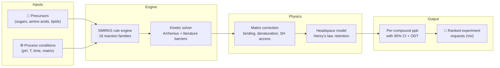

# Maillard

[](https://www.python.org/downloads/)
[](https://www.docker.com/)
[](https://opensource.org/licenses/Apache-2.0)
[](results/validation/prediction_uncertainty.md)
[](data/lit/family_ingestion_plan.json)

**Maillard** is a computational screening framework that predicts which combinations of
sugars, amino acids, temperatures, pH, and protein matrices will produce **meat-like aroma**
in plant-based formulations — and which will produce **off-notes** or **safety concerns** —
*before* you run a single wet-lab experiment.

Plant-based meat smells "beany" because the Maillard reactions that create real meat aroma
behave very differently inside a soy or pea protein matrix than in a free aqueous system.
Maillard simulates 16 families of reaction chemistry, corrects for how the plant matrix traps
or releases each volatile, and tells you exactly where its predictions are trustworthy, where
they are directional, and **what experiment would improve them most**.

> **Who is this for?** Alternative protein scientists who want to triage formulations before
> burning GC-MS time, and computational chemists who want a transparent, benchmarked platform
> for matrix-aware Maillard chemistry.

---

## How it works



**Inputs:** Choose your protein source (pea, soy, wheat gluten, mycoprotein, or 10 others),
precursors, and process conditions. **Engine:** The SMIRKS rule engine generates
atom-balanced reaction candidates across 16 chemistry families; a kinetic solver ranks them
using literature-calibrated Arrhenius parameters. **Physics:** Matrix corrections account for
protein-volatile binding, denaturation, and accessibility; a headspace model applies Henry's
law partitioning and retention penalties. **Output:** Per-compound predicted concentrations
(ppb) with 90% confidence intervals, odour-activity ratios, and a ranked list of which
wet-lab experiment would reduce uncertainty the most.

---

## What the output looks like

Before installing anything, here is what a typical prediction report contains:

| Compound | Predicted ppb | 90% CI | ODT (ppb) | Above ODT? | Confidence |
|---|---|---|---|---|---|
| 2-methyl-3-furanthiol | 12.4 | 3.1 – 49.7 | 0.007 | ✅ ~1770× | `bounded_calibration` |
| 2-furfurylthiol | 4.8 | 0.9 – 25.3 | 0.01 | ✅ ~480× | `bounded_calibration` |
| hexanal | 284 | 71 – 1136 | 4.5 | ⚠️ off-note | `transferred_literature` |
| methional | 0.8 | 0.1 – 6.4 | 0.2 | ✅ ~4× | `surrogate_family` |

> **How to read this:** *Predicted ppb* is the observable headspace concentration after matrix
> and retention corrections. *90% CI* is the Monte Carlo uncertainty envelope — narrow
> whiskers mean the prediction is well-anchored, wide ones mean the model needs more data.
> *ODT* is the odour detection threshold — compounds far above ODT dominate the sensory
> profile. *Confidence* shows the provenance tier of the underlying barrier constants.

The full report also includes a compound confidence overlay chart, an intervention waterfall,
and provenance metadata linking every number to its literature source.


---

## How well calibrated is it?

We publish four orthogonal evidence surfaces rather than a single accuracy number.

### Headline: **39 out of 48** matched literature data points fall within the model's 90% confidence interval

<table>
<tr>
<td width="33%" valign="top"><a href="docs/assets/validation_overview.png"></a><br/><sub><b>Parity.</b> Predicted vs. measured ppb across 16 benchmarks.</sub></td>
<td width="33%" valign="top"><a href="docs/assets/family_coverage.png"></a><br/><sub><b>Coverage.</b> Which of the 16 families are wired and evidence-backed.</sub></td>
<td width="33%" valign="top"><a href="results/validation/experiment_brief_cards.html"><b>Interactive Gaps Dashboard</b></a><br/><sub><b>Gaps.</b> Detailed briefs showing which experiments would close the largest blind spots. Use <code>open results/validation/experiment_brief_cards.html</code> to view.</sub></td>
</tr>
</table>

| Surface | Question | Status |
|---|---|---|
| **Parity** | On matched systems, how close is predicted ppb to measured? | 16 benchmarks · 48 matched rows |
| **External hold-out** | On systems excluded from calibration, does the frozen model still cover? | 4 bundles · **0/8 inside 90% CI** · median 36× error |
| **Coverage** | Which reaction families are wired and calibrated? | 16/16 wired · 7 with DFT anchors |
| **Experiment priority** | Where would the next experiment improve confidence the most? | 9/48 cells outside 90% CI — all queued |

> **On the external hold-out (0/8):** These 8 data points are intentionally excluded from
> calibration. The large error (median 36×) quantifies how much structured plant-protein
> trapping is *not yet* captured by free-precursor kinetics alone. The gap heatmap converts
> each miss into a ranked, bookable wet-lab request.

### When to trust the predictions

| Trust level | Use for | Example |
|---|---|---|
| **High** — use freely | Ranking formulations within the benchmark envelope | Free-precursor sulfur chemistry (Cys + ribose, 80–150°C) |
| **Moderate** — verify before deciding | Directional prioritisation | Pea vs soy matrix comparisons; choosing what to test next |
| **Low** — exploratory only | Hypothesis generation | New protein sources without nearby benchmarks; extrusion claims |

Full validation methodology: [VALIDATION_CONTRACT.md](docs/reference/VALIDATION_CONTRACT.md).
Regenerate all evidence artifacts: `./scripts/docker_maillard.sh summary`.

---

## The 16 reaction families

Maillard covers 16 families of chemistry, each independently calibrated and wired:

| # | Family | Key compounds | Role | Status | Path to Benchmark Level |
|---|---|---|---|---|---|
| 01 | Amino acid–sugar core | MFT, FFT, methional, pyrazines | Core meaty aroma | ✅ Benchmarked | *Already benchmarked.* |
| 02 | Lipid oxidation & crosstalk | Hexanal, 2-pentylfuran, nonanal | Off-note & competition | ✅ Benchmarked | *Already benchmarked.* |
| 03 | Thiamine degradation | MFT (via thiamine), thiazoles | Sulfur support | 📐 Literature-calibrated | Ingest quantitative thiamine degradation benchmarks with GC-MS thiazole/MFT yields. |
| 04 | Nucleotide & ribose support | IMP, GMP, umami precursors | Umami/kokumi support | 📐 Literature-calibrated | Ingest thermal IMP/GMP degradation to ribose/ribose-5-phosphate benchmarks. |
| 05 | Glutathione & peptide support | GSH-derived sulfur volatiles | Sulfur boost | 📐 Literature-calibrated | Ingest cysteine-peptide thermal system benchmarks measuring volatile sulfur yield vs. free Cys. |
| 06 | Alternative protein matrices | Matrix-specific modifiers | Scope extension | 🔄 Directional | Ingest matched isolate/concentrate headspace retention benchmarks (e.g., pea/soy/wheat). |
| 07 | Carbonyl donor hierarchy | Sugar reactivity ranking | Formulation variable | ✅ Benchmarked | *Already benchmarked.* |
| 08 | Off-notes & suppression | Dicarbonyl traps, inhibitors | Guardrail | ✅ Benchmarked | *Already benchmarked.* |
| 09 | Caramelization & pyrolysis | HMF, furfural | Severity flag | 🔄 Directional | Ingest pure carbohydrate pyrolysis benchmarks measuring HMF/furfural formation rates. |
| 10 | Fermentation pretreatment | Free AA/nucleotide enrichment | Upstream modifier | 📐 Literature-calibrated | Ingest pre- vs. un-fermented isolate benchmarks measuring free precursor enrichment and yields. |
| 11 | Lipid–Maillard crosstalk | MFT quenching by aldehydes | Competition surface | 🧮 Rate-closure queued | Determine absolute radical quenching rate constants for hexanal suppression & validate on crosstalk. |
| 12 | Protein damage markers | CML, CEL, furosine, lysinoalanine | Safety guardrail | 🧮 Rate-closure queued | Determine absolute crosslinking rate constants (DHA + lysine) & validate against marker yields under HME. |
| 13 | Polyphenol–amino capping | Quinone–thiol trapping | Precursor sink | 🧮 Rate-closure queued | Determine Michael addition rate constants for quinone-cysteine capture & validate on Cys depletion. |
| 14 | Ascorbic acid Maillard | Dicarbonyl source, crosslinks | Upstream modifier | 🧮 Rate-closure queued | Determine rate constants for dehydroascorbic acid ring-opening hydration & validate on dicarbonyl yields. |
| 15 | PE stealth sugar sink | Phospholipid glycation | Sugar depletion | 🧮 Rate-closure queued | Determine rate constants for PE-amine condensation and Amadori 1,2-proton shift & validate on sugar loss. |
| 16 | Melanoidin polymerization | Thiol scavenging | Trapping burden | 🧮 Rate-closure queued | Determine sulfur-radical addition rate constants for melanoidin trapping & validate on volatile loss. |

### Status Key & Validation Tiers

To prevent confidence confusion, the status symbols represent distinct validation tiers:
* **✅ Benchmarked (Benchmark-validated)**: The underlying reaction network and kinetic parameters are validated against high-quality, quantitative wet-lab experimental datasets (e.g., GC-MS headspace concentrations from Mottram 1994, Hofmann 1998, Farmer 1999). Absolute concentration outputs fall within the model's 90% confidence interval, passing the strict release gate.
* **📐 Literature-calibrated (Literature-calibrated priors)**: Arrhenius pre-exponential factors ($A$) and activation energies ($E_a$) are derived directly from published literature kinetic rates and mechanisms (e.g., Martins, van Boekel, Nursten), but have not yet been matched against a dedicated quantitative experimental validation benchmark. Absolute yields carry higher uncertainty, but relative ordering is well-grounded.
* **🔄 Directional (Directional only)**: Preserves correct physical trends or relative orderings (e.g., Matrix A traps volatile B more than Matrix C; caramelization increases with severity), but absolute yields are uncalibrated and lack direct literature/experimental anchoring.
* **🧮 Rate-closure queued (Rate refinement in progress)**: Reaction rates and kinetic barriers are currently parameterized using coarse family-rule surrogates or semi-empirical estimates. Target studies (either via physical kinetic measurements or quantum chemical simulations) are queued to determine refined rate constants, replacing the surrogates to promote the family to Literature-calibrated or Benchmarked status.


Full literature basis: [docs/slr_benchmark_evaluation.md](docs/slr_benchmark_evaluation.md) (76 peer-reviewed papers evaluated against an 8-criterion quality checklist).

---

## Guiding experiments: what to measure next

Maillard doesn't just predict — it tells you which experiment would improve its predictions the most, using a **Value of Information (VoI)** framework that ranks compounds by: **uncertainty × sensory impact**.

> [!TIP]
> **Interactive Experiment Briefs Dashboard Available:**
> For a detailed scientific breakdown of these validation gaps, including full chemical reaction pathways, step-by-step equations, log-scale prediction ranges, and links to experimental protocols, open the interactive dashboard in your browser:
> ```bash
> open results/validation/experiment_brief_cards.html
> ```

### Top 5 Highest-Value Calibration Gaps

Based on the active validation matrix, these are the top 5 compound × system combinations where new measurements or calibrations will yield the highest reduction in prediction uncertainty:

| Rank | VoI | Target Compound | Benchmark / System | Matrix | Primary Gap / Rationale |
|---|---|---|---|---|---|
| **1** | 7.70 | 2-methyl-3-furanthiol | Farmer 1999 (Cys + Glucose, 150°C) | Free | Multi-factor SIDA to close precursor × matrix gap for critical meaty odorant. |
| **2** | 6.41 | 2-methyl-3-furanthiol (MFT) | PMC9905368 (Wheat Gluten + HVP + Xylose, 120°C) | Wheat Gluten | Precursor × matrix retention gap in wheat gluten matrix. |
| **3** | 6.24 | 2-methyl-3-furanthiol (MFT) | PMC9905368 (SPI + HVP + Xylose, 120°C) | Soy Isolate | Precursor × matrix retention gap in soy protein isolate matrix. |
| **4** | 5.59 | 2-methyl-3-furanthiol (MFT) | Hofmann 1996 (Thiamine + Cys + Ribose, 100°C) | Free | Thiamine degradation sulfur support pathway kinetics. |
| **5** | 5.21 | 2-methyl-3-furanthiol (MFT) | Cerny 2008 (Thiamine + Cys + Xylose, 145°C) | Free | Thiamine degradation sulfur support pathway kinetics. |

### Primary High-Value Physical Experiments

While the table above focuses on resolving specific calibration gaps in existing literature systems, the lab should prioritize three newly designed physical experiments to close the remaining structural gaps in matrix-aware kinetics and volatility:

1. **Pea Protein Isolate (PPI) Meaty-Positive Benchmark**
   * **System**: 5% w/v pea isolate slurry + 1.0 mM exogenous D-ribose + 1.0 mM L-cysteine.
   * **Conditions**: pH 5.5, 95°C, aqueous heating time course (0 to 240 minutes).
   * **Goal**: Quantify the tradeoff between meaty volatile generation (MFT, FFT) and lipid oxidation off-flavours (hexanal, 2-pentylfuran) in pea matrix.
   * **Case Study Protocol**: [pea_matrix_meaty_benchmark.md](docs/protocols/pea_matrix_meaty_benchmark.md)

2. **Soy Protein Isolate (SPI) High-Severity Meaty Benchmark**
   * **System**: 5% w/v soy isolate slurry + 1.0 mM exogenous D-ribose + 1.0 mM L-cysteine.
   * **Conditions**: pH 5.8, 120°C, high-severity thermal time course (0 to 240 minutes).
   * **Goal**: Capture quantitative sulfur volatile yields and off-flavour suppression under realistic pre-extrusion conditions, plus safety marker (acrylamide) formation.
   * **Case Study Protocol**: [soy_matrix_meaty_benchmark.md](docs/protocols/soy_matrix_meaty_benchmark.md)

3. **Precursor & Denaturation Accessibility Assays**
   * **System**: Ellman's assay (free -SH) and OPA assay (free -NH₂) on pea/soy isolate lots pre- and post-heating.
   * **Goal**: Replace the current placeholder matrix accessibility fractions (`cysteine_accessibility`, `lysine_accessibility`) with direct physical measurements under specific denaturation states.
   * **Shared Protocol Contract**: [PPI_SPI_PRIMARY_BENCHMARK_PROTOCOL.md](docs/protocols/PPI_SPI_PRIMARY_BENCHMARK_PROTOCOL.md)

* **Complete Experiment Rankings**: [experiment_value_ranking.md](results/validation/experiment_value_ranking.md)


---

## Getting started

### Prerequisites

- [Docker](https://www.docker.com/products/docker-desktop/) (recommended) or Python 3.12 with conda
- Git

### Install and boot

```bash
git clone https://github.com/PabloAMC/Maillard.git
cd Maillard
./scripts/docker_maillard.sh up && ./scripts/docker_maillard.sh bootstrap
```

### Step 1 — Predict & screen

Run a simulation for a custom formulation:

```bash
./scripts/docker_maillard.sh run "python scripts/run_pipeline.py \
  --sugars ribose,glucose \
  --amino-acids cysteine,leucine \
  --ratios ribose:0.5,glucose:0.2,cysteine:0.2,leucine:0.1 \
  --ph 5.5 --temp 105 --time-minutes 45 \
  --protein-type pea_iso \
  --target meaty --minimize beany \
  --report --output-dir results/first_run"
```

Open `results/first_run/report.md` for the full analysis.

### Step 2 — Optimise & compare

Auto-search the ingredient space over 50 Bayesian iterations:

```bash
./scripts/docker_maillard.sh run "python scripts/optimize_formulation.py \
  --sugars ribose,glucose --amino-acids cysteine,leucine \
  --target-tag meaty --minimize-tag beany \
  --protein-type pea_iso --n-iterations 50"
```

Or run the built-in quickstart comparison:

```bash
./scripts/docker_maillard.sh quickstart
```


### Step 3 — Ingest lab results & close the loop

When your GC-MS results come back, feed them back to shrink the uncertainty whiskers:

```bash
./scripts/docker_maillard.sh ingest \
  --file path/to/my_results.csv \
  --protein-type pea_iso \
  --process-state extrusion_structured \
  --temp-c 105 --ph 5.5 \
  --precursor cysteine=15.0 \
  --precursor glucose=30.0 \
  --confirm
```

The engine updates the benchmark database and regenerates validation artifacts.

Full quickstart guide: [QUICKSTART.md](docs/guides/QUICKSTART.md). Glossary for non-computational scientists: [GLOSSARY.md](docs/guides/GLOSSARY.md).

---

<details>
<summary><b>Computational methods under the hood</b></summary>

### Reaction enumeration

The SMIRKS rule engine (`src/smirks_engine.py`) generates deterministic, atom-balanced reaction
candidates from precursor sets. The chemistry surface is explicit and inspectable — if the
reaction graph is not coherent, no later scoring is trustworthy.

### Kinetics

Literature-calibrated Arrhenius parameters (Schiff base 15 kcal/mol → enolisation 28 kcal/mol;
anchored to Hofmann, Martins, Nursten) drive laptop-speed FAST screening in < 1 second.
A Cantera ODE solver is available for temporal profiles and mechanism debugging.

### Matrix physics

Accessibility corrections model how protein denaturation, sulfhydryl availability, and pH
alter precursor reactivity in structured plant matrices. Volatile retention factors
(non-covalent binding to denatured proteins) and Henry's law headspace partitioning translate
beaker-chemistry yields into what a sensory panel would actually perceive.

### Uncertainty quantification

Monte Carlo propagation across the full benchmark panel produces per-compound 90% confidence
intervals. Each prediction carries a confidence tier label (`bounded_calibration`,
`transferred_literature`, `surrogate_family`, `xtb_derived`) that propagates through the
pipeline and surfaces in every report.

### Selective quantum chemistry (xTB → DFT)

For high-value rate-limiting steps, GFN2-xTB identifies kinetically viable pathways (pathfinder,
not a barrier authority). Final barriers come from DFT (r2SCAN-3c/def2-svp + ddCOSMO implicit
water via PySCF/Sella). See the [Computational Gap Runbook](docs/guides/COMPUTATIONAL_GAP_RUNBOOK.md)
for the current queue and copy-paste commands.

### Key dependencies

RDKit (reaction enumeration), Cantera (ODE kinetics), PySCF + Sella (DFT refinement),
xtb (pathfinding), MACE (ML potentials), NumPy/SciPy (numerics), Matplotlib (figures).

### Supported protein matrices

14 protein sources are registered with endogenous composition profiles and matrix correction
factors: pea isolate, pea concentrate, soy isolate, soy concentrate, wheat gluten, mycoprotein,
chickpea, lentil, faba bean, oat, potato, sunflower, spirulina, and yeast extract.
Pea and soy have the strongest literature backing; others are directional.

</details>

---

## Where to look next

| If you are a… | Start with |
|---|---|
| **Food scientist** — first run | [QUICKSTART.md](docs/guides/QUICKSTART.md) |
| **Scientist** — understanding the output | [GLOSSARY.md](docs/guides/GLOSSARY.md) |
| **Reviewer** — auditing what is verified | [VALIDATION_CONTRACT.md](docs/reference/VALIDATION_CONTRACT.md) → [results/validation/](results/validation/) |
| **Experimentalist** — closing the gaps | [PPI_SPI protocol](docs/protocols/PPI_SPI_PRIMARY_BENCHMARK_PROTOCOL.md) → [experiment ranking](results/validation/experiment_value_ranking.md) |
| **Maintainer** — extending the chemistry | [architecture.md](docs/architecture.md) → [SMIRKS_SYSTEM.md](docs/reference/SMIRKS_SYSTEM.md) |
| **QM operator** — running the DFT queue | [COMPUTATIONAL_GAP_RUNBOOK.md](docs/guides/COMPUTATIONAL_GAP_RUNBOOK.md) |
| **Literature curator** — ingestion & calibration | [data/lit/README.md](data/lit/README.md) |
| **New contributor** | [CONTRIBUTING.md](CONTRIBUTING.md) |

---

## Citation

If you use Maillard in your research, please cite:

```
Moreno Casares, P. A. (2026). Maillard: Computational screening for meat-like
Maillard chemistry in plant-based protein matrices. GitHub repository.
https://github.com/PabloAMC/Maillard
```

## License

[Apache 2.0](LICENSE)
