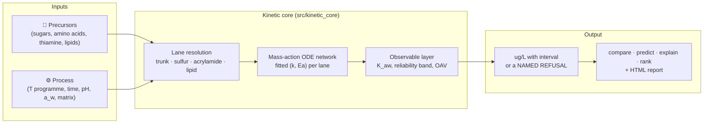

# Maillard

[](https://www.python.org/downloads/)
[](https://www.docker.com/)
[](https://opensource.org/licenses/Apache-2.0)
[](results/validation/core_panel_scores.md)
[](results/validation/core_panel_scores.md)

**Maillard** is a mass-action kinetic model of the Maillard reaction for alternative-protein
scientists: sugars, amino acids, lipids and process conditions in; per-compound aroma volatiles
(meaty thiols, furanones, acrylamide, lipid aldehydes) out — each with a measured reliability
interval, an odour-activity ratio, and a **named refusal** wherever the model cannot represent
what was asked. It exists to help decide *which experiment to run next*, not to replace the
GC-MS.

> **One engine (2026-09-03).** Until retirement step B5 this repository carried two prediction
> paths — a SMIRKS rule-enumeration "screening lane" with a fitted volatile budget, and the
> kinetic core. The screening lane, its validation harness and its headline numbers are deleted;
> everything below is the kinetic core, scored on its own. The retired lane's README, artifacts
> and audit trail are kept verbatim in [`docs/history/`](docs/history/) and
> [`results/legacy_lane/`](results/legacy_lane/), and the August 2026 adversarial audit that
> preceded the retirement is in [AUDIT.md](AUDIT.md).

> **Who is this for?** Alternative-protein scientists who want to triage formulations and
> process conditions before burning GC-MS time, and computational chemists who want a
> transparent, benchmarked, honestly scored Maillard kinetics platform.

---

## How it works



**Inputs** are a formulation (precursor names and mM) and a process (an isothermal or
programmed thermal history, pH, water activity, matrix). **Lane resolution** decides which of
the four networks can represent the request — the Maillard lanes (trunk, sulfur, acrylamide)
do not compose with each other, the lipid lane co-integrates with any one of them — and refuses,
with the reason, anything that maps to no lane or to a species the fit corpus never measured.
**Integration** is a plain mass-action ODE system with rate constants and activation energies
read from the frozen fit reports under `results/validation/kinetic_core_b*_fit_report.json`.
**The observable layer** wraps every absolute in its measured reliability band, converts to
headspace where a threshold exists, and reports odour-activity ratios. **Nothing in the code
carries a fitted constant as a literal**: every number the model ships is a fit-report value
or a *declared assumption* with its band.

---

## Getting started

```bash
git clone https://github.com/PabloAMC/Maillard.git
cd Maillard
./scripts/docker_maillard.sh up && ./scripts/docker_maillard.sh bootstrap
```

Everything runs inside the container (`./scripts/docker_maillard.sh run "<command>"`); host
Python is for editing only. The front door is one script with four verbs:

```bash
python scripts/maillard.py compare --template > my_comparison.yml   # two arms, A vs B
python scripts/maillard.py compare my_comparison.yml --report compare.html
python scripts/maillard.py predict my_comparison.yml --system a      # one arm, absolutes
python scripts/maillard.py explain 2-methyl-3-furanthiol             # what the core knows about a compound
python scripts/maillard.py rank --top 10                             # which measurement would teach the model most
```

`compare` leads with **ratios** between the two arms — the quantity the systematic scale error
cancels out of — and prints each arm's envelope declaration. `predict` prints absolutes *with*
their interval and OAV. `explain` answers a compound with the lane, the declared assumptions and,
for a refused compound, the reason. `rank` reads the core's Monte-Carlo envelope and orders
(benchmark, compound) rows by how badly and how uncertainly the model misses them. `--json`
gives the machine-readable payload of any verb; `--report` writes a self-contained HTML page.

Regenerate the evidence artifacts:

```bash
python scripts/generators/generate_core_panel_scores.py                 # ~15 s
python scripts/generators/generate_core_prediction_uncertainty.py --n-samples 200 --workers 4   # ~40 min
python scripts/generators/generate_model_card.py                        # re-splices the card below
```

Test tiers and gates: `pytest tests/unit tests/scripts -q`, `pytest tests/integration tests/scientific -q`,
and `python scripts/ci/<gate>.py` for the five gates (citation, data read-only, fit-then-score,
hold-out isolation, benchmark schema).

---

## How well calibrated is it?

Badly, and measurably. The numbers below are what the core scores on the union panel — the 19
trust-loop bundles that carry a measurement, the 17 `maillard_path` hold-outs and the 4 external
matrix bundles, 40 in all, 49 scored rows — read from
[`core_panel_scores.md`](results/validation/core_panel_scores.md) and
[`core_prediction_uncertainty.md`](results/validation/core_prediction_uncertainty.md), and
pinned by `tests/scientific/test_core_headline_guards.py`. A moved number has to move this page
in the same change.

| | kinetic core |
| --- | --- |
| rows within 3x of the measurement | **8 of 49** (median fold error 11x, geometric mean 36x) |
| **out of sample** — every row a core fit read removed | **4 of 40** (median 31x) |
| by lane, within 3x | acrylamide 2/12 · sulfur 6/29 · lipid 0/7 · trunk 0/1 |
| strict-ready (passes its own contract; PRIMARY; free precursor) | **1 of 40** — `thiamine_cys_glucose_120C_Bolton1994`, 1.34x under the bundle's declared 3x contract |
| literature rows inside the 90% Monte-Carlo interval | **7 of 25** evaluable (median width 0.94 dex); **6 of 23** out of sample; **24 sulfur rows not evaluable** |
| direction / ranking skill | **not yet measured on the core** (see below) |

Three things a reader must know, all declared in code and printed on every row they touch:

- **The sulfur fit read eight panel rows.** The B2–B8 sulfur calibration (62 rows, 23 free
  parameters) used the Hofmann 1998 Table 1 pH-5 rows — ribose, glucose, fructose *and xylose* —
  plus five fed-intermediate step rows. The xylose row sits on the **hold-out** panel. By the
  repository's leverage rule (0.37 free parameters per row) these rows stay in the counts,
  flagged `in_core_fit`; the out-of-sample line above is the count without them
  (`src/kinetic_core/fit_targets.py`).
- **The sulfur lane has no uncertainty.** Its fit report carries no parameter covariance, so the
  envelope samples nothing on it; 24 of 49 rows are therefore *not evaluable* rather than misses.
  A Laplace covariance at the B8 optimum is the next step, not a wider prior.
- **The K_aw and HS-SPME bands are headspace facts.** The envelope applies them only to rows the
  bundle declares as headspace-quantified, never to isotope-dilution or HPLC values; ten bundles
  declare no method and get them by default, and say so.

**Directional and ranking claims are not yet measured on the core.** The retired screening lane
was scored on a 36-claim directional panel (24/36); that number was a property of the deleted
engine and does not transfer. Until the core is scored on that panel
([`docs/validation/directional_claims_panel.yml`](docs/validation/directional_claims_panel.yml)),
the model card reports every ranking claim *do-not-use* by its own rule — not because it is known
to be wrong, but because it is unmeasured. This is the first post-retirement step in
[`tasks/data_restructure_plan.md`](tasks/data_restructure_plan.md).

**The cutover exam, frozen.** The pre-registered exam that compared the core with the lane it
replaced ([`cutover_prereg.md`](results/validation/cutover_prereg.md) →
[`cutover_final_exam.md`](results/validation/cutover_final_exam.md)) was last run on 2026-09-03,
the day the old lane was deleted, and is kept as a record: the core answered 34 of 40 points
(6 refused with a named reason), landed **3 / 34** within 3x with an all-answered median of
**19.08x**, and on the 33 points both lanes answered its paired median was **24.78x** against the
old lane's **10.86x**. The core lost the exam on median accuracy, as the pre-registration allowed
for, and won it on refusals: every one of its misses is localised to a named lane and a named
constant, which is what makes `rank` useful.

> **On literature provenance:** the kinetic anchors and benchmark values in this repo were
> ingested with heavy LLM assistance and are **not yet fully human-verified**. An automated
> audit (2026-08-26) found ~20% of registry DOIs unresolvable plus a class of live DOIs
> pointing at the wrong paper; five benchmarks are now quarantined and every suspect anchor
> carries an `audit_flag` in its registry entry. **87 records are marked
> `no_verifiable_source`** (re-measured 2026-09-02 across every tracked JSON and YAML file
> under `data/` and `results/literature/`, including nested records), of which
> **65 carry numeric payloads** and **65 of those are consumed at runtime**. Both rises in that
> count were the repository getting more honest, not worse; both falls were deletions, not
> verifications. The registries are `data/keys/papers.yml` (285 DOIs) and
> `data/keys/compounds.yml` (74 InChIKey-resolved compounds); `scripts/ci/citation_gate.py`
> blocks a dead or confabulated DOI.

<!-- BEGIN GENERATED: model-card -->

### Model card — the validity domain, generated from the artifacts

*Generated by `scripts/generators/generate_model_card.py`. Do not hand-edit between the markers; regenerate. Every number below is read from a tracked artifact or recomputed live, and the row says which.*

- **Absolute concentrations are unreliable.** On the union panel the kinetic core lands 8/49 rows within 3x (median fold error 11.1x, worst 7.56e+06x); out of sample -- every row a core fit read removed -- 4/40 (median 31.2x). Nothing in this repository licenses a ppb number as a specification. The core's 90% Monte-Carlo interval covers 7/25 evaluable literature rows (24 not evaluable: the sulfur lane carries no sampled uncertainty), 6/23 out of sample.
- **Directional and ranking claims are NOT YET MEASURED on the kinetic core.** The 24/36 directional panel this card used to quote was scored on the retired screening lane and does not transfer; until the core is scored on that panel, every ranking claim is reported do-not-use by the card's own rule, not because it is known to be wrong.
- **The sulfur branch has 8 absolute literature anchors, and the model fails every one of them.** They are the primary-source-verified stable-isotope-dilution rows in hofmann1998_c2c3_recombination_145C_20min_pH3, hofmann1998_c2c3_recombination_145C_20min_pH5, hofmann1998_c2c3_recombination_145C_20min_pH7, hofmann1998_fructose_cysteine_145C_20min_pH5, hofmann1998_furan2aldehyde_h2s_145C_20min_pH5, hofmann1998_glucose_cysteine_145C_20min_pH5, hofmann1998_norfuraneol_cysteine_145C_20min_pH5, hofmann1998_ribose_cysteine_145C_20min_pH5. A further 1 primary-source-verified sulfur row(s) are on the panel and are NOT counted here, because a constant was selected by looking at them (hofmann1998_norfuraneol_h2s_145C_20min_pH5): agreement on a fitted row is not evidence about the model. The previously shipped claim of ZERO anchors was corrected on 2026-08-28 (Wave W) when the full text behind them was obtained; the retired benchmark (cys_ribose_140C_Hofmann1998) is kept in the tree as the provenance record of the values that were not measurements. Absolute agreement is poor and the DIRECTION is a separate question.

| Claim type | System class | Measured | Verdict |
|---|---|---|---|
| Absolute concentration (ppb) | free precursor, asparagine + reducing sugar [acrylamide lane] | 2/12 rows within 3x, median 7.28x<br/><sub>recomputed live on the union panel; an absolute is never trust by rule</sub> | **do-not-use** |
| Absolute concentration (ppb) | protein matrix, lipid-derived aldehydes [lipid lane] | 0/7 rows within 3x, median 3.36e+03x<br/><sub>recomputed live on the union panel; an absolute is never trust by rule</sub> | **do-not-use** |
| Absolute concentration (ppb) | free precursor, cysteine / ribose meaty thiols [sulfur lane] | 6/29 rows within 3x, median 10.6x<br/><sub>recomputed live on the union panel; an absolute is never trust by rule</sub> | **do-not-use** |
| Absolute concentration (ppb) | free precursor, sugar + amine browning / furanics [trunk lane] | 0/1 rows within 3x, median 11.9x<br/><sub>recomputed live on the union panel; an absolute is never trust by rule</sub> | **do-not-use** |
| Absolute concentration interval (90% CI) | every lane with sampled uncertainty | 7/25 evaluable literature rows inside; 6/23 out of sample; 24 not evaluable<br/><sub>results/validation/core_prediction_uncertainty.json (n=200); the sulfur lane has no sampled uncertainty</sub> | **do-not-use** |
| Direction / ranking on any axis | any | not yet measured on the kinetic core<br/><sub>the directional panel was scored on the retired screening lane (2026-09-03); re-scoring it on the core is the next retirement step</sub> | **do-not-use** |
| Any claim of benchmark-grade agreement | the union panel: trust loop + hold-outs + matrix bundles | 1/40 strict-ready (thiamine_cys_glucose_120C_Bolton1994); 8/49 rows within 3x, out-of-sample 4/40<br/><sub>recomputed live; strict-ready is the repository's own passing bar</sub> | caution |
| Which experiment to run next (value of information) | any system the core envelope covers | every ranked row is a measured model failure<br/><sub>this claim type does not depend on the model being right -- it depends on the model being wrong in a located, quantified way, which it demonstrably is</sub> | **trust** |

**Verdict thresholds** (applied, not judged): trust = >= 80% agreement on >= 3 claims; caution = >= 60% agreement, or too few claims to establish; do-not-use = < 60% agreement, or unmeasured. An unmeasured axis is reported do-not-use on purpose — absence of evidence is not evidence.

**Provenance census (recounted at generation time, not copied).** **87 records** carry `source_status: no_verifiable_source` across 9 tracked data files — the figure the provenance note above quotes, reproduced here by recount. A further 46 carry the same marker under a different status key (`status`, `value_status`, `value_anchor_status`), for 133 in total. The numeric-payload and runtime-consumed subsets (65 and 65) use a narrower definition than this recount and are pinned separately by the headline guards under `tests/scientific/`.

**Blocking gates at generation time:** `holdout_guard.py` PASS · `citation_gate.py` PASS · `fit_target_gate.py` PASS.

**How to use this model in one line:** compare two formulations and read the ratio (`python scripts/maillard.py compare`), never quote the absolute number, and treat any pH or moisture direction as unsupported.

<!-- END GENERATED: model-card -->

---

## What the core is

Four networks that do *not* compose, each with its own integrator (`src/kinetic_core/`):

| lane | steps | species it adds | pH term | fitted to |
| --- | ---: | --- | --- | --- |
| trunk | 26 | glucose / fructose / glycine → Amadori, deoxyosones, melanoidins; HMF, DMHF, 3,4-dideoxyglucosone, acetylformoin | none | Martins 2005 time series (B1), Blank 1997 furanic yields (B7) |
| sulfur | 93 | pentoses, cysteine, thiamine → MFT, FFT, furfural, the MFT dimer | pH trajectory (B2.2) | Hofmann 1998 Tables 1/3/4/10, Kang 2026, Zhou 2023, Whitfield 1999, Cerny 2007, van Seeventer 2001 (B2–B8) |
| acrylamide | 42 | asparagine + reducing sugar → acrylamide, HMF | none | Claeys 2005, De Vleeschouwer 2009, Knol 2005 rate constants (B3) |
| lipid | — | a linoleate hydroperoxide pool → Frankel 1989's six products (hexanal, pentane, decadienal, …) | none | branch distribution fitted (B6); the **rate is a declared assumption** with a Q10 band |

The sulfur steps are deliberately absent from the acrylamide lane — composing them would spend
the same cysteine twice — so a request spanning both is declared **unanswerable** rather than
silently routed. What `engine.UNREPRESENTED_COMPOUNDS` refuses today, and why, is printed by
`maillard explain <compound>`: 1-hexanol and 2-pentylfuran (no measured branch fraction),
propanal and 2-nonenal (Frankel fed linoleate only), HEMF (needs alanine and a pentose in one
lane), and the thiophenone (a rate of exactly zero, because the only fed-precursor experiment
reports an area percent). Every refusal is an `EnvelopeDeclaration` with a reason and no number.

**Fit / hold-out discipline.** Every fit wave was pre-registered
(`results/validation/kinetic_core_b*_prereg.md`), every fit report names its rows and their
source anchors, and `scripts/ci/holdout_guard.py` asserts statically that no fit generator names
the hold-out directory and that panel discovery never recurses. The one place that discipline was
found wanting — the xylose pH-5 row above — is declared rather than fixed silently.

---

## Repository layout

Three trees, one rule each (`agents.md`):

| tree | rule | map |
| --- | --- | --- |
| `data/` | curated inputs, **read-only at runtime** (`scripts/ci/data_readonly_gate.py`); paths from `src/data_paths.py`, loads through `src/data_access.py`, names through `data/keys/` | [`data/README.md`](data/README.md) (generated) |
| `results/` | generated artifacts: the core's scorecard and envelope, the fit and hold-out reports per wave, the literature ledgers; `results/legacy_lane/` is the retired lane's archive | [`results/legacy_lane/README.md`](results/legacy_lane/README.md) |
| `docs/` | human documents: [USING_THE_TOOL.md](docs/USING_THE_TOOL.md), [QUICKSTART.md](docs/guides/QUICKSTART.md), [GLOSSARY.md](docs/guides/GLOSSARY.md), [VALIDATION_CONTRACT.md](docs/reference/VALIDATION_CONTRACT.md), [FIT_HOLDOUT_DECLARATION.md](docs/reference/FIT_HOLDOUT_DECLARATION.md), the retired lane's README under `docs/history/` | |

Code: `src/kinetic_core/` (the engine, its parameters, panel, scoring, envelope, fit-target
ledger), `src/comparative_cli.py` + `scripts/maillard.py` (the front door), `src/report_html.py`,
`src/explain_compound.py`, `src/experiment_value.py` (the `rank` verb), `src/model_card.py`; the
literature side (`src/family_ingestion_plan.py`, `src/literature_intake_registry.py`,
`scripts/deep_research_tracker.py` and the `generate_*` scripts that write
`results/literature/`); and the five CI gates under `scripts/ci/`.

**Key dependencies:** NumPy / SciPy (integration), RDKit (compound identity through InChIKey),
PyYAML, jsonschema, Matplotlib (report figures).

---

## Guiding experiments: what to measure next

`maillard rank` reads the core's Monte-Carlo envelope and orders every (benchmark, compound) row
by uncertainty × miss × sensory weight; the tracked ranking is
[`experiment_value_ranking.md`](results/validation/experiment_value_ranking.md). The single
experiment that would close the most gaps is still a **quantitative PPI/SPI meaty-positive
benchmark** — pea and soy protein isolates with ribose + cysteine, both the desirable thiols and
the off-flavour aldehydes in one GC-MS run
([protocol](docs/protocols/PPI_SPI_PRIMARY_BENCHMARK_PROTOCOL.md)). Closing the loop from such a
measurement back into the core's parameters ("calibrate on your own data") is roadmap item 4 in
[`tasks/data_restructure_plan.md`](tasks/data_restructure_plan.md).

---

## Where to look next

| If you are a… | Start with |
| --- | --- |
| **Anyone, first command** | `python scripts/maillard.py compare --template` → the model card above |
| **Flavour scientist** — using the tool | [USING_THE_TOOL.md](docs/USING_THE_TOOL.md) |
| **Food scientist** — first run | [QUICKSTART.md](docs/guides/QUICKSTART.md) |
| **Scientist** — understanding the output | [GLOSSARY.md](docs/guides/GLOSSARY.md) |
| **Reviewer** — auditing what is verified | [VALIDATION_CONTRACT.md](docs/reference/VALIDATION_CONTRACT.md) → [results/validation/](results/validation/) → [AUDIT.md](AUDIT.md) |
| **Experimentalist** — closing the gaps | [PPI_SPI protocol](docs/protocols/PPI_SPI_PRIMARY_BENCHMARK_PROTOCOL.md) → [experiment ranking](results/validation/experiment_value_ranking.md) |
| **Maintainer** — extending the chemistry | `src/kinetic_core/` module docstrings → [`tasks/data_restructure_plan.md`](tasks/data_restructure_plan.md) → [CONTRIBUTING.md](CONTRIBUTING.md) |
| **Literature curator** — ingestion | [data/lit/README.md](data/lit/README.md) |
| **Historian** — what the retired lane claimed | [docs/history/README_legacy_lane_2026-09-03.md](docs/history/README_legacy_lane_2026-09-03.md), [results/legacy_lane/](results/legacy_lane/) |

---

## Citation

If you use Maillard in your research, please cite:

```
Moreno Casares, P. A. (2026). Maillard: Computational screening for meat-like
Maillard chemistry in plant-based protein matrices. GitHub repository.
https://github.com/PabloAMC/Maillard
```

## License

[Apache 2.0](LICENSE)
