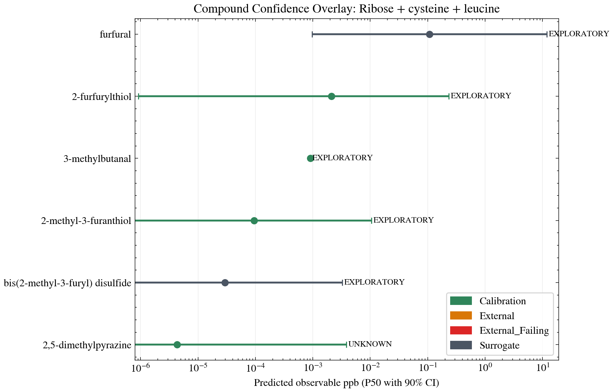
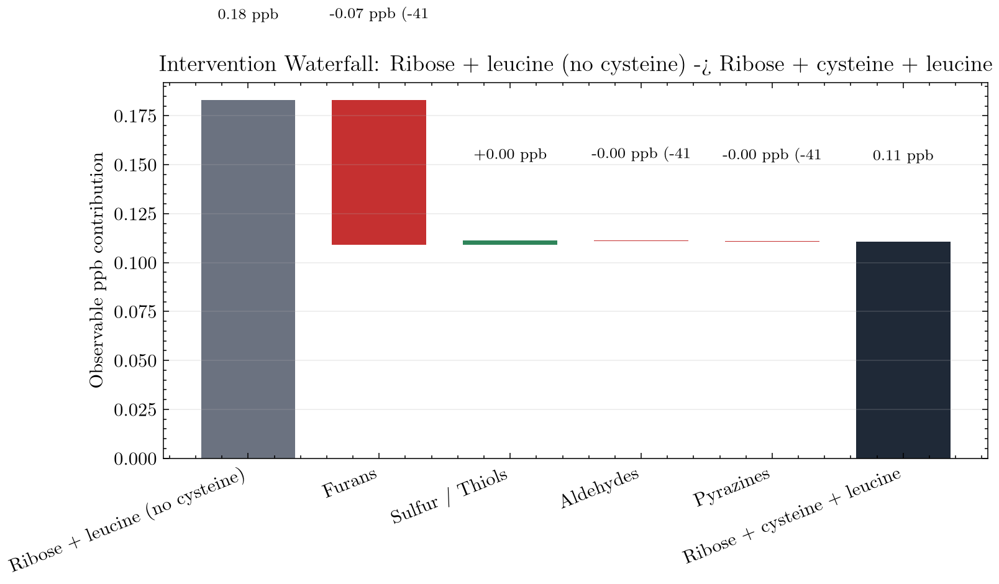

# Maillard

[](https://www.python.org/downloads/)
[](https://www.docker.com/)
[](https://opensource.org/licenses/Apache-2.0)
[](results/validation/prediction_uncertainty.md)
[](results/validation/external_validation_report.md)

## In one paragraph

Plant-based meat tastes "beany" because the **Maillard reactions** that produce real meat
aroma behave very differently inside a soy or pea matrix than in water. **Maillard** is a
computational screening tool that predicts which sugars, amino acids, temperatures, pH and
matrix choices will produce **meat-like aroma molecules** (such as 2-methyl-3-furanthiol, the
"roasted-meat" thiol) versus **off-notes** — *before* you run a single wet-lab experiment.
It does this by simulating the underlying chemistry (kinetic ODEs over 16 reaction families),
correcting for how the matrix traps or releases each volatile, and refining the most uncertain
reaction barriers with quantum chemistry (DFT). Today it predicts **39 out of 48** literature
data points within their 90% confidence envelope, and it tells you exactly which **9** are
still wrong and **what experiment would fix them next**.

> **Who is this for?** Food scientists who want to triage formulations *before* burning lab
> time, and computational chemists who want a transparent benchmark surface for matrix-aware
> Maillard chemistry.

---

## Why this is hard (and why a simple lookup won't do)

| Existing tool | What it gives you | What it misses |
| --- | --- | --- |
| NIST WebBook, FlavorDB | Static spectra & odor descriptors of *isolated* compounds | No yields. No matrix. No process. |
| RMG, Cantera, generic kinetics | Free-radical / gas-phase chemistry solvers | No protein binding, no headspace partitioning |
| Sensory panels | Ground truth for finished products | Slow, expensive, late in the design loop |

Maillard fills the middle. It maps **(ingredients + process + matrix) → (per-compound
concentrations + headspace + confidence)** so you can rank candidate formulations cheaply,
then spend wet-lab time on the few that truly matter.

---

## The Scientist's Daily Loop (3 Steps)

Boot the workspace first:

```bash
./scripts/docker_maillard.sh up && ./scripts/docker_maillard.sh bootstrap
```

### Step 1 — Predict & Screen

Run a simulation for a custom formulation:

```bash
./scripts/docker_maillard.sh run "python scripts/run_pipeline.py \
  --sugars ribose,glucose \
  --amino-acids cysteine,leucine \
  --ratios ribose:0.5,glucose:0.2,cysteine:0.2,leucine:0.1 \
  --ph 5.5 --temp 105 --time-minutes 45 \
  --protein-type pea_iso \
  --target meaty --minimize beany \
  --report --output-dir results/first_run"
```

Open `results/first_run/report.md` for the sensory analysis and compound confidence overlay.



**How to read the overlay:** vertical axis = predicted ppb (log scale). Dashed lines = odour
detection thresholds (ODT). Whiskers = 90% CI — narrow whiskers are well-calibrated, wide
ones are surrogates that need lab data.

---

### Step 2 — Optimise & Compare

Auto-search the ingredient space over 50 Bayesian iterations:

```bash
./scripts/docker_maillard.sh run "python scripts/optimize_formulation.py \
  --sugars ribose,glucose --amino-acids cysteine,leucine \
  --target-tag meaty --minimize-tag beany \
  --protein-type pea_iso --n-iterations 50"
```

Or run a side-by-side campaign with the quickstart example:

```bash
./scripts/docker_maillard.sh quickstart
```

Open `results/quickstart/comparison/comparison.md` and view the Intervention Waterfall.



**How to read the waterfall:** grey bars = baseline; green = increases; red = decreases;
rightmost bar = optimised total.

---

### Step 3 — Ingest Lab Results & Close the Loop

When your GC-MS results come back, feed them back to shrink the uncertainty whiskers:

```bash
./scripts/docker_maillard.sh ingest \
  --file path/to/my_results.csv \
  --protein-type pea_iso \
  --process-state extrusion_structured \
  --temp-c 105 --ph 5.5 \
  --precursor cysteine=15.0 \
  --precursor glucose=30.0 \
  --confirm
```

The engine updates the benchmark database and regenerates validation artifacts. Run
`./scripts/docker_maillard.sh summary` to see the updated trust dashboard.

---

## How good are the predictions, really?

We publish four orthogonal evidence surfaces rather than a single accuracy %.

| Surface | Question | Headline |
| --- | --- | --- |
| **Parity** ([validation_overview.png](docs/assets/validation_overview.png)) | On matched systems, how close is predicted ppb to measured ppb? | 16 benchmarks · 48 matched rows |
| **External hold-out** ([external_validation_report.md](results/validation/external_validation_report.md)) | On systems excluded from calibration, does the frozen model still cover the measurement? | 4 bundles · **0/8 inside 90% CI** · median 36.02× |
| **Coverage** ([family_coverage.png](docs/assets/family_coverage.png)) | Which of the 16 reaction families are wired, calibrated, or DFT-anchored? | 16/16 wired · 7 with DFT anchors |
| **Gaps** ([gap_heatmap.png](results/validation/gap_heatmap.png)) | Where would the next wet-lab experiment move confidence the most? | **9/48 cells outside 90% CI** — all queued as bookable requests |

<table>
<tr>
<td width="33%" valign="top"><a href="docs/assets/validation_overview.png"></a><br/><sub><b>Parity.</b> Predictions vs. actual lab measurements.</sub></td>
<td width="33%" valign="top"><a href="docs/assets/family_coverage.png"></a><br/><sub><b>Coverage.</b> Which reaction families are wired and evidence-backed.</sub></td>
<td width="33%" valign="top"><a href="results/validation/gap_heatmap.png"></a><br/><sub><b>Gaps (VoI Heatmap).</b> Which experiments would resolve the most critical blind spots.</sub></td>
</tr>
</table>

> **Note on external hold-out (0/8):** these 8 points are intentionally excluded from
> calibration. The large error (median 36×) is expected — it reflects how much structured
> plant protein trapping is not yet captured by free-precursor kinetics alone. The gap heatmap
> converts every miss into a ranked, bookable wet-lab request.

Full machine-readable artifacts (regenerate with `./scripts/docker_maillard.sh summary`):

- 90% envelope per matched compound: [results/validation/prediction_uncertainty.md](results/validation/prediction_uncertainty.md)
- External hold-out panel: [results/validation/external_validation_report.md](results/validation/external_validation_report.md)
- Ranked experiment requests: [results/validation/experiment_value_ranking.md](results/validation/experiment_value_ranking.md)
- Per-cell VoI heatmap: [results/validation/gap_heatmap.png](results/validation/gap_heatmap.png)

<details>
<summary><b>Computational-gap QM queue</b> (offline DFT/xTB targets — not yet in parity plot)</summary>

Official selective-QM queue:
- Family 11: `hexanal_radical_quench`
- Family 12: `lysinoalanine_crosslink`
- Family 13: `quinone_cys_michael`
- Family 13 safety: `asparagine_sugar_explicit_water_cluster`
- Family 14: `aa_ring_open_dicarbonyl`
- Family 15: `pe_schiff_base`, `pe_amadori`
- Family 16: `melanoidin_radical_trapping`

Runbook: [docs/guides/COMPUTATIONAL_GAP_RUNBOOK.md](docs/guides/COMPUTATIONAL_GAP_RUNBOOK.md).
</details>

---

## Where to look next

| If you are a… | Start with |
| --- | --- |
| **Food scientist** — first run | [docs/guides/QUICKSTART.md](docs/guides/QUICKSTART.md) |
| **Skeptic** — auditing what is verified | [docs/reference/VALIDATION_CONTRACT.md](docs/reference/VALIDATION_CONTRACT.md) → [results/validation/](results/validation/) |
| **Maintainer** — extending the chemistry | [docs/architecture.md](docs/architecture.md) → [docs/reference/SMIRKS_SYSTEM.md](docs/reference/SMIRKS_SYSTEM.md) |
| **QM operator** — running the DFT queue | [docs/guides/COMPUTATIONAL_GAP_RUNBOOK.md](docs/guides/COMPUTATIONAL_GAP_RUNBOOK.md) |
| **Literature Curator** — ingestion & calibration | [data/lit/README.md](data/lit/README.md) |
| **New contributor** | [CONTRIBUTING.md](CONTRIBUTING.md) → [docs/guides/GLOSSARY.md](docs/guides/GLOSSARY.md) |
