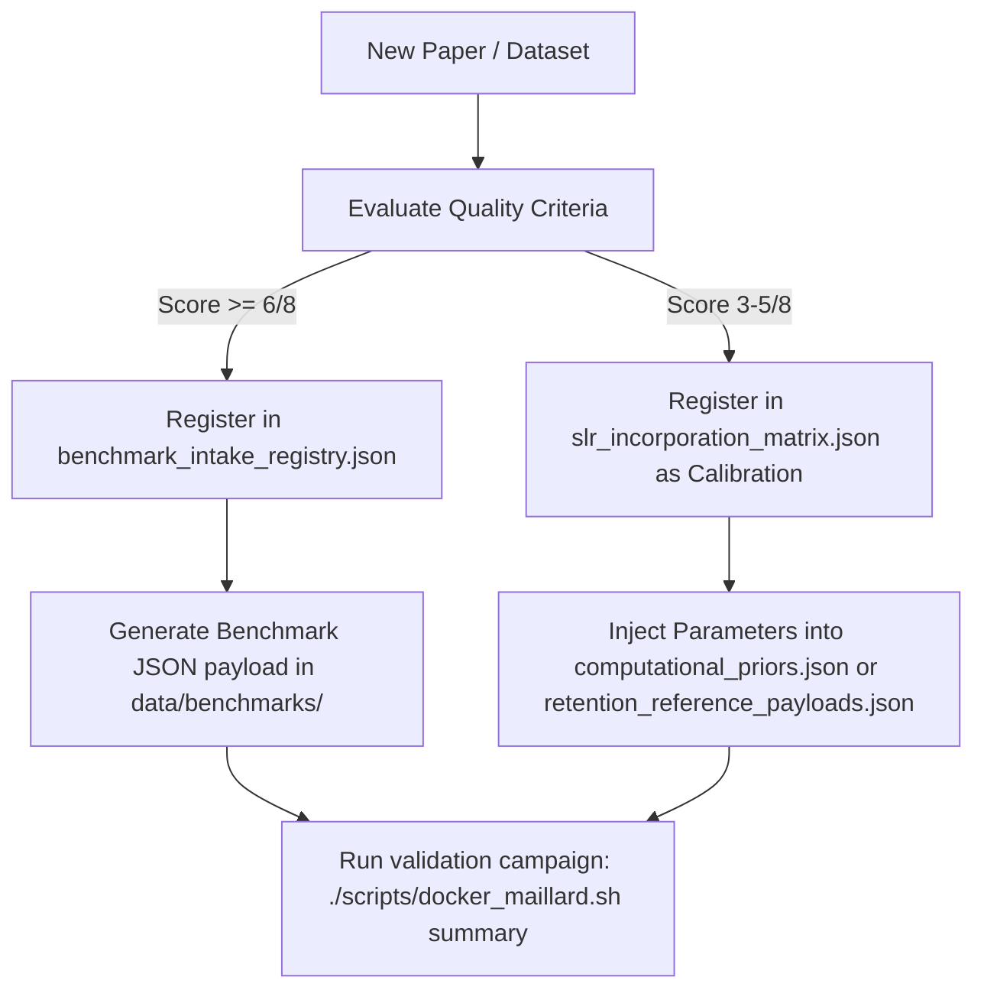

# Literature and Calibration Registries (`data/lit/`)

This directory houses the structured literature, theoretical priors, and experimental benchmark datasets that parameterise the Maillard Reactant Framework runtime engine. 

---

## 1. Directory Structure & File Map

To ensure model transparency and traceabilty, all reference files are organised into six functional domains:

### Category A: Core Kinetics & Physical Constants
These files contain the fundamental physical chemistry constants parameterising the thermodynamic and rate equation calculations.
*   **[`arrhenius_params.yml`](file:///Users/pabloantoniomorenocasares/Developer/Maillard/data/lit/arrhenius_params.yml)**: Canonical pre-exponential factors ($A$) and activation energies ($E_a$) parameterising the baseline chemical reactions in `src/smirks_engine.py`.
*   **[`henry_constants.yml`](file:///Users/pabloantoniomorenocasares/Developer/Maillard/data/lit/henry_constants.yml)**: Henry's law constants ($K_H$) used by the headspace module (`src/headspace.py`) to resolve gas-liquid partitioning coefficients.
*   **[`calibration_offsets.json`](file:///Users/pabloantoniomorenocasares/Developer/Maillard/data/lit/calibration_offsets.json)**: Per-family barrier offsets produced by an Optuna fit against two benchmarks (`cys_ribose_150C_Mottram1994`, `cys_glucose_150C_Farmer1999`) via `scripts/calibrate_barriers.py`. NOT MLP/xTB-vs-DFT offsets (earlier description was wrong), and currently unwired — no runtime path reads this file (`get_barrier` reads only the `BARRIER_OFFSETS` env var and `refinement_surrogate_patches.json`). **Both fit targets were quarantined on 2026-08-26** (fabricated/unlocatable sources — see `data/benchmarks/quarantined/README.md`) and are no longer in the validation panel. This file must stay unwired until verified sources replace them.

### Category B: Literature & SLR Integration Registries
Registries translating qualitative literature reviews and systematic surveys into machine-readable status trackers.
*   **[`benchmark_intake_registry.json`](file:///Users/pabloantoniomorenocasares/Developer/Maillard/data/lit/benchmark_intake_registry.json)**: The authoritative catalogue of literature papers and experimental datasets evaluated against quality thresholds.
*   **[`slr_incorporation_matrix.json`](file:///Users/pabloantoniomorenocasares/Developer/Maillard/data/lit/slr_incorporation_matrix.json)**: The ledger tracking which papers from the Systematic Literature Review (SLR) are currently integrated into runtime modules.
*   **[`family_ingestion_plan.json`](file:///Users/pabloantoniomorenocasares/Developer/Maillard/data/lit/family_ingestion_plan.json)**: The implementation roadmap mapping the 16 SLR chemistry lanes to their target modules, preferred payload formats, and development waves. NOTE 2026-08-27: these are literature lanes, not 16 implemented mechanisms — only 5 carry generative reaction templates. See `results/validation/family_implementation_status.md`, derived from the engine by enumeration.
*   **[`deep_research_backlog.json`](file:///Users/pabloantoniomorenocasares/Developer/Maillard/data/lit/deep_research_backlog.json)**: Non-ingested candidate entries identified during automated research passes awaiting manual curation.

### Category C: Theoretical Priors & Sensory Bounds
These files provide the model with starting default assumptions and safety bounds.
*   **[`computational_priors.json`](file:///Users/pabloantoniomorenocasares/Developer/Maillard/data/lit/computational_priors.json)**: Initial guess parameters for reaction rates and intermediate stability, labeled with confidence tiers (`bounded_calibration`, `transferred_literature`, `surrogate_family`, `xtb_derived`).
*   **[`flavor_reference_payloads.json`](file:///Users/pabloantoniomorenocasares/Developer/Maillard/data/lit/flavor_reference_payloads.json)**: Odor detection thresholds (ODT) and concentration ranges of character-impact compounds in animal muscle matrices vs commercial plant-based analogues.
*   **[`safety_reference_payloads.json`](file:///Users/pabloantoniomorenocasares/Developer/Maillard/data/lit/safety_reference_payloads.json)**: Legally mandated safety limits for undesirable compounds (such as acrylamide or furan) used to constrain optimization pathways.

### Category D: Matrix & Retention Calibrations
Parameters governing how the complex plant protein matrix alters reaction chemistry and volatile release.
*   **[`protein_source_registry.json`](file:///Users/pabloantoniomorenocasares/Developer/Maillard/data/lit/protein_source_registry.json)**: Endogenous precursor compositions, moisture contents, and amino acid profiles (e.g. for Pea Protein Isolate, Soy Protein Isolate).
*   **[`retention_reference_payloads.json`](file:///Users/pabloantoniomorenocasares/Developer/Maillard/data/lit/retention_reference_payloads.json)**: Experimentally measured volatile retention factors governing the non-covalent binding of flavor compounds to denatured proteins.
*   **[`process_state_calibrations.json`](file:///Users/pabloantoniomorenocasares/Developer/Maillard/data/lit/process_state_calibrations.json)**: Scaling factors modeling how extrusion, heating, and shear alter sulfhydryl accessibility and overall reaction cross-sections.
*   **[`matrix_decision_panel.json`](file:///Users/pabloantoniomorenocasares/Developer/Maillard/data/lit/matrix_decision_panel.json)**: Truth tables resolving matrix-level structural state modifiers.
*   **[`matrix_family_coverage_registry.json`](file:///Users/pabloantoniomorenocasares/Developer/Maillard/data/lit/matrix_family_coverage_registry.json)**: Mapping of matrix-specific modifiers across the 16 chemistry families.

### Category E: QM & MLP Computational Refinement Maps
Input coordinates, target structures, and status ledgers for transition state (TS) and barrier refinement.
*   **[`computational_gap_closure_targets.json`](file:///Users/pabloantoniomorenocasares/Developer/Maillard/data/lit/computational_gap_closure_targets.json)** & **[`computational_gap_multistep_targets.json`](file:///Users/pabloantoniomorenocasares/Developer/Maillard/data/lit/computational_gap_multistep_targets.json)**: Target reactions where high-level DFT computations are needed to replace coarse xTB/MLP estimates.
*   **[`dft_coverage_map.json`](file:///Users/pabloantoniomorenocasares/Developer/Maillard/data/lit/dft_coverage_map.json)**: Ingestion log tracking the status of DFT runs (preflight, running, completed, promoted).
*   **[`geometry_benchmark_set.json`](file:///Users/pabloantoniomorenocasares/Developer/Maillard/data/lit/geometry_benchmark_set.json)**, **[`reaction_benchmark_set.json`](file:///Users/pabloantoniomorenocasares/Developer/Maillard/data/lit/reaction_benchmark_set.json)** & **[`ts_seed_benchmark_set.json`](file:///Users/pabloantoniomorenocasares/Developer/Maillard/data/lit/ts_seed_benchmark_set.json)**: Validated geometry files and reaction coordinates used for regression testing transition state search routines.
*   **[`mlp_candidate_registry.json`](file:///Users/pabloantoniomorenocasares/Developer/Maillard/data/lit/mlp_candidate_registry.json)** & **[`mlp_external_benchmark_evidence.json`](file:///Users/pabloantoniomorenocasares/Developer/Maillard/data/lit/mlp_external_benchmark_evidence.json)**: Training datasets and parity metrics verifying the accuracy of the surrogate Machine Learning Potentials.
*   **[`refinement_surrogate_patches.json`](file:///Users/pabloantoniomorenocasares/Developer/Maillard/data/lit/refinement_surrogate_patches.json)**: Bounded fallback parameters used when explicit quantum chemical refinement fails to converge.

### Category F: Predefined Systems & Test Sets
*   **[`canonical_systems.json`](file:///Users/pabloantoniomorenocasares/Developer/Maillard/data/lit/canonical_systems.json)**: Definition of baseline formulations used for integration testing.
*   **[`ribose_glycine_2021.json`](file:///Users/pabloantoniomorenocasares/Developer/Maillard/data/lit/ribose_glycine_2021.json)**: A historical validation dataset for early prototype model matching.

---

## 2. Ingestion Pipeline: Scientist's Daily Loop

To add a new paper or experimental dataset:



### Steps for Registering New Papers

1.  **Quality Assessment**: Assess the paper against the 8 quality criteria (found in [docs/protocols/BENCHMARK_INTAKE_CHECKLIST.md](file:///Users/pabloantoniomorenocasares/Developer/Maillard/docs/protocols/BENCHMARK_INTAKE_CHECKLIST.md)):
    *   **C1**: Exact reactant identities specified.
    *   **C2**: Precursor concentrations/ratios specified.
    *   **C3**: Reaction conditions ($pH, T, t, a_w$) reported.
    *   **C4**: Analytical method with identified Internal Standard (IS).
    *   **C5**: Absolute concentrations reported (not just relative peak areas).
    *   **C6**: Replicates ($\ge 3$) reported.
    *   **C7**: LOD/LOQ stated.
    *   **C8**: Sensorially relevant thresholds stated.
2.  **Add to Ingestion Registry**: Open **[`benchmark_intake_registry.json`](file:///Users/pabloantoniomorenocasares/Developer/Maillard/data/lit/benchmark_intake_registry.json)** and append the paper metadata inside `eligible_references`:
    ```json
    {
      "id": "author_year",
      "citation": "Author et al. (Year), Journal Volume:Pages",
      "doi": "10.xxxx/xxxx",
      "status": "ready_for_reference_encoding",
      "chemistry_family": "01",
      "matrix_family": "soy_isolate",
      "runtime_artifacts": [
        {
          "path": "data/lit/flavor_reference_payloads.json",
          "artifact_type": "flavor_reference_payload",
          "artifact_id": "author_year_flavor_anchor"
        }
      ]
    }
    ```
3.  **Run Ingestion Validation**: Run the literature learning loop to verify file syntax and rebuild the active backlog report:
    ```bash
    ./scripts/docker_maillard.sh run "python -m src.literature_learning_loop"
    ```

---

## 3. Systematic Literature Review (SLR) Report Generation

The 16 systematic literature review (SLR) report files located in **[`data/Gemini_Deep_Research/`](file:///Users/pabloantoniomorenocasares/Developer/Maillard/data/Gemini_Deep_Research)** are generated programmatically. 

To regenerate all 16 reports (e.g., `slr_family_01_amino_acid_sugar_core.md` through `slr_family_16_melanoidin_polymerization.md`) after adding or updating entries in the structured registries, run the generator script inside the Docker container:

```bash
./scripts/docker_maillard.sh run "python scripts/generators/generate_slr_family_reports.py"
```

This script:
1. Deletes old manually created SLR files.
2. Extracts core parameters and backlog items for Family 01 from the matrix and backlog registries.
3. Extracts entries for Families 02-16 from the benchmark intake registry.
4. Performs dynamic checklist (C1-C8) scoring.
5. Produces consistent, markdown-formatted reports including coverage maps, consolidated entries, and model corrections.

