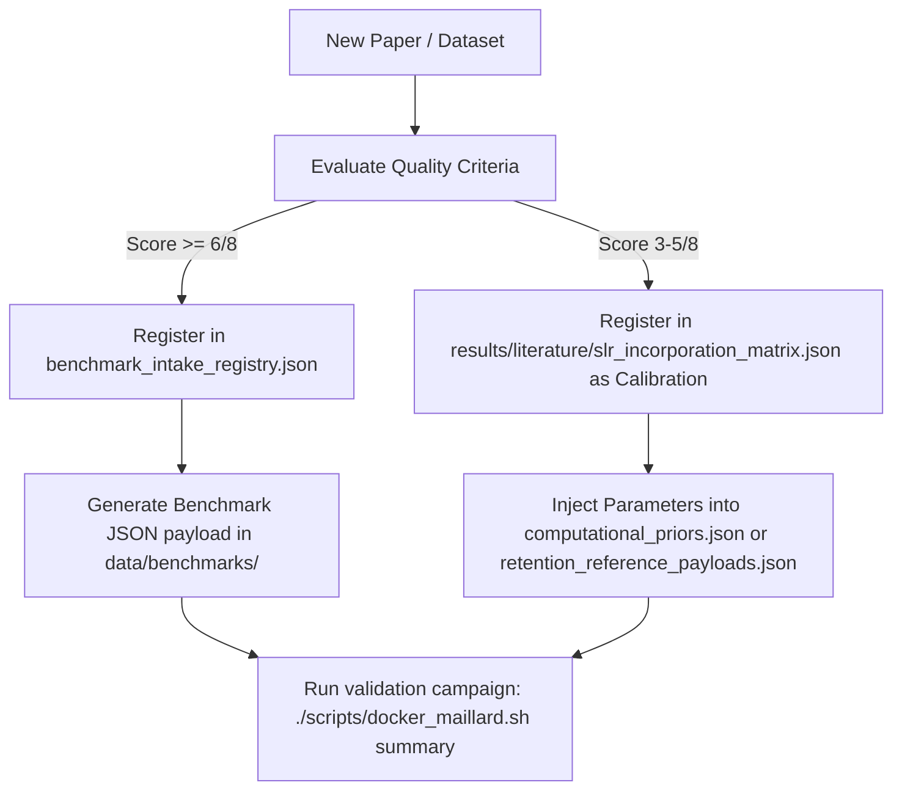

# Literature and Calibration Registries (`data/lit/`)

This directory houses the structured literature, theoretical priors, and experimental benchmark datasets that parameterise the Maillard Reactant Framework runtime engine. 

---

## 1. File map

The per-file map that used to live here is now generated: see **[`data/README.md`](../README.md)**
(built by `scripts/generators/build_data_readme.py`, kept current by
`tests/unit/test_data_readme.py`). Paths in code come from `src/data_paths.py`; every load goes
through `src/data_access.py`; compound and paper identity resolve through `data/keys/`.

---

## 2. Ingestion Pipeline: Scientist's Daily Loop

To add a new paper or experimental dataset:



### Steps for Registering New Papers

1.  **Quality Assessment**: Assess the paper against the 8 quality criteria (found in [docs/protocols/BENCHMARK_INTAKE_CHECKLIST.md](../../docs/protocols/BENCHMARK_INTAKE_CHECKLIST.md)):
    *   **C1**: Exact reactant identities specified.
    *   **C2**: Precursor concentrations/ratios specified.
    *   **C3**: Reaction conditions ($pH, T, t, a_w$) reported.
    *   **C4**: Analytical method with identified Internal Standard (IS).
    *   **C5**: Absolute concentrations reported (not just relative peak areas).
    *   **C6**: Replicates ($\ge 3$) reported.
    *   **C7**: LOD/LOQ stated.
    *   **C8**: Sensorially relevant thresholds stated.
2.  **Add to Ingestion Registry**: Open **[`benchmark_intake_registry.json`](file:///Users/pabloantoniomorenocasares/Developer/Maillard/data/lit/benchmark_intake_registry.json)** and append the paper metadata inside `eligible_references`:
    ```json
    {
      "id": "author_year",
      "citation": "Author et al. (Year), Journal Volume:Pages",
      "doi": "10.xxxx/xxxx",
      "status": "ready_for_reference_encoding",
      "chemistry_family": "01",
      "matrix_family": "soy_isolate",
      "runtime_artifacts": [
        {
          "path": "data/lit/flavor_reference_payloads.json",
          "artifact_type": "flavor_reference_payload",
          "artifact_id": "author_year_flavor_anchor"
        }
      ]
    }
    ```
3.  **Run Ingestion Validation**: Run the literature learning loop to verify file syntax and rebuild the active backlog report:
    ```bash
    ./scripts/docker_maillard.sh run "python -m src.literature_learning_loop"
    ```

---

## 3. Systematic Literature Review (SLR) Report Generation

The 16 systematic literature review (SLR) report files are generated programmatically into `results/literature/slr_family_reports/` (not tracked; regenerate on demand). 

To regenerate all 16 reports (e.g., `slr_family_01_amino_acid_sugar_core.md` through `slr_family_16_melanoidin_polymerization.md`) after adding or updating entries in the structured registries, run the generator script inside the Docker container:

```bash
./scripts/docker_maillard.sh run "python scripts/generators/generate_slr_family_reports.py"
```

This script:
1. Deletes old manually created SLR files.
2. Extracts core parameters and backlog items for Family 01 from the matrix and backlog registries.
3. Extracts entries for Families 02-16 from the benchmark intake registry.
4. Performs dynamic checklist (C1-C8) scoring.
5. Produces consistent, markdown-formatted reports including coverage maps, consolidated entries, and model corrections.

