# Modelling the Maillard reaction: an introduction

*For a reader who knows what the Maillard reaction is and nothing else. Each section is one or two
figures and a few sentences. The figures are made from the repository's own records, so they change
when the evidence changes. Updated 2026-09-09. Step-by-step reaction trees: [appendix](REACTION_TREES.md).
Every paper used: [sources](SOURCES.md).*

The chemistry is known. The rates are measured in one temperature window, mostly by one laboratory
per path. The model works where the rates were measured and fails where they were not.

*With ten minutes, read sections 1, 5 and 7: the chemistry, how well the model does, and the one
problem that decides the rest. The other sections say how the model is built, how it got here and
what is needed next.*

1. [The chemistry](#1-the-chemistry)
2. [Where the measurements are, and what they can support](#2-where-the-measurements-are-and-what-they-can-support)
3. [How a kinetic model works](#3-how-a-kinetic-model-works)
4. [What the repository is made of](#4-what-the-repository-is-made-of)
5. [How well the model does](#5-how-well-the-model-does)
6. [How the model got here](#6-how-the-model-got-here)
7. [The one problem that matters most](#7-the-one-problem-that-matters-most-where-the-thiols-go)
8. [What is needed next](#8-what-is-needed-next)

## 1. The chemistry

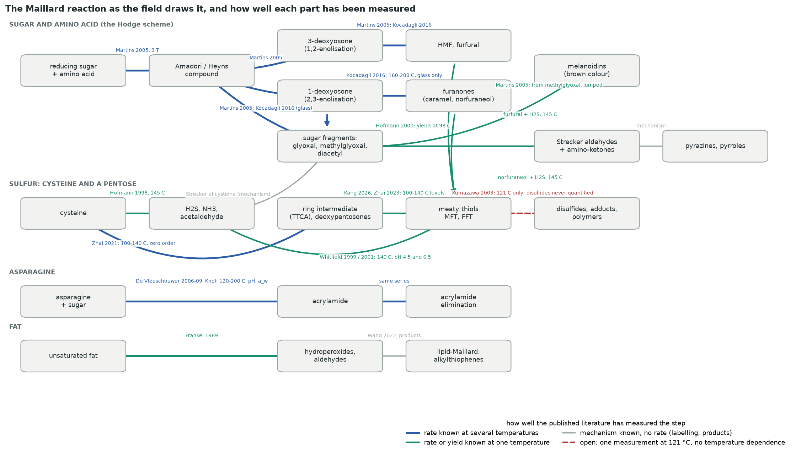

*The map of the reaction has not changed since 1953. The colours show how well each step has been
measured: only the sugar and acrylamide branches have rates at several temperatures.*

A sugar and an amino acid join to form an Amadori compound. It breaks down along two branches. One
gives HMF and furfural. The other gives the caramel furanones. Both also break into small fragments
(glyoxal, methylglyoxal, diacetyl). The fragments react with amino acids and make the aldehydes that
smell of each amino acid, and from those, pyrazines. Everything ends in melanoidins, the brown
polymers. Cysteine adds a sulfur branch: it releases hydrogen sulfide, which joins the furanones and
furfural to make the two thiols that smell of cooked meat, MFT and FFT. Asparagine has its own branch
to acrylamide. Fats oxidise alongside and their aldehydes join in.

## 2. Where the measurements are, and what they can support

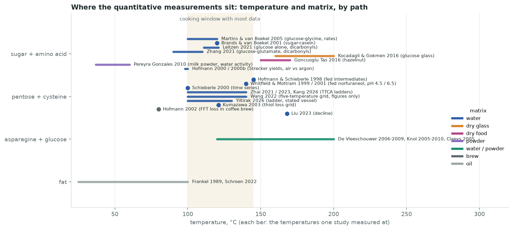

*Almost every rate was measured between 100 and 145 °C in water. Below that there are only powders
and storage tests; above it only dry glasses and roasting. The thiol branch has no temperature series
from a single laboratory except two published as figures.*

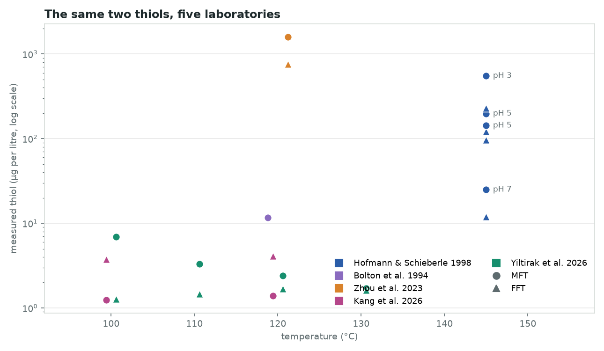

*Cysteine with a pentose, or with its first product, heated in five laboratories: the two meaty
thiols come out a thousandfold apart. Recipes, vessels and calibration all differ, and no pot has
been repeated by a second laboratory. No model can be more accurate than this spread until it is
explained.*

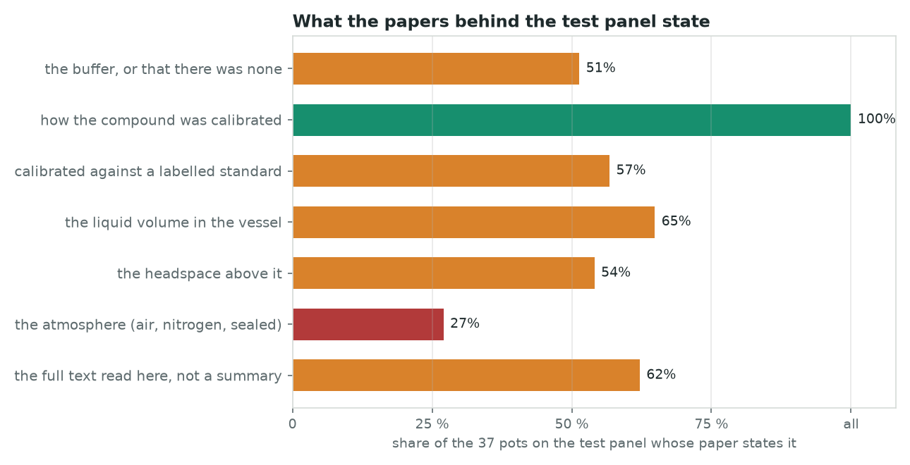

*What each paper on the test panel tells us. Temperature, time and pH are always given. The vessel,
the headspace and the atmosphere, which set how much oxygen the pot sees, are missing from a third
to three quarters of them. Fitting harder cannot recover what was not written down.*

The matrix matters as much as the temperature. The same small fragments come out in the opposite
order in a sugar glass at 180 °C and in water at 120 °C.

## 3. How a kinetic model works

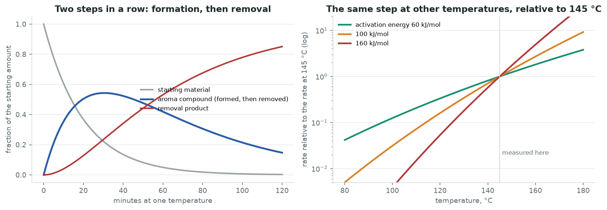

*Left: a compound is formed by one step and removed by the next, so it rises, peaks and falls. Right:
a rate measured at 145 °C may be five times slower at 100 °C, or a hundred times; only a second
measurement tells which.*

The model is the map in section 1 written as a list of steps, each with a rate, run forward in time
for a given recipe and cooking programme. Most of the thiol branch's rates were measured at one
temperature, so away from it they are guesses.

## 4. What the repository is made of

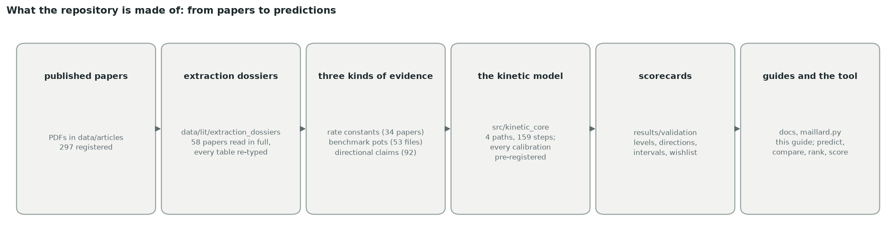

*Papers are read into dossiers with every table re-typed. Three kinds of evidence are kept apart:
rates that build the model, benchmark pots it is scored on but never tuned on, and statements of
direction it is scored on. Every re-calibration is written down before it runs, pass or fail.*

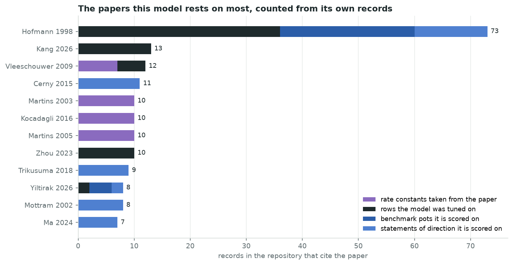

*Counted from the repository's own records: which papers the model was tuned on and which it is
scored against. One paper, Hofmann and Schieberle 1998, holds up most of the sulfur branch.*

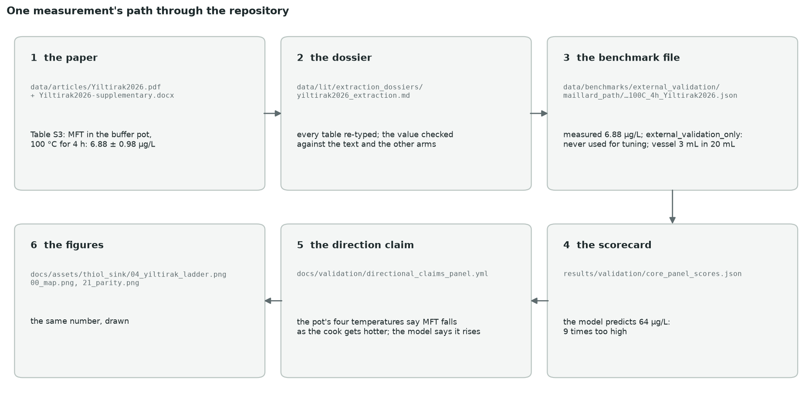

*One value followed from the paper to the figure that shows it. At every step there is a file, and
the file says where the value came from and what it may be used for. This one is marked "never used
for tuning", so the model's miss on it is a real test.*

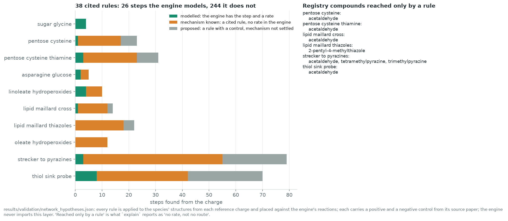

*Beside the model sits a small layer of cited reaction rules, each with a positive and a negative
control from its source paper. Run over the model's own species from each reference charge, the
rules find the steps the literature draws; the green part is what the model integrates with a rate,
the rest is what it does not. This is how a refusal can say "no rate, not no route": the right-hand
list is the registry's compounds that only a rule reaches.*

## 5. How well the model does

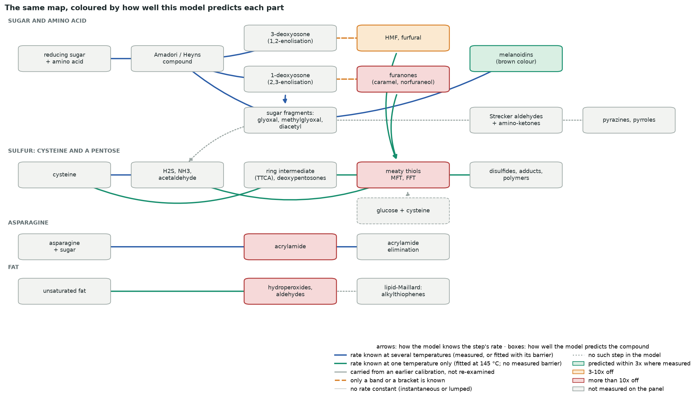

*The map from section 1 again. Boxes: how far the model's prediction is from the measurement, on pots it
was never tuned on. Arrows: whether the model knows the step's rate at several temperatures, at one, or
only as a range. Brown colour is right. HMF is close. The furanones, the thiols, acrylamide and the fat
aldehydes are off by more than tenfold on other laboratories' pots. Glucose with cysteine has no route.*

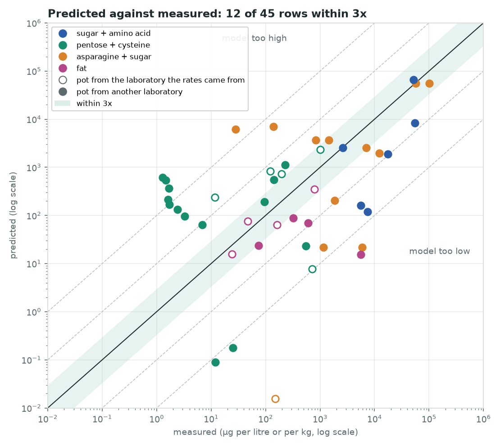

*Every scored pot. Filled points are from laboratories the rates did not come from. The misses
cluster by path: the thiols from other laboratories all sit too high, the fat aldehydes all too low,
acrylamide both ways. That is what missing steps look like, not noise.*

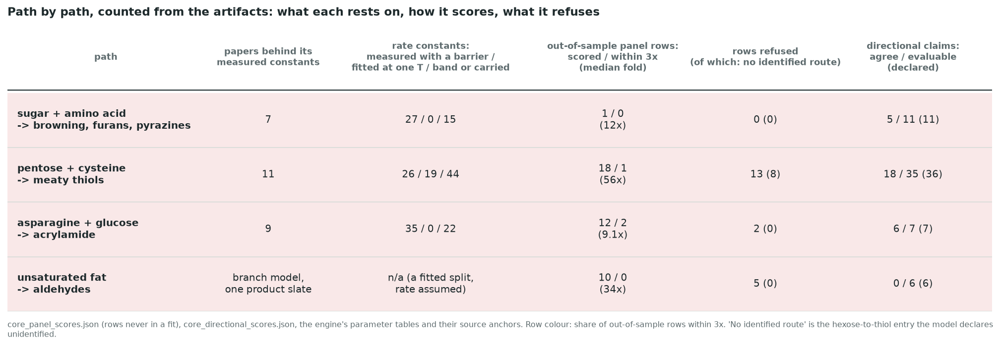

*The four paths counted from the records: how many papers stand behind each path's measured
constants, how its rate constants are known, how its held-out rows score, what it refuses, and how
its directional claims fare. The sugar path rests on measured constants (its browning hold-out is the
first row of section 6); the thiol path has most of its constants fitted at one temperature or
carried, and scores worst; the fat path is a fitted split from one product slate with its rate
assumed. The rows refused for want of an identified route are the thiols from glucose.*

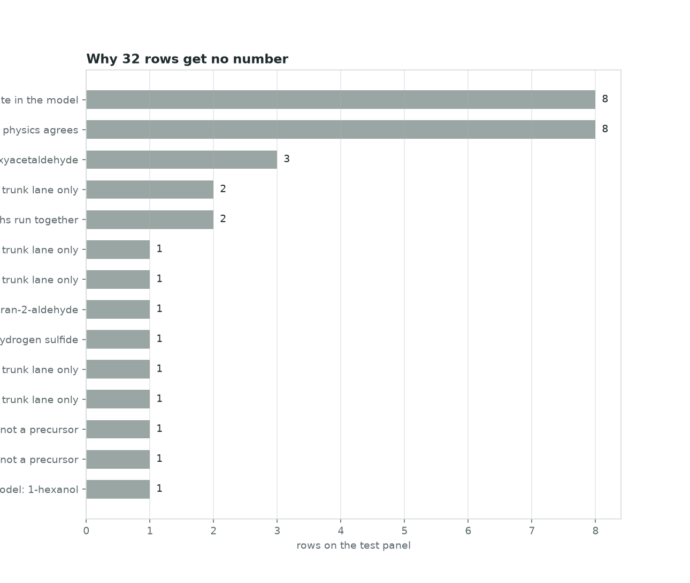

*The rows the panel asks for and the model declines to answer. It says "no route" or "no such
compound" rather than guessing. Most are the thiols from glucose, and compounds from fat that the
model does not make.*

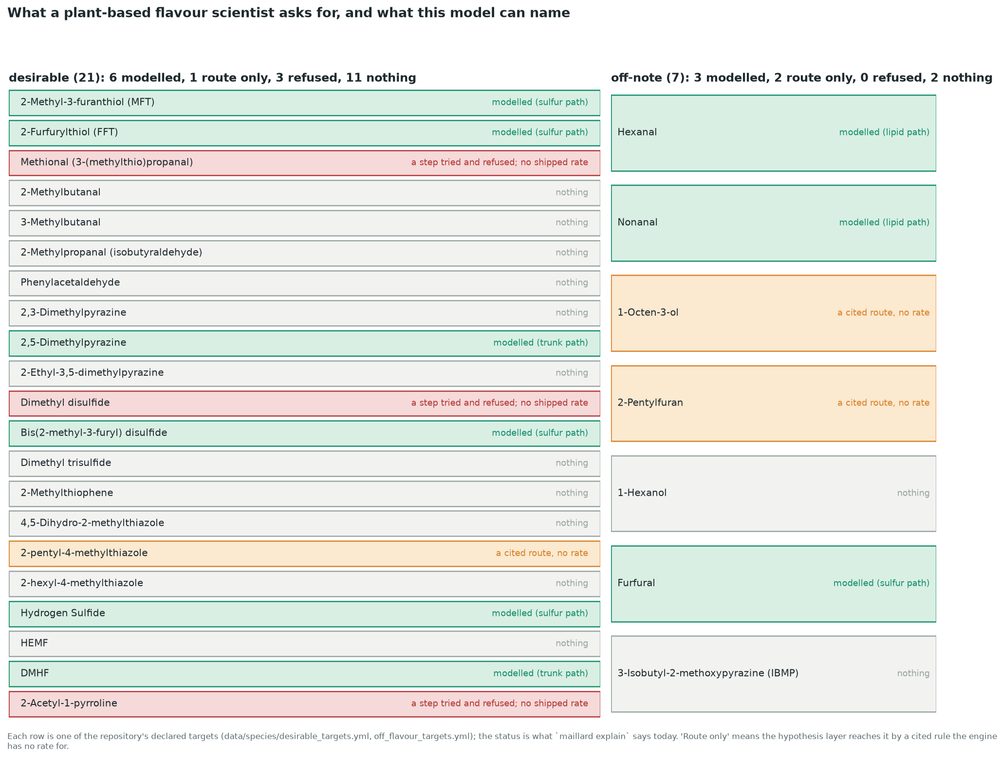

*The question a plant-based flavour scientist asks first. Of the twenty-one odorants the repository
declares as the targets of a meaty plant-based flavour, the model names six with a rate; one more it
reaches by a cited route with no rate; three (methional, dimethyl disulfide, 2-acetyl-1-pyrroline)
had a step pre-registered, run and refused on 9 September 2026 and stay in the network at zero;
eleven it cannot name at all, mostly the Strecker aldehydes and the pyrazines beyond the first, whose
per-amino-acid rates no paper on disk prints, and sulfur heterocycles with no measured route. Of the
six off-notes it names three.*

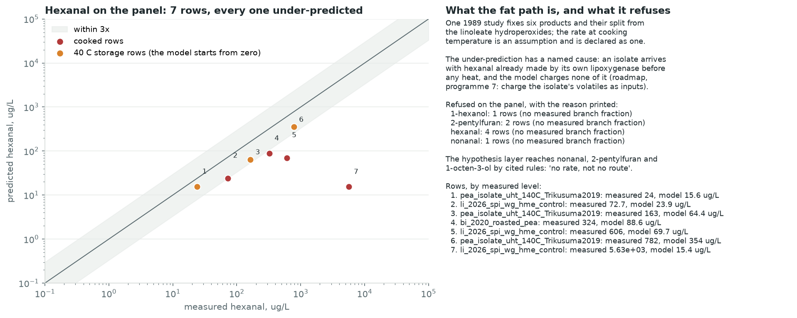

*The fat path, which no earlier figure showed. Every hexanal row is under-predicted, and the cause is
named: an isolate arrives with hexanal already made by its own enzymes before any heat, and the
model charges none of it. Nonanal and 2-pentylfuran are refused because no measured branch fraction
exists; the rules reach both.*

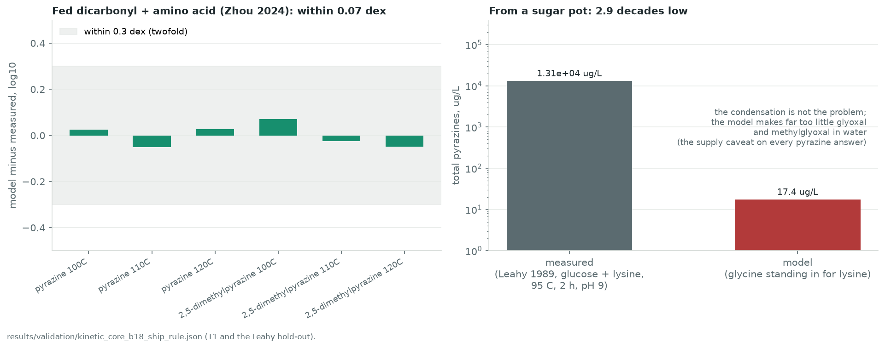

*The newest step on the sugar path, and its caveat in one picture. Fed the small dicarbonyls, the
two fitted constants reproduce one laboratory's rates within twenty percent at three temperatures.
From a sugar and amino acid pot, the total pyrazine comes out three decades low. When this figure's
record was made the reason was the glyoxal supply; the aqueous glucosone route added the next day
(section 6) brings the glyoxal to the measured level and leaves the pyrazine total where it was, so
the miss now sits in the Strecker step at that pot's temperature and pH, or in lysine against
glycine. Every pyrazine answer carries that sentence.*

## 6. How the model got here

Every re-calibration was written down before it ran, with the test it had to pass. Six of the
seventeen failed, and the failures are kept because each one narrowed the problem. This is the list,
in order, in plain words.

| what was tried | why | what happened | kept |
|---|---|---|---|
| the sugar path fitted to one glucose and glycine study at three temperatures | the only study with every step measured | browning on pots it never saw came out within a factor of about 1.5 | yes |
| the pentose and cysteine path fitted to one laboratory's fed-intermediate experiments at 145 °C, with that laboratory's pH series | the only step-by-step data for the thiols | fits that laboratory; the pH trend of the last step comes out backwards | yes |
| the asparagine path fitted to one laboratory's rate constants | the only rate constants for acrylamide | right shape; levels off by tenfold in other laboratories | yes |
| the fat path built from one product slate, with the rate assumed | no measured rate exists at cooking temperatures | flagged as an assumption on every answer | yes, flagged |
| HMF and the caramel furanone added to the sugar path | the panel measures them | HMF close; the furanone off by fiftyfold | yes |
| the thiol removal steps given measured temperature dependence | the removal step decides the level | fits the reference laboratory | yes |
| end-of-cook levels taken out of the thiol fit; only rates, yields and ratios tuned | levels are what the model should predict, not what it is tuned on | glucose and fructose thiols fell to zero: they had no step-level support, and the model now says so instead of guessing | yes, the current thiol parameters |
| the temperature dependence split into two barriers, with a second laboratory's temperature ladder in the fit | one barrier for every formation step is too crude | neither barrier could be pinned by the data | no |
| oxygen made an input, with the vessel's headspace as a reservoir | the laboratories' vessels differ | the oxygen steps could not be pinned; no gap between laboratories closed | no; kept inert |
| water activity and pH terms on the sugar path, declared from measurements rather than fitted | the panel moves both | the water claims split; the pH claims agree | yes |
| the small dicarbonyls added from constants measured in a dry glass | the panel measures them | they come out in the wrong order in water | yes, flagged |
| water activity and pH terms on the acrylamide path, declared from one laboratory's series | the panel moves both | the pH claims agree | yes |
| thiol removal re-tuned on the twelve-hour 100 °C series and the intermediate's own decay | the model loses thiols too fast at low temperature | peaks at six hours where the pot keeps rising; breaks the 145 °C pots | no |
| the thiol disulfide made reversible, so the dimer is a reservoir rather than a grave | every measured thiol sink has a partner and saturates or reverses; the model's dominant sink has neither | the data drove the release to zero: the model holds a hundredth of the disulfide two laboratories measure, because its oxidant runs out first | no; the finding is kept |
| the thiol removal made a saturating adduct on an electrophile pool the pot itself makes, feeding the measured room-temperature binding step | the same measured sink, but with a supply that runs out | the pool never forms, because the earlier fits had already switched off the browning step it was tied to; and the measured binding equilibrium lets go of the thiol above 80 °C, so even a large pool would hold under 5 % of it when hot | no; the finding is kept |
| a pyrazine step added to the sugar path, its two rate constants fitted on one laboratory's fed-dicarbonyl ladders and its pH shape on another's | the roasted note, asked for and refused until a measured rate existed | the fed-dicarbonyl rates fit within 20 %; from a sugar and amino acid pot the yield is a thousandfold low, because the model makes far too little glyoxal and methylglyoxal in water | yes, with that caveat on every answer |
| the protein's bound lysine made a reactant on the sugar path (glycation to the bound Amadori compound, then CML and CEL), from one laboratory's rates on casein in water and barriers declared from measured steps | isolates are mostly bound lysine, and the safety markers the panel asks for are made on it | the rates reproduce within a factor of 1.5 where the data are firm; the level of CML in the source's own pot within its printed range; a milk laboratory's constant within 20 % at 120 °C; a dry seed's a fiftyfold away | yes, on a pot with a stated protein loading, with the availability band as its interval |
| the glyoxal supply in water given its own route, from the Amadori compound to glucosone at a milk laboratory's rate, replacing the dry-glass entry | the pyrazine step's caveat: a sugar pot made a ten-thousandth of the glyoxal a laboratory measures | a glucose and amine pot now holds glyoxal within a factor of two of the measurement at 100 °C and inside the measured range at 130 °C; browning unchanged; the pyrazine total still three decades low, so that miss is not the glyoxal | yes, with the transfer band on every glyoxal and pyrazine answer |
| methionine's chain added to the sugar path: methional as its Strecker aldehyde on the free dicarbonyls, then methanethiol and the disulfide, fitted on one laboratory's rates in a fruit-sugar pot | methional is the cooked-potato note at the top of the desirable list and no lane named it | the fit ran the methionine-to-glycine ratio to its ceiling and was still four decades short in that pot, while a second laboratory's methionine and glucose pot came out two decades too high: methional does not form from the free dicarbonyls; the second laboratory's fed Amadori compound says it forms from methionine's own Amadori compound | no; the finding names the next structure |
| 2-acetyl-1-pyrroline from proline: the Strecker of proline to 1-pyrroline and its acylation by methylglyoxal, on one laboratory's fed yields | the bread-crust and popcorn note of extruded and baked products | the fed acylation fits within a factor of two; the chain from proline rises a thousandfold with the methylglyoxal charge where the source rises threefold, because the competing tetrahydropyridine branch and the pyrroline's own loss are not written | no; the acylation constant is kept in the record for the next structure |
| the thiol removal made an irreversible addition to the pot's own sugar intermediates | the third form the two refusals above left standing, from the lipid papers | the fit switched the step off at every temperature: the 145 °C fed pots, fifty-four of the sixty-four rows, want no removal the 100 °C pot could use | no; three structures refused on the same rows points at the rows' weighting or at the laboratory, not at a fourth structure |
| a benchmark allowed to declare what its pot arrived with, from the source's own unheated column; pots that were never cooked refused instead of charged for raw material | a pea beverage paper printed both columns, and a third of every level was there before any heat | three external rows went from 34×, 32× and 3× to inside threefold with nothing in the model changed; four raw-powder pots are now refused with the cure named | yes |
| every benchmark cross-referenced against every paper on disk | one hold-out had scored one of six species its paper prints, and cited an author not on the paper | eight measurements added; the amine-free sugar entry was right to 11 % and the step after it 32× too slow, which located the HMF deficit | yes |
| twenty-three papers downloaded against the model's own reading list, each read and recorded | the model had been asking for an aqueous dehydration rate, a lipid temperature term and an extrusion residence time | the dehydration rate arrived as a fed experiment the model could not even express; the lipid term arrived twice, from oil and from a nut paste, disagreeing by two; the residence time is measured on a different feed | recorded |
| every fitted constant audited for what the data determine, at the shipped optimum | no one had asked which of the fifty constants the fit rows can see | twelve of forty-seven are pinned; twenty are constants no row touches; the two fits built on fed pots over small networks are fully pinned and the two built on end-of-cook levels through large networks are mostly blind | yes |
| the 3-deoxyglucosone step made reversible with its sugar epimer, fitted on the fed pots and a second laboratory's ratios | the fed experiment showed the chemistry runs both ways and a quarter of the charge becomes an epimer the model did not carry | all five constants pinned to a tenth of a decade; did not ship, because the peak came three times early: the exit that sets the timing had been measured at pH 6.8 and applied at pH 5 | no, kept as the record |
| the exits from 3-deoxyglucosone given the pH term the same 2003 table prints for them, on both exits | the timing | the peak landed; one hold-out row (methylglyoxal at pH 4.4) went from 1.3× to 33×: the term on the fragmentation exit, borrowed from a lumped step, did not transfer | no, kept as the record |
| the same term on the formic-acid exit alone, refit | the hold-out had kept that one and rejected the other | on the hold-out none of the fits read, 3,4-dideoxyglucosone 32× → 6.6×, HMF 12× → 9×, methylglyoxal 1.3× → 1.0×; two more HMF rows inside threefold; the headline 10 of 45 → 12 of 45 | yes |

## 7. The one problem that matters most: where the thiols go

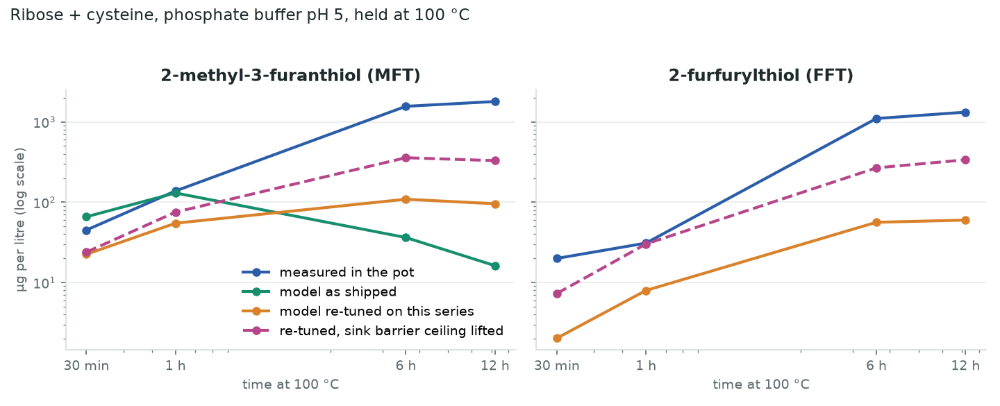

*The reference pot, held at 100 °C for twelve hours. The pot keeps making thiols the whole time.
Every version of the model stops after an hour and then loses what it made. Re-tuning the removal
step on this series (orange, purple) does not reach the measurement and breaks the 145 °C data.*

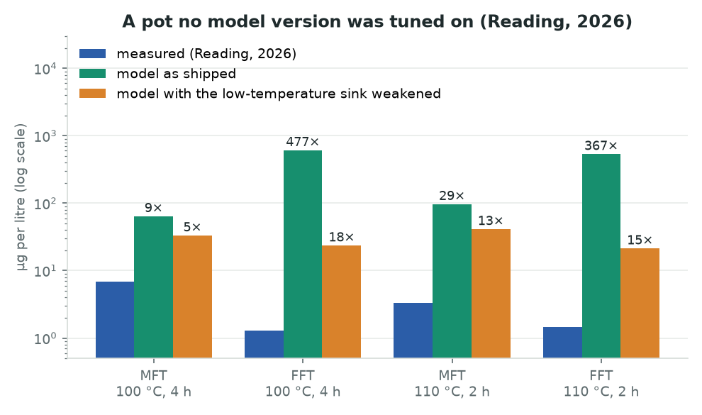

*A pot from another laboratory that no version of the model has seen. Weakening the removal step
alone cuts the error from 480 times to 18. Most of what looked like laboratories disagreeing is the
same removal problem.*

The model removes thiols far faster than any pot does, at 100 °C and at 140 °C alike. One removal
step with one temperature dependence cannot fit both, so the step needs a different form. Three
forms have now been built and all three refused: the disulfides giving the thiol back, a removal
that stops when it runs out of its partner, and the thiols adding for good to the reactive sugars
the pot makes. The figure below shows why the first two failed. Two smaller faults are also known:
the ring intermediate that holds the sulfur opens about ten times too fast, and the formation steps
have no pH dependence where the pots show a strong one.

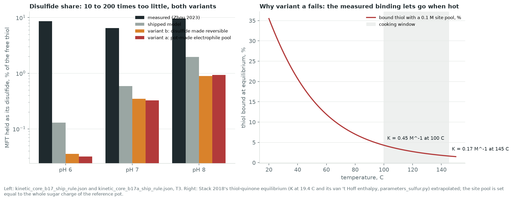

*Both forms were built and tested. Left: the share of the thiol held as its disulfide, which one
laboratory measures at seven to ten percent across pH; the shipped model holds a tenth to a
hundredth of that, and neither variant moves it, because the model runs out of oxidant first.
Right: the binding step of the second variant, measured at room temperature, lets the thiol go
above 80 °C, so even a pool as large as the whole sugar charge would hold under five percent of it
during a cook. What both left standing was a third candidate, the thiols adding for good to the
reactive sugars: it was built, and the fit switched it off at every temperature.*

**Three failures with one thing in common, found by reading the papers rather than the model.** The
step that turns two thiols into their disulfide needs an oxidant, and the model tracks how much
oxidant each pot has. Counting them showed that every one of the fourteen measurements that carry
the most weight is a pot the model gives no oxidant at all, and no pot anywhere is given a supply
from the air above it. So all three removal steps were judged against a measurement the model could
not have reproduced at any setting: the disulfide it was asked to make could not form. Half of that
is defensible and half is not. The pots fed hydrogen sulfide have a chemical reason to carry none,
which one of the papers argues directly. Two of the pots have no hydrogen sulfide in them and sit
beside a near-identical pot from the same laboratory that does carry oxidant, and nothing anywhere
says why they differ.

That paper also names where the oxidant would come from: the reactive sugars the pot makes on its
way to its own products, on a flow about sixteen times larger than the thiols'. The pot in question
has no step that makes one of those sugars from what it is fed, although the paper measures three of
them in it. So the next thing to build is not a fourth removal step. It is the supply that all three
were missing, and it is written down before it is run.

## 8. What is needed next

**One experiment.** The reference pot (ribose 100 mmol/L, cysteine 33 mmol/L, 0.5 mol/L phosphate,
pH 5) in 20 mL vials with 5 mL of liquid, volumes written down. Two temperatures, 100 °C for 0.5 to
12 hours and 140 °C for 5 to 120 minutes, one vial per time point, three replicates. Beside it, the
same buffer with MFT alone and FFT alone at 1 mg/L on the same grid, so removal is measured with
nothing forming. Measure the thiols by stable-isotope dilution and their disulfides in the same run,
plus the sugar and cysteine left and the pH. One arm at 100 °C under nitrogen. About 130 vials and two
weeks of GC-MS. The model as shipped predicts that the fed thiol decays to zero and that the pot peaks
after an hour. If instead the thiol levels off with its disulfide and the pot keeps rising, the
removal step is reversible. Either result decides the next version.

**The fed experiment worked, and it says what to fund.** The one wave of 2026 that pinned every
constant it fitted was the one built on a paper that fed a pure intermediate and followed it
(section 6's last three rows): five constants to a tenth of a decade, where the fits scored on
end-of-cook levels through the whole network leave most of their constants unseen by any row. The
audit of what the data can determine (the row above them) says the same thing from the Fisher
information: it is the design that pins, not the number of rows. So the fed-intermediate ladder in
[what to measure next](EXPERIMENTS.md) is not one option among five; it is the shape every
experiment for this model should take. The thiol sink is the case in point: its barrier and both
dimerisation rates sit on their ceilings together, so no refit on the present data can move it, and
only the thiol-against-time experiment above can.

**Four more experiments, and what each would decide.** The one above is the first of five, and the
other four are set out with their protocols in [what to measure next](EXPERIMENTS.md): a ladder of
fed intermediates that would pin six sliding constants at once; a sensory panel for the odour
thresholds this model refuses to correct for a plant matrix; a binding measurement on a plant
protein in water and hot, which reading has now failed to supply twice; and a melanoidin
composition series, which would replace a fixed repeat unit that five laboratories falsify from
both directions. That guide also says what is not worth measuring, and why.

**Without a laboratory.** Two published data sets exist only as figures (a Beijing grid at 100 to
140 °C and a five-temperature ladder from another Chinese group). Their numbers, from the authors,
would give the removal step its first data from a third laboratory. The reversible removal step was
built and tested against the existing series on 8 September 2026 and refused: the data drove it to
zero, because the model holds a hundredth of the disulfide that two laboratories measure, its oxidant
running out first (the reversible-disulfide row of section 6). That points at the oxygen supply for the
disulfide share, which is a different quantity from the missing thiol. The saturating removal step,
on a pool that browning itself makes, was built and tested the next night and refused too: the pool
never forms, because the earlier fits had switched off the browning step it was tied to, and the
measured binding equilibrium lets the thiol go above 80 °C, so it could not have held it when hot
(the saturating-adduct row of section 6). What both refusals leave standing is a third candidate the reading
of the lipid papers supplies: an irreversible addition of the thiol to unsaturated carbonyls, the
adducts that halve the thiols when a lipid is present. That was built and tested the same day as a
third structure and refused too: the fit switched it off at every temperature, because the fed
pots at 145 °C outweigh the ratios at 100 °C in the objective by two to one, and any removal the
100 °C pot could use perturbs them. (That count was written down wrongly at first, as fifty-four
against seven; counting the rows themselves gives twelve fed measurements against six ratios. The
imbalance is real and it is smaller than the record claimed.) Three structures refused on the same
rows looked like an argument for a fourth. Reading the papers said otherwise, and section 7 above
says what: the disulfide those three were scored against could not form in the pots that decide
the fit, because they carry no oxidant at all. So the next thing to build is the supply, not a
fourth removal step, and after that the experiment below.

**What the tool can do today.** It compares two recipes, predicts one, explains where a compound
comes from, scores your own measurements, calibrates itself to your laboratory from those
measurements without touching the shipped model, charges a pea, soy or whey protein's reactive sites
from measured densities so the thiols and aldehydes meet the protein and its bound lysine glycates
(CML, CEL and the bound Amadori compound, on a pot with a stated protein loading), answers for the
roasted pyrazines with the caveat that only the fed-dicarbonyl step is measured, and lists what to
measure next. It refuses questions the
evidence cannot answer instead of guessing, and when it refuses it says whether the chemistry has no
route or only no rate: a small layer of cited reaction rules, run over the model's species, lists the
steps the literature draws that the model does not have
([network_hypotheses.md](../../results/validation/network_hypotheses.md)). For the thiols, the same
list with the literature's numbers is [the sink table](../validation/thiol_sink_candidates.md). The
table of what the tool answers and what it refuses is at the top of the [quick start](QUICKSTART.md).

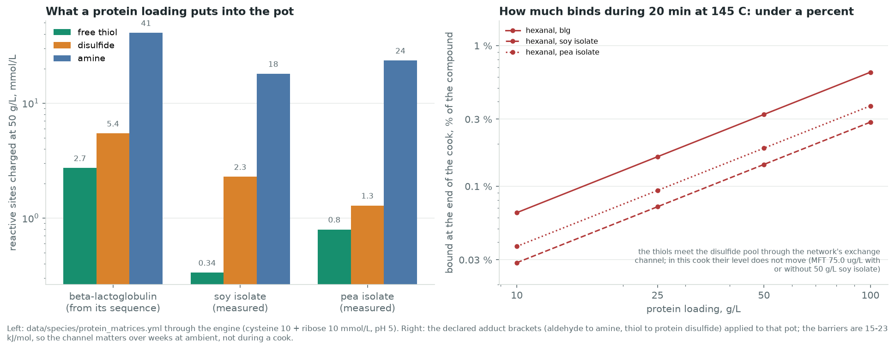

*What a protein loading does. Left: the reactive sites a pea or soy isolate, or whey's main protein,
brings into the pot, from measured densities with their spread. Right: how much of the aldehyde
binds to them during a cook, under a percent, because the measured barriers of that binding are
low; the channel matters over weeks at ambient, not in twenty minutes at 145 °C. The layer is
honest about being small.*

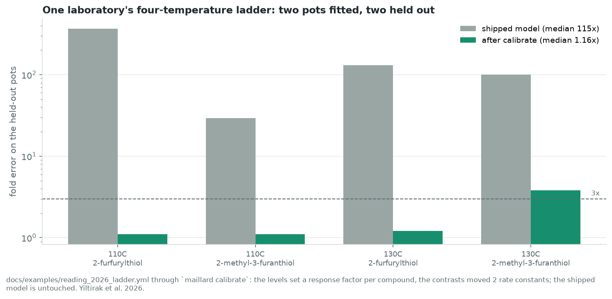

*What your own data does. One laboratory's four-temperature series, two pots fitted and two held
out: the levels set a response factor per compound, the contrasts move the two rate constants they
can identify, and the held-out pots go from a hundredfold off to within threefold. The shipped model
is untouched; the calibration is a file you apply.*

## Words used here

| word | meaning |
|---|---|
| pot | one published cooking experiment: stated ingredients, buffer, temperature, time, and a measured result |
| held out | a pot the model was never tuned on; every score here is on held-out pots |
| rate constant | how fast one step runs at a stated temperature |
| activation energy | the number that says how fast a rate rises with temperature |
| fed-intermediate experiment | one intermediate heated on its own; the cleanest source of a rate or a yield |
| fold error | measured over predicted, or the reverse, whichever is larger; 1 is perfect, 3 is the working threshold |
| removal, sink | the steps that take an aroma compound out of the pot once it has formed |
| dossier | the repository's re-typed record of one paper |
| decade, dex | a factor of ten; 0.3 decades is twofold, 3 decades a thousandfold |
| refusal | the model declining to give a number, with the reason: no route, no rate, or a compound it cannot name |
| declared assumption, declared extrapolation | a number the model uses outside where it was measured, printed with every answer that depends on it |
| rule, hypothesis layer | a reaction drawn in a cited paper, written as a structural transformation with a test case that must fire and one that must not; it places routes, never rates |
| site, protein matrix | a protein's reactive groups (free thiol, disulfide, amine) counted per gram from measurements, charged into the pot when a loading is stated |
| response factor | the constant offset between one laboratory's instrument and the model's scale, set by that laboratory's own levels during calibration |
| resolved | a ratio between two recipes large enough to clear the same-sample scatter of the analytical method |

## Sources

Every paper the model uses, alphabetically, with what was taken from each: [SOURCES.md](SOURCES.md),
made from the repository's records. Where each figure's numbers come from:

| figure | measurement | repository record |
|---|---|---|
| sections 1, 2, 4: the scheme, the coverage map, the papers by weight | the papers the repository has read | `data/lit/extraction_dossiers/`, `data/keys/papers.yml`, `scripts/generators/build_thiol_sink_figures.py` |
| section 2: the five laboratories | Hofmann & Schieberle 1998, Bolton 1994, Zhou 2023, Kang 2026, Yiltirak 2026 | the benchmark panel and the sulfur fit's row table |
| section 2: what papers state | the benchmark files' vessel and calibration fields | `data/benchmarks/`, `results/validation/core_panel_scores.json` |
| section 4: one number's path | Yiltirak 2026, Table S3 | `data/benchmarks/external_validation/maillard_path/`, `docs/validation/directional_claims_panel.yml` |
| section 5: the map, the parity plot, the scorecard, the rows with no number | the benchmark scorecard and the directional panel | `results/validation/core_panel_scores.json`, `core_directional_scores.json` |
| section 6: the history | the pre-registrations and their outcomes | `results/validation/kinetic_core_b*_prereg.md`, `kinetic_core_b*_ship_rule.md`, `scripts/generators/WAVES.md` |
| section 7, 100 °C pot | Schieberle, Hofmann & Münch 2000, Table IV | `schieberle2000_extraction.md` |
| section 7, second pot | Yiltirak et al. 2026, Food Res. Int. | `yiltirak2026_extraction.md` |
| the trees | the model's reaction lists | `scripts/generators/build_reaction_tree.py`, [REACTION_TREES.md](REACTION_TREES.md) |
| section 8: what the rules propose | the cited reaction rules and the species' structures | `data/lit/reaction_rules.yml`, `data/species/structures.yml`, `results/validation/network_hypotheses_prereg.md` |
| section 4: the hypothesis layer; section 5: the declared targets, hexanal, the pyrazine step; section 7: the two refused sinks; section 8: the protein matrix, the calibration | `network_hypotheses.json`; `explain` over the two target lists and the panel scorecard; the pyrazine and sink ship rules; the engine run on the protein matrices; the Reading ladder through `calibrate` | `scripts/generators/build_story_figures.py`, `results/validation/kinetic_core_b18_ship_rule.json`, `kinetic_core_b17_ship_rule.json`, `kinetic_core_b17a_ship_rule.json`, `data/species/protein_matrices.yml`, `docs/examples/reading_2026_ladder.yml` |
