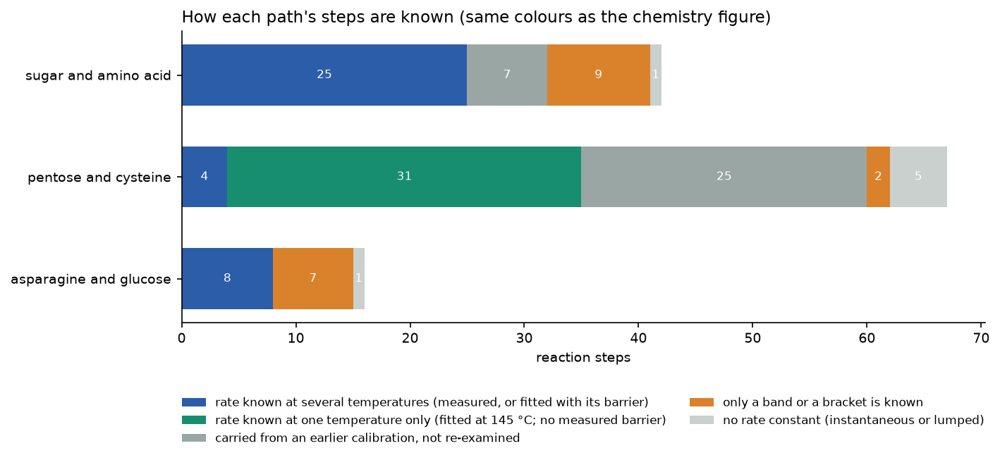
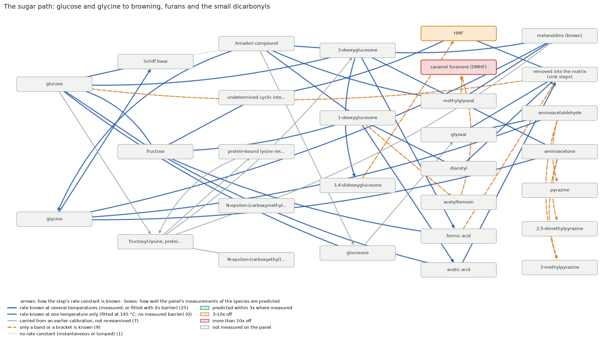
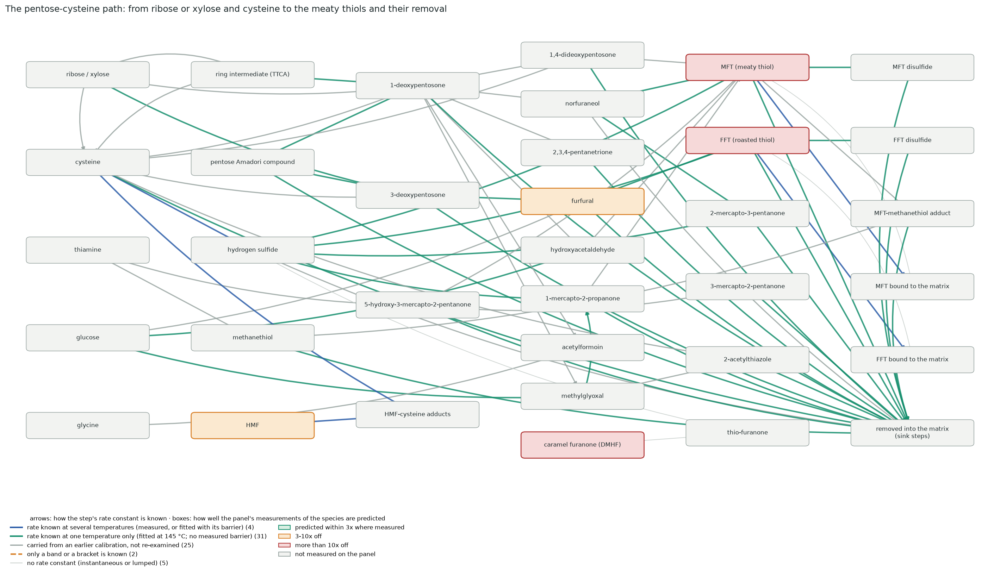
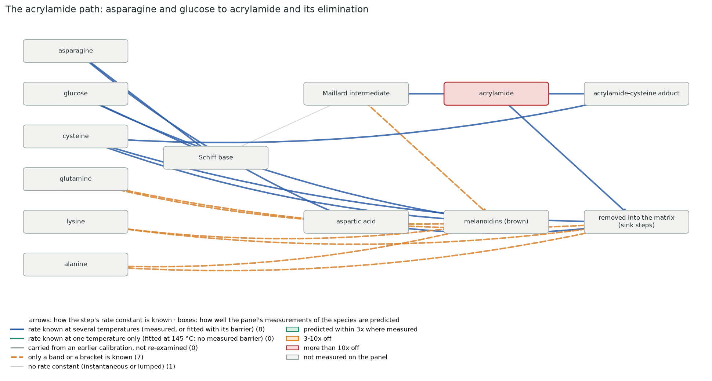
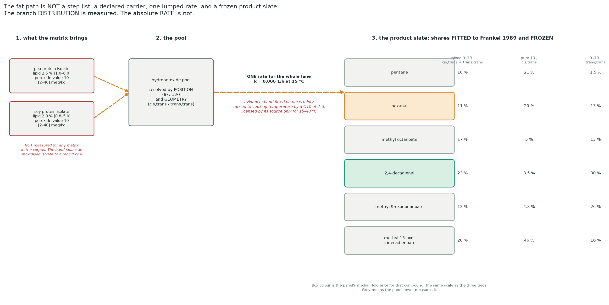

# The reaction trees, step by step

*Appendix to the [introduction](INTRODUCTION.md). The model carries **four** paths. Three of them are
step lists and are drawn as trees below; the fourth, the fat path, is not a step list at all, and the
last section says what it is instead and why it looks different. All four figures are drawn from the
code by `scripts/generators/build_reaction_tree.py`.
Each box is a molecule; each arrow is one step, coloured by how its rate constant is known. A box is
coloured only when the test panel measures that molecule, by how far the prediction is from the
measurement. Bookkeeping pools (fragment carbon, acid equivalents, oxidant) are hidden, and steps
whose only products are such pools are drawn into one box, "removed into the matrix": those are the
sinks. Steps the shipped model carries at exactly zero (the inert defaults of the two refused sink
variants) are not drawn. Updated 2026-09-09, after the pyrazine step joined the sugar path.*

On the sugar path two thirds of the steps are known with their temperature dependence; the rest
are bands or brackets (the dicarbonyl sinks from a dry glass, the pyrazine condensations declared
fast). On the pentose–cysteine path only four steps are measured with a barrier; thirty-one have a
rate pinned at 145 °C by the fit but no measured temperature dependence, and twenty-five are kept
unchanged from earlier calibrations. That is the whole thiol problem in one bar: away from 145 °C
every constant is an extrapolation.

## The sugar path

## The pentose–cysteine path

Read it from the two thiols rightwards: every arrow leaving them, into the disulfides, the
matrix-bound forms and the sink box, is green, a rate fitted at 145 °C with no measured temperature
dependence. Those are the arrows the experiment in the introduction measures.

## The acrylamide path

## The fat path, which is not a tree

The three figures above have 63, 83 and 20 steps. **This path has none.** It declares no reactions and
no rate constants of the kind the other paths carry, so there is no step list to draw and no arrow
whose colour could mean anything. Drawing it as a tree would invent a structure the code does not
have. It works in three stages instead.

**What the matrix brings.** How much fat an isolate carries, and how oxidised that fat already is,
are inputs. Neither is measured for any matrix in this corpus. The peroxide value is the sharper
problem: the band runs from an unoxidised isolate to a badly rancid one, a twentyfold spread that
propagates into every number this path produces. Anyone who measures that one quantity on their own
ingredient collapses the largest uncertainty here in an afternoon.

**One rate, and it is the weakest number in the model.** The whole path turns on a single constant for
how fast the peroxide pool breaks down. It was read off a graph in a room-temperature emulsion study,
carries no stated uncertainty of any kind, and its temperature dependence has never been measured. To
reach cooking temperature the model multiplies it by a rule of thumb the source itself offers, and
that source licenses the rule between 15 and 40 °C. This path runs it to 180. The module says so in
its own warning text rather than burying it, and the figure repeats it, because a reader comparing a
hexanal prediction against a measurement deserves to know that its absolute size rests on this.

**The split between products is the part that is measured.** Where the pool goes, once it goes, comes
from a 1989 study that separated the peroxides by position and geometry and reported the six products
of each. Those shares are fitted and frozen. So the path is honest about two different things at once:
**the branch distribution is measured, the absolute rate is not.** A comparison between two
formulations at a common rate assumption is far more trustworthy than any single absolute number.

That division is worth carrying into how the answers are read. Ratios and rankings on this path lean
on the measured half. Absolute concentrations inherit the assumed half, and with it the peroxide band
and a rule of thumb extended four times past its licence.

**What is still open here**, and it is more than on any other path: the temperature dependence exists
in the literature twice and the two published values disagree by roughly a factor of two; one
alkylfuran row misses badly in an extruded matrix; this path has no evaluable directional claims at
all; and a reversible protein-binding channel that governs how much aldehyde ever reaches a headspace
measurement is absent from the model entirely. The last of those was named on 2026-09-11 and is
written up in [the experiments guide](EXPERIMENTS.md), experiment 4.

## Other figures kept for reference

The dicarbonyl ordering in water against the model, and the intermediate's decay against the model,
both behind the introduction's section 5: `docs/assets/thiol_sink/06_dicarbonyls_water.png`,
`05_ttca_decay.png`; the 140 and 168 °C shapes: `02_wang2022_shapes.png`, `03_liu2023_168C.png`; the
literature funnel: `07_literature_funnel.png`. Two more belong to the fat path and were built before
it had a section to sit in: how its hexanal is arrived at, and the product slate checked against a
second source: `24_fat_path_hexanal.png`, `31_lipid_slate_crosscheck.png`.
