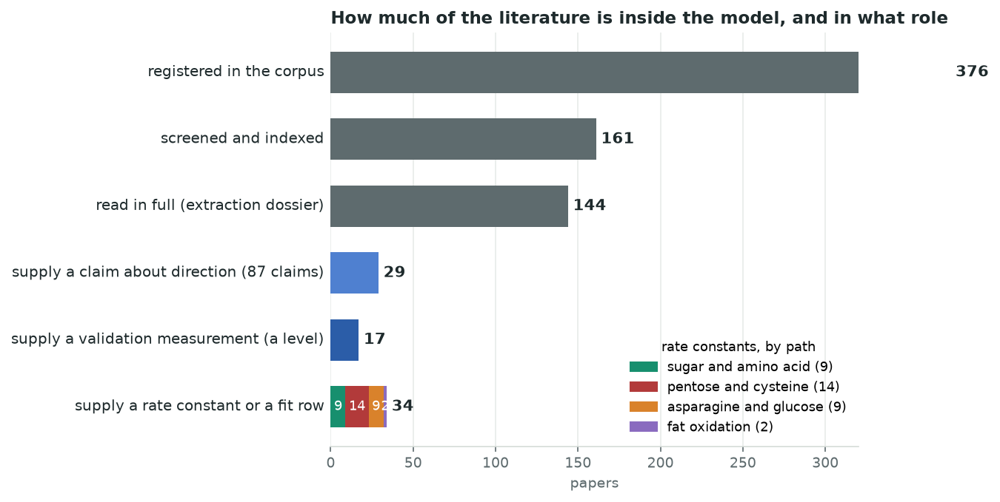

# What this model can and cannot predict, and why

*For a reader who knows what the Maillard reaction is and nothing else about this repository.
Updated 2026-09-07. Every number below is traceable through the sources table at the end.*

## The model in one paragraph

Heat a sugar with an amino acid and you get the Maillard reaction: a cascade of steps that ends in
brown colour and in the small molecules that give cooked food its aroma. This repository holds a
model of that cascade as a list of chemical steps, each with a measured rate constant, integrated
over a cooking programme. You give it a recipe (which sugars, which amino acids, how much, how hot,
for how long, at what pH); it returns how much of each aroma compound forms. The rate constants come
from published experiments. The model is then judged on other published experiments it was never
tuned on.

**The verdict today.** Browning and the sugar-side intermediates are predicted to within a factor
of 1.5 on held-out data. The meaty thiols, the compounds that matter most for savoury flavour, are
wrong by factors of 10 to 500, and the reason is now known: the model destroys them far faster than
real pots do. Everything else in this document is detail on that sentence.

## The map

Green: predicts held-out measurements within a factor of about 1.5. Amber: the shape is right and the
levels are within a factor of 3 inside the laboratory the constants came from, but not across
laboratories. Red: wrong by more than a factor of 10, or wrong in direction. Dashed grey: no route
exists in the model at all. Arrows run left to right in the order the chemistry happens.

## How much of the literature is inside the model

Nearly three hundred papers are registered and about half of them screened, but a rate constant has
to come from an experiment that isolates one step, and only about thirty-four papers do that. Most of
the rest supply the measurements the model is judged against: end-of-cook levels from seventeen
studies, and eighty-seven statements of direction (this rises with temperature, that falls with pH)
from twenty-seven. So "the whole literature" is in the model as its examiner, not as its author.

## Path by path

The same five rows in more detail, for the reader who wants the sources.

**Sugar and amino acid to brown colour.** What we have: the full step list with rate constants and
temperature dependence from one careful study of glucose and glycine, measured at three
temperatures. How it does: a held-out browning study reproduces within a factor of 1.5, and the
effects of water activity and pH are carried as measured ratios. What we lack: the small dicarbonyls
(glucosone, glyoxal, methylglyoxal, diacetyl) were measured in a dry sugar glass at 160–200 °C and,
transplanted into water, they come out in the wrong order: the model puts glucosone twenty times
above 3-deoxyglucosone where two laboratories find it seven to ten times below. A constant does not
survive a change of matrix.

**Pentose sugar and cysteine to the meaty thiols.** What we have: rate constants for every step at
one reference temperature (145 °C), from one laboratory's feeding experiments in which each
intermediate was heated on its own; the temperature dependence of formation; a single ring
intermediate (TTCA) that opens to release the sulfur. How it does: inside that laboratory, at that
temperature, the thiols land within a factor of 2 to 4. Across laboratories and away from 145 °C
they are wrong by 10 to 500, always too low late in the cook and always too high early. What we
lack: any measurement of how fast a thiol is removed once formed, at more than one temperature.
This is the problem the rest of this document is about.

**Hexose sugar and cysteine.** No route. Glucose plus cysteine does make these thiols in real pots,
through furfural and furfuryl alcohol, but no published step-level measurement exists, so the model
declares the answer unknown rather than inventing one. One published time series (glucose plus
cysteine at 168 °C) is on file as the first test for whoever builds the route.

**Asparagine and glucose to acrylamide.** What we have: formation and elimination constants, their
temperature dependence, and their dependence on pH and on water activity, all from one laboratory
(Leuven) over 120–200 °C. How it does: it reproduces that laboratory's own series; extrusion
experiments in real food matrices are not reproduced. What we lack: any second laboratory's constants.

**Fat to aldehydes.** What we have: six aldehyde products and their split from one 1989 study of
oxidising linoleate, and a declared temperature rule. How it does: hexanal in storage tests within a
factor of 2 to 30. What we lack: nonanal and 2-pentylfuran, which the panel asks for and no measured
branch exists for.

## The tree, step by step

The map above groups the chemistry into stages. The three figures below are the actual step lists
the model integrates, one per path, drawn from the code. Each box is a molecule; each arrow is one
step, coloured by how its rate constant is known. A box is coloured only when the test panel measures
that molecule, by how far the prediction is from the measurement. Bookkeeping pools (fragment carbon,
acid equivalents, oxidant) are hidden, and steps whose only products are such pools are drawn into
one box, "removed into the matrix": those are the sinks.

*The sugar path is almost entirely measured, with temperature dependence. On the pentose–cysteine
path only four steps are; thirty-one have a rate pinned at 145 °C by the fit but no measured
temperature dependence, and twenty-eight are carried unchanged from earlier calibrations. That is
the whole thiol problem in one bar: away from 145 °C every constant is an extrapolation.*

*Read the pentose–cysteine tree from the two thiols rightwards: every arrow leaving them, into the
disulfides, the matrix-bound forms and the sink box, is green, a rate fitted at 145 °C with no
measured temperature dependence. Those are the arrows the experiment in the last section measures.*

## The one problem that matters most: where the thiols go

A thiol's level in a pot is formation minus removal. Formation is measured; removal was fitted
indirectly, from end-of-cook levels at 121–145 °C, and turns out to be far too strong everywhere else.
Four laboratories now show it.

*The reference pot (ribose plus cysteine in buffer, the very system the constants came from) held at
100 °C for twelve hours. Blue is measured: the thiols rise forty-fold and are still rising at the end.
Green is the model as shipped: it peaks after an hour and then loses what it made. Orange and purple
are attempts to re-tune the removal on this series: with every existing bound respected, and with one
bound relaxed. Neither reaches the measurement, and both broke the 145 °C data they were originally
tuned on.*

At the other end, a Beijing laboratory cooked cysteine and xylose at 140 °C and saw the thiols rise for
an hour and then decline gently; the model loses a thousandfold in two and a half hours. A second
Beijing pot at 168 °C measured MFT halving between twenty and sixty minutes; the shipped model
predicts nothing at all at that temperature.

*Why this matters beyond the thiols themselves: a Reading pot at 100 and 110 °C that no version of the
model has ever seen. As shipped, the model is 480 times too high for FFT. The re-tuned model, which
was only asked to match the 100 °C series above, brings that to 18 without seeing this data. Most of
what looked like laboratories disagreeing with each other is the same removal problem.*

**What the removal must look like.** One removal step with one temperature sensitivity cannot serve
100 °C and 145 °C at once: every re-tuning that fixed one broke the other. The removal needs a
different structure, not a different number: either it is reversible (the disulfides give the thiol
back) or it saturates (it runs out of the reactive partner it consumes). A second, smaller fault is
known: the ring intermediate opens about ten times too fast, so its sulfur and sugar are spent early.

## What has been tried

- Splitting the formation step's temperature dependence into two: neither half could be pinned down
  by the data, and the shapes of the temperature series turned out to be set by removal, not formation.
- Treating oxygen as an input, from the vessel's headspace: with only one laboratory reporting its
  vessel volumes, no oxygen effect could be identified, and none closed a gap between laboratories.
- Re-tuning the removal on the 100 °C series: reproduces the direction at 168 °C and moves the Reading
  pot from 198× to 14×, but cannot hold 100 °C and 145 °C at the same time.
- Adding measured water-activity and pH effects on the sugar and acrylamide paths: adopted; the tool
  now answers those questions inside the measured ranges instead of refusing them.

## What would settle it

**One experiment.** Ribose 100 mmol/L and cysteine 33 mmol/L in 0.5 mol/L phosphate at pH 5, the
reference pot, in 20 mL vials with 5 mL of liquid, the volumes written down. Two temperatures, 100 °C
(0.5 to 12 hours) and 140 °C (5 to 120 minutes), one vial per time point, three replicates. Alongside,
the same buffer with MFT alone and with FFT alone at 1 mg/L on the same grid. Measure the thiols by
stable-isotope dilution and, in the same run, their disulfides; also the sugar and cysteine remaining
and the pH. One arm at 100 °C under nitrogen. About 130 vials, two weeks of GC-MS.

It measures removal directly, with nothing forming to confound it, and tells three things at once: how
fast the thiols go, whether they come back from the disulfide, and whether oxygen matters. The shipped
model predicts that the fed thiol decays to zero and that the pot peaks after an hour at 100 °C; the
alternative is a plateau with its disulfide and a pot still rising at twelve hours. Either result
decides the next version of the removal step.

**Without a laboratory.** Two published data sets exist only as figures (the Beijing 100–140 °C grid
and a five-temperature ladder from a second Chinese group); their underlying numbers, obtainable from
the authors, would give removal its first tuning rows from a third laboratory. And the reversible or
saturating removal can be built and pre-registered against the existing series in a day, which tells
us whether the measured shapes are reachable before anyone orders standards.

## Sources

| what | who, where | record in this repository |
|---|---|---|
| reference pot constants and the 100 °C series | Hofmann & Schieberle 1998; Schieberle, Hofmann & Münch 2000 (Munich) | `data/lit/extraction_dossiers/hofmann1998_reconciliation.md`, `schieberle2000_extraction.md` |
| 100 and 140 °C shapes | Wang et al. 2022, Flavour Fragr. J. (Beijing) | `wang2022_extraction.md` |
| 168 °C decline | Liu et al. 2023, LWT (Beijing) | `liu2023b_extraction.md` |
| the pot never tuned on | Yiltirak et al. 2026, Food Res. Int. (Reading) | `yiltirak2026_extraction.md` |
| ring intermediate decay | Zhai et al. 2021, J. Agric. Food Chem. (Jiangnan) | `zhai2021_extraction.md` |
| dicarbonyls in water | Leitzen et al. 2021, Pharmaceuticals; Zhang et al. 2021, Food Sci. Nutr. | `leitzen2021_extraction.md`, `zhang2020_extraction.md` |
| acrylamide constants and their pH and water-activity dependence | De Vleeschouwer et al. 2006, 2007, 2008, 2009 (Leuven) | `devleeschouwer2006/2007/2008_extraction.md` |
| the attempts and their outcomes | this repository's pre-registrations | `results/validation/kinetic_core_b*_prereg.md`, `scripts/generators/WAVES.md` |
| the figures | generated from the repository's results and code | `scripts/generators/build_thiol_sink_figures.py`, `scripts/generators/build_reaction_tree.py` |
