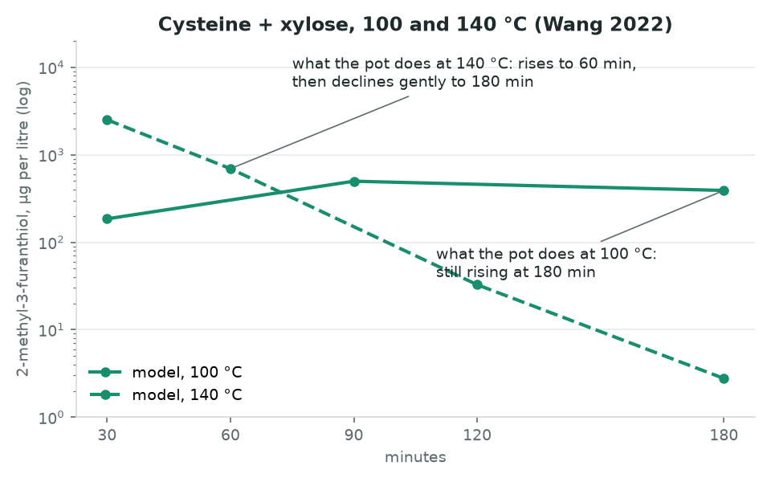
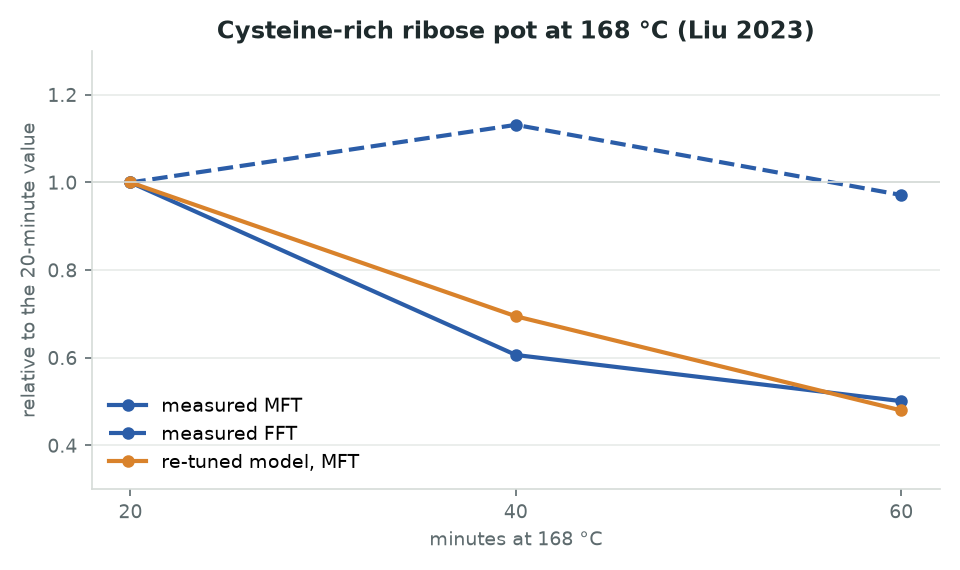
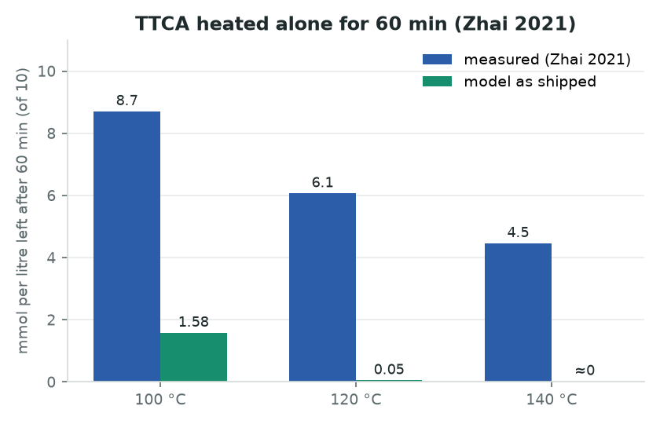
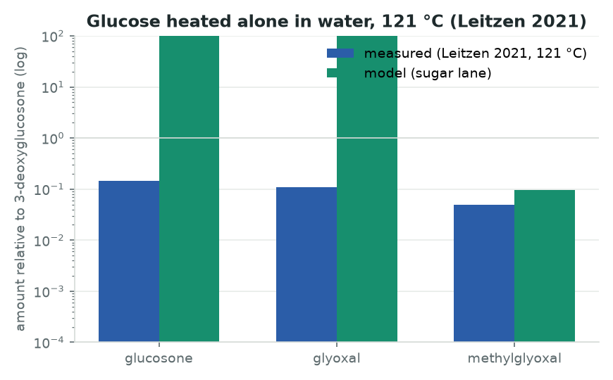

# Where the thiols go

*A guide to the one problem that stops this tool from predicting meaty aroma, written for a reader
who has never opened the repository. Updated 2026-09-07. Figures are generated by
`scripts/generators/build_thiol_sink_figures.py` from the repository's own results.*

---

## 1. What the tool is trying to do

When a sugar and an amino acid are heated together, they react (the Maillard reaction) and produce
hundreds of small molecules, a few of which carry most of the aroma of cooked food. This repository
holds a **kinetic model**: a list of chemical steps with rate constants, integrated over a cooking
programme, that predicts how much of each aroma compound a given recipe produces. The steps and
their constants come from published measurements, never from the numbers the model is later judged
on.

The two compounds this guide is about are **2-methyl-3-furanthiol (MFT)** and **2-furfurylthiol
(FFT)**. They are the thiols that smell of cooked meat and roasted coffee; humans detect them at a
few nanograms per litre, so a recipe's meaty character is decided by micrograms. They form when a
pentose sugar (ribose, xylose) reacts with cysteine, the sulfur-bearing amino acid. The part of the
model that handles them is called the **sulfur lane**.

Predicting a thiol level means getting two things right: how fast the thiol is **formed** from the
sugar and cysteine, and how fast it is **removed** afterwards. The removal steps are what chemists
call the **sinks**: oxidation to disulfides, addition to other reactive molecules, loss into the
brown polymers. This guide is about the sinks, because every recent test says the model's sinks are
wrong.

## 2. How the model is tested, and what the wave names mean

Two rules decide how the model is calibrated and judged:

- **Fit on primary evidence, validate on levels.** Measured rate constants, yields from a fed
  intermediate, and ratios measured within one study may be used to tune the model. The final
  concentration a paper reports at the end of a cook is never used for tuning; it is what the model
  is scored against afterwards.
- **Every attempt is pre-registered.** Before a re-tuning runs, a document states which rows it
  will read, which tests it must pass to be adopted, and what the author expects to happen. The
  attempt is then run once and the outcome recorded, pass or fail.

Each attempt is called a **wave** and numbered. Three of them matter for this guide:

| name in the repository | what it means in this guide |
|---|---|
| **B9** | the calibration the tool ships today, made in early September 2026 |
| **B16, ceiling kept** | the 2026-09-07 attempt to re-tune the sinks on a new time series, with every existing bound respected |
| **B16, ceiling lifted** | the same attempt with one bound relaxed, run only to see what the data ask for |

The full ledger of attempts is in section 5. The current scorecard of the whole model, across all
its compounds, is in the repository's `README.md`; this guide looks only at the sulfur lane.

## 3. The evidence, one laboratory at a time

The figures below all show the same kind of comparison: what a laboratory measured in its pot,
against what the model predicts for that pot. Blue is always the measurement; green the shipped
model; orange the re-tuned model; purple the re-tuned model with the relaxed bound. Concentrations
are on logarithmic axes, because the errors span factors of a thousand.

### 3.1 The model's own reference pot, held at 100 °C for twelve hours

The pot is ribose and cysteine in phosphate buffer at pH 5, the very system whose published
constants the model was tuned on (Hofmann and Schieberle, Munich, 1998). In 2000 the same
laboratory published how the thiols grow when that pot is held at 100 °C instead of 145 °C: **MFT
rises forty-fold between half an hour and twelve hours, and is still rising at the end.**

The shipped model rises for an hour, then falls, and ends four times below its own peak. Re-tuning
the sinks on this series does not fix it: with every bound respected the model still peaks at six
hours; with the bound on the sink's temperature sensitivity relaxed, the re-tuning runs straight to
the new limit and still peaks at six hours. Whatever removes the thiols in the model at 100 °C, the
pot does not have it, and the model's sugar supply also runs out hours before the pot's does.

### 3.2 A third laboratory, 100 °C and 140 °C

A Beijing laboratory (Wang and colleagues, 2022) cooked cysteine and xylose in buffer at five
temperatures for up to three hours, in a vial whose volume they state. Their numbers are published
only as a colour map, so the figure shows the model's own curves and the shapes the paper describes
in words. At 100 °C the pot is still rising at three hours where the model peaks at ninety minutes.
At 140 °C the pot rises to an hour and then declines gently; **the model loses a thousandfold in
two and a half hours.** The sinks are too strong at the high end as well as the low.

### 3.3 A pot at 168 °C

Another Beijing laboratory (Liu and colleagues, 2023) cooked a cysteine-rich ribose pot at 168 °C
and measured MFT falling by half between twenty and sixty minutes. The shipped model predicts less
than a nanogram per litre by sixty minutes, which is the same thing as predicting nothing. The
re-tuned model, with its weaker sink, lands on the measured decline exactly. The direction of the
fix is right; its size and its temperature dependence are not.

### 3.4 The pot nobody tuned on: the Reading ladder

The University of Reading (Yiltirak and colleagues, 2026) cooked ribose and cysteine at four
temperatures with matched times. No version of the model has ever been tuned on these numbers. As
shipped, the model over-predicts FFT at 100 °C by a factor of 480. The re-tuned model, which was
only asked to match the Munich series in figure 3.1, brings that to 18 without seeing the Reading
data at all. **This is the lever**: most of the disagreement between laboratories that has looked
like a calibration problem is the same sink problem.

### 3.5 The intermediate that the model spends too fast

When xylose and cysteine first react they form a stable ring compound (TTCA) that later opens to
release its sulfur. A Jiangnan laboratory (Zhai and colleagues, 2021) heated the pure compound and
measured how much survives an hour: most of it at 100 °C, half at 140 °C. The model opens the ring
about ten times faster, and the released sugar is then consumed elsewhere. Every published cook that
starts from this intermediate (three of them are in the corpus) is missed for this reason.

### 3.6 A separate problem with the same cause: the sugar-only steps

Not a thiol problem, but the same mistake in a different lane. Sugars heated alone in water break
down into small dicarbonyls. The model's constants for those steps were measured in a solid glucose
glass at 160–200 °C, and transplanted to water they put glucosone twenty times above
3-deoxyglucosone, where a pharmaceutical laboratory (Leitzen and colleagues, 2021) finds it seven
times below. Constants do not survive a change of matrix unchanged; the sink constants above were
measured in a 121–145 °C window and asked to work at 100 °C and at 168 °C.

## 4. What the evidence adds up to

1. The model removes MFT and FFT much faster than any pot does, at every temperature tested from
   100 °C to 168 °C.
2. Slowing the removal at low temperature is the single change that has moved the between-laboratory
   errors, in a pot the model had never seen.
3. One removal step with one temperature dependence cannot serve 100 °C and 145 °C at the same time:
   every re-tuning that fixed the 100 °C series broke the 145 °C measurements it was tuned on. The
   sink needs a different **structure**, not a different number. The candidates are a removal that
   is reversible (the disulfides give the thiol back) or one that saturates (it runs out of the
   reactive partner it needs).
4. The model's sugar supply at 100 °C runs out hours before the pot's, so the formation side needs
   the same scrutiny.
5. The ring-opening of the xylose–cysteine intermediate is ten times too fast, a single constant that
   can be re-tuned on the published measurement.

## 5. What has been tried

| attempt | hypothesis tested | outcome | what it settled |
|---|---|---|---|
| B9 (September 2026) | Tune only on primary evidence; let measured levels judge. | adopted; ships today | The honest baseline. Glucose-only recipes predict no thiol at all, because no published step supports that route. |
| B10 | Formation has two temperature sensitivities, one per route. | not adopted | Neither could be pinned down; the shape of the temperature ladders is set by the sinks, not by formation. |
| B11 | Oxygen is an input: a headspace reservoir feeding the sinks. | structure kept, effect set to zero | With one laboratory's vessel volumes in the data, no oxygen effect can be identified; none closed a between-laboratory gap. |
| B12–B15 | Water activity and pH change the rates, as measured within single studies. | adopted | The tool now answers questions on those axes inside the measured ranges instead of refusing them. |
| B16 | The sinks, re-tuned on the 100 °C series and the intermediate's decay. | not adopted | One sink barrier cannot serve 100 and 145 °C; weakening it moves the Reading ladder from 198× to 14×; the intermediate is spent ten times too fast. |

## 6. What would settle it

Three experiments, in order of value. Each is written so the model can be wrong in public: the
shipped model's prediction is stated next to the alternative it is tested against.

### Experiment 1, the sink (the one that matters)

**Question.** When a thiol disappears from a hot pot, where does it go, how fast, and does it come
back?

**Pot.** Ribose 100 mmol/L and L-cysteine 33 mmol/L in 0.5 mol/L potassium phosphate at pH 5.0, in
purified water. This is the Munich reference pot of figure 3.1, so every point lands where the model
is already anchored.

**Vessel.** 5 mL of liquid in 20 mL crimp-capped headspace vials, sealed under air, stirred; the fill
and the headspace written down. One arm at 100 °C purged with nitrogen before sealing.

**Temperatures and times.** 100 °C at 0.5, 1, 2, 4, 8 and 12 hours. 140 °C at 5, 10, 20, 40, 60 and
120 minutes. One vial per time point, quenched in ice; no vial is re-heated.

**The fed arm.** MFT alone, and FFT alone, at 1 mg/L in the same buffer, heated on the same grid,
with the disulfide quantified as the thiol disappears. This measures the removal directly, with no
formation to confound it.

**What to measure.** MFT, FFT and 3-mercapto-2-pentanone by stable-isotope dilution with labelled
standards; the two homodimer disulfides and the mixed disulfide in the same chromatographic run;
ribose and cysteine remaining, by HPLC; the pH at every time point.

**Size.** 2 temperatures × 6 times × 3 replicates for the pot (36 vials) and for the fed thiols (72),
plus the nitrogen arm (18): about 130 vials and two weeks of GC-MS.

| the shipped model predicts | the alternative being tested |
|---|---|
| At 100 °C MFT peaks near one hour and ends four times below the peak at twelve hours; at 140 °C both thiols fall a thousandfold in two hours; the disulfides accumulate and never give the thiol back. | Thiols rise through twelve hours at 100 °C and decline gently at 140 °C; the fed thiol settles at a plateau with its disulfide rather than decaying to zero; nitrogen changes the disulfide share, not the thiol level. |

**What it decides.** The direct removal rates and their temperature dependence, which the repository
lists as the five constants no published measurement identifies. Whether the next version installs a
reversible removal, a saturating one, or turns instead to the sugar supply. Whether oxygen matters.

### Experiment 2, the intermediate

Purified TTCA at 10 mmol/L in 0.2 mol/L phosphate at pH 5.5, and separately in water at pH 7 to
link with the published series; 100, 120 and 140 °C for 10 to 120 minutes in triplicate; the ring
compound, its open isomer, free cysteine and xylose by HPLC, MFT and FFT by the method of
experiment 1. The shipped model predicts 16 % of the compound left after an hour at 100 °C and none
at 140 °C; the published measurement is 87 % and 45 %. If that holds in buffer, one constant is
re-tuned ten times slower and three published cooks become scorable.

### Experiment 3, the sugar-only steps

Glucose 0.3 mol/L in water and in 0.1 mol/L phosphate at pH 6.8, no amino acid; 100, 120 and 140 °C
for 0.5 to 6 hours; the seven dicarbonyls by o-phenylenediamine derivatisation and LC-MS/MS,
reported in mmol/L with glucose and fructose remaining, so that the products can be balanced
against the sugar lost. The model predicts glucosone twenty times above 3-deoxyglucosone; water
gives the reverse. This fixes the constants that were carried over from a sugar glass.

## 7. What can be done without a laboratory

- **Ask two groups for their numbers.** The Wang 2022 grid (five temperatures by six times, one
  stated vessel) and the Wang 2026 ladder exist only as figures. The underlying values would give
  the sulfur lane its first tuning rows from a third laboratory, at no cost.
- **Change the sink's structure and pre-register it.** A reversible dimerisation with a
  temperature-dependent equilibrium, and a removal that scales with the reactive carbonyl pool,
  tested against the same rows as B16 plus the Reading and Beijing shapes. A day of work; it tells
  us whether the measured shapes are reachable at all before anyone buys standards.
- **Re-tune the ring-opening constant** on the published three-temperature measurement of the
  intermediate. Small, and it unlocks three published cooks.
- **Add a per-laboratory response factor** for absolute levels. After the sinks are fixed, what
  remains between laboratories is extraction, calibration and vessel; a term estimated on
  within-laboratory ratios would give honest intervals on absolute predictions.
- **Obtain the one missing low-temperature anchor**: a book chapter reporting how fast MFT and FFT
  disappear at 50 °C in pH 5 buffer, which with the published 80 °C rate would bracket the sink's
  temperature sensitivity from below.

## 8. Where the numbers come from

| figure | measurement | repository record |
|---|---|---|
| 3.1 | Schieberle, Hofmann & Münch 2000, ACS Symp. Ser. 756, Table IV | `data/lit/extraction_dossiers/schieberle2000_extraction.md` |
| 3.2 | Wang et al. 2022, Flavour Fragr. J., doi 10.1002/ffj.3710 | `wang2022_extraction.md` |
| 3.3 | Liu et al. 2023, LWT 182:114874 | `liu2023b_extraction.md` |
| 3.4 | Yiltirak et al. 2026, Food Res. Int., Table S3 | `yiltirak2026_extraction.md` |
| 3.5 | Zhai et al. 2021, J. Agric. Food Chem. 69:10648 | `zhai2021_extraction.md` |
| 3.6 | Leitzen et al. 2021, Pharmaceuticals 14:1121 | `leitzen2021_extraction.md` |
| model values | the B16 ship rule and the directional scorecard | `results/validation/kinetic_core_b16_ship_rule.json`, `results/validation/core_directional_scores.json` |
| the attempts | pre-registrations and outcomes | `results/validation/kinetic_core_b*_prereg.md`, `scripts/generators/WAVES.md` |
